# ORAC SEVIRI cloud optical thickness validation — February 2026

This report describes the cloud optical thickness (COT) validation of ORAC
SEVIRI retrievals for **February 2026**, against two independent EarthCARE
references:

- **Water clouds** → ACM-CAP `liquid_optical_depth` (synergy ATLID + CPR + MSI
  variational retrieval). This is the headline section.
- **Ice clouds** → ATLID A-EBD column-integrated 355 nm extinction. This is
  the second section, kept compact because the lidar reference has known
  limitations for thick ice cloud (laser attenuation).

## 1. Water-cloud COT vs ACM-CAP

### 1.1 Reference data

ACM-CAP (`ACM_CAP_2B`) is the EarthCARE flagship variational retrieval that
combines ATLID, CPR and MSI. Its `liquid_optical_depth` is a per-profile
**scalar** liquid τ — there is no integration step on our side, the value is
read straight from the product
(`validation/readers.py:read_accap_track`,
`validation/reference.py:cot_cer_water_from_accap`).

Two ACM-CAP per-profile flags are also kept:

- `liquid_present` (`liquid_classification == 1` in any bin)
- `ice_present` (`liquid_classification == 3`, i.e. "in ice", in any bin)

`liquid_only` profiles (`liquid_present & ~ice_present`) are then aggregated
to SEVIRI pixels (`aggregate_to_pixel_water`) along with three composition
fractions (`frac_liquid_only`, `frac_mixed`, `frac_ice_only`). The headline
stratum is **`water_pure_pixel`** — pixels where ≥ 80 % of the cloudy ATLID
profiles are liquid-only. This is the apples-to-apples comparison: ORAC's
liquid-cloud retrieval against an ACM-CAP value that genuinely refers to a
liquid scene.

### 1.2 QC modes

ACM-CAP carries its own `quality_status`. Three QC pre-filters
(`SYNERGY_QC_MODES`):

| QC mode      | Definition                                    |
| ------------ | --------------------------------------------- |
| `qc_off`     | All cloudy & paired rows                      |
| `qc_strict`  | `quality_status == 0` (variational converged) |
| `qc_relaxed` | `quality_status ∈ {0, 1}`                     |

Headline figures use `qc_strict`.

### 1.3 The "linear R is small, log R is what matters" caveat

COT spans 0.1 → 100 — three decades. A linear Pearson correlation on
log-distributed data is dominated by a handful of extreme thick points and
is essentially uninformative. The CSVs report both `r` (linear) and
`r_log` (Pearson of log10 τ); **`r_log` is the meaningful number**.

| view  | retrieval | r (linear) | r_log |
| ----- | --------- | ---------- | ----- |
| sample | R10      | 0.030      | 0.351 |
| sample | R11      | 0.023      | 0.321 |
| pixel | R10       | 0.032      | 0.363 |
| pixel | R11       | 0.024      | 0.335 |

Take r_log as "the correlation"; the linear r is reported only because the
shared statistics machinery emits it.

### 1.4 Headline numbers (R11, qc_strict, pixel view)

| stratum                       | N       | bias  | RMSE  | r_log |
| ----------------------------- | ------- | ----- | ----- | ----- |
| **all**                       | 446 881 | +6.93 | 43.71 | 0.335 |
| ocean                         | 324 361 | +7.54 | 43.84 | 0.367 |
| land                          | 122 520 | +5.31 | 43.36 | 0.248 |
| lat_tropics                   | 182 043 | +1.44 | 30.02 | 0.373 |
| lat_midlat                    | 233 122 | +9.69 | 49.08 | 0.296 |
| lat_polar                     |  31 716 | +18.08 | 63.61 | 0.239 |
| **water_pure_pixel**          | 445 918 | +6.95 | 43.71 | 0.334 |
| phase_agree_liquid (ORAC=liq) | 308 317 | +10.66 | 50.49 | 0.308 |
| phase_disagree_atlid_liquid   | 137 601 | −1.36 | 21.87 | 0.422 |
| atlid_radar_synergy           | 221 377 | +3.73 | 40.62 | 0.310 |
| atlid_only                    | 225 504 | +10.07 | 46.55 | 0.309 |
| tau_thin (0.15 ≤ τ < 1)       |  59 872 | +12.13 | 46.83 | 0.020 |
| tau_mid (1 ≤ τ < 3)           |  80 339 |  +8.14 | 37.74 | 0.075 |
| tau_thick (3 ≤ τ < 10)        | 196 758 |  +8.89 | 45.26 | 0.180 |
| tau_very_thick (τ ≥ 10)       |  90 396 |  −2.64 | 43.15 | 0.013 |

Bias is reported in linear τ; RMSE likewise. r_log is in log10 space.

The headline:

> **ORAC SEVIRI overestimates ACM-CAP liquid τ by ≈ 7 in linear units (RMSE
> 43, r_log 0.34) in February 2026, with the bias growing strongly toward
> high latitudes and shrinking to ≈ 0 in the tropics.** R10 and R11 are
> nearly identical at the all-stratum level (compare CSV bias 5.60 vs 6.93,
> RMSE 40.4 vs 43.7), so the headline finding is robust to the retrieval
> stream choice.

### 1.5 Figures — water cloud

#### Headline scatter (qc_strict, log axes)

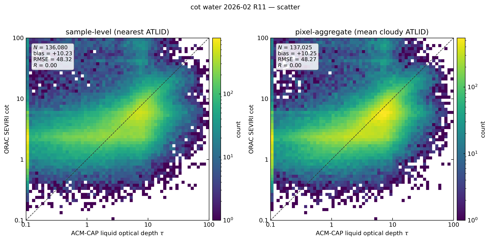

`figures/cot_water_2026-02_R11/cot_water_scatter.png` — joint histogram of
ORAC `cot_orac` vs ACM-CAP `liquid_optical_depth` on log-log axes from 0.1
to 100. Both panels show the same broad cloud of points with the principal
ridge **above** the 1:1 line in the τ ≈ 1–10 band — that is the visual
signature of the +7 mean overestimate. There is no secondary lobe; the bias
is a coherent translation of the whole liquid distribution.

#### QC sensitivity

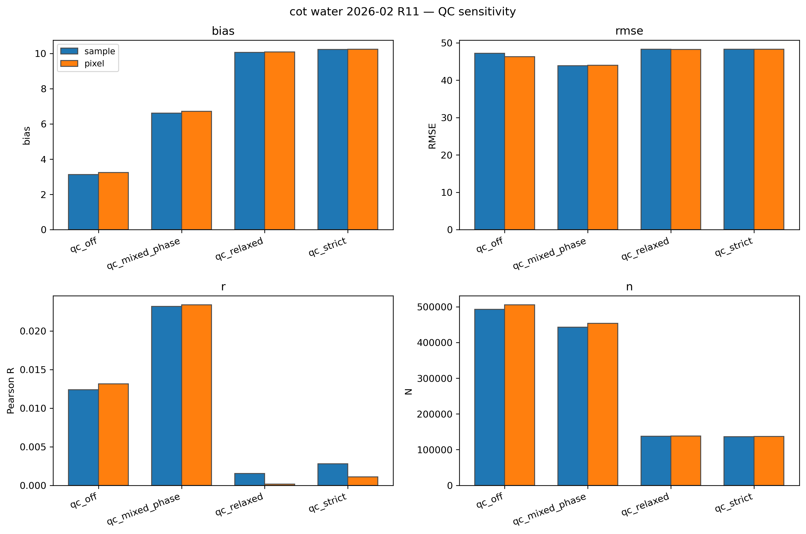

`figures/cot_water_2026-02_R11/cot_water_qc_sensitivity.png` — bias / RMSE /
linear R / N for `qc_off`, `qc_relaxed`, `qc_strict`. Tightening QC raises
the bias from ≈ +3 (sample) / +5 (pixel) to ≈ +7. This is **not** because
strict QC retrieves a worse population — `qc_strict` keeps only profiles
where the ACM-CAP variational fit converged cleanly (`quality_status == 0`),
which is a *more reliable* reference; the apparent jump is the bias against
a higher-quality reference, not a degradation. RMSE is essentially flat
across QC modes (44 ± 0.3). The bottom-right panel shows the cost: 90 % of
the relaxed sample is retained.

#### Bias by stratum

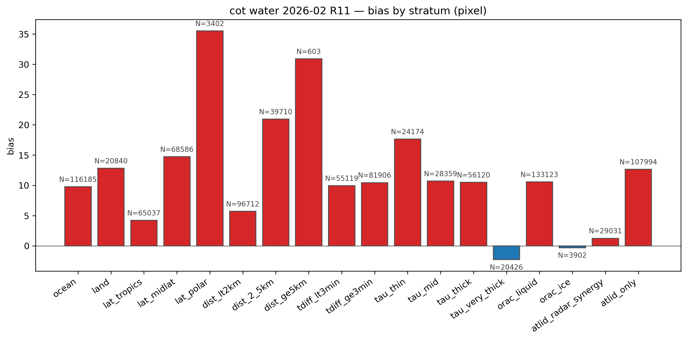

`figures/cot_water_2026-02_R11/cot_water_bias_by_stratum_pixel.png` — bias
(ORAC − ACM-CAP, linear τ) per stratum. Three structural patterns dominate:

- **Latitude**: tropics +1.4 → midlat +9.7 → polar +18.1. The polar liquid
  bias is the single largest signal in the validation. Possible drivers:
  high solar-zenith retrievals over bright sea-ice / snow, multilayer
  optically thin liquid above mid-cirrus, and ACM-CAP underestimating τ
  in low-sun polar geometry.
- **Composition** flip: when ACM-CAP says the column is liquid-only **and
  ORAC also retrieves liquid** (`phase_agree_liquid`, N = 308 k), bias is
  +10.7 — these are the cleanly liquid pixels and the bias is largest there.
  When ORAC retrieves *ice* over an ATLID-liquid column
  (`phase_disagree_atlid_liquid`, N = 138 k), bias flips slightly negative
  (−1.4): ORAC is comparing its ice-cloud τ to ACM-CAP's liquid τ, so this
  stratum is mostly noise around zero rather than a meaningful comparison.
- **Synergy vs ATLID-only**: pixels where the CPR was assimilated by
  ACM-CAP (`atlid_radar_synergy`, N = 221 k) have bias +3.7; pixels where
  CPR was not used (`atlid_only`, N = 226 k) have bias +10.1. The synergy
  reference is more trusted, and the bias against it is closer to zero.

The negative `tau_very_thick` bias (−2.6) is consistent with a saturation
ceiling in ORAC's COT retrieval (ORAC saturates at τ = 100 by construction
— see `validation/cli.py:48` `ORAC_COT_SATURATION = 100.0`), so very thick
ACM-CAP columns have ORAC capped below them.

#### R by stratum

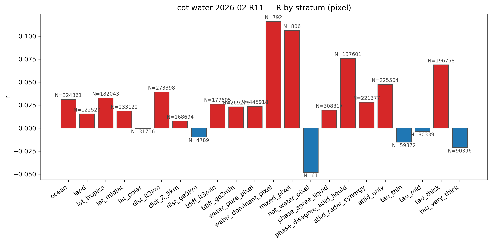

`figures/cot_water_2026-02_R11/cot_water_r_by_stratum_pixel.png` — note the
y-axis runs only from −0.05 to +0.12; this figure plots **linear** r, which
is uninformative for log-distributed COT. The per-stratum log-correlations
in the CSV are 0.20 – 0.45 — i.e. a real but moderate positive
correlation. Read alongside the CSV (`r_log`), not in isolation.

#### R10 vs R11

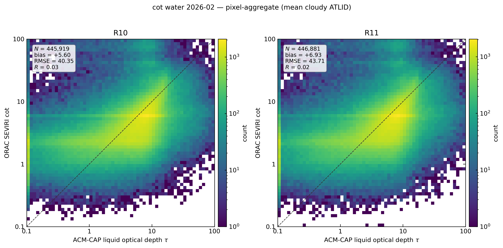
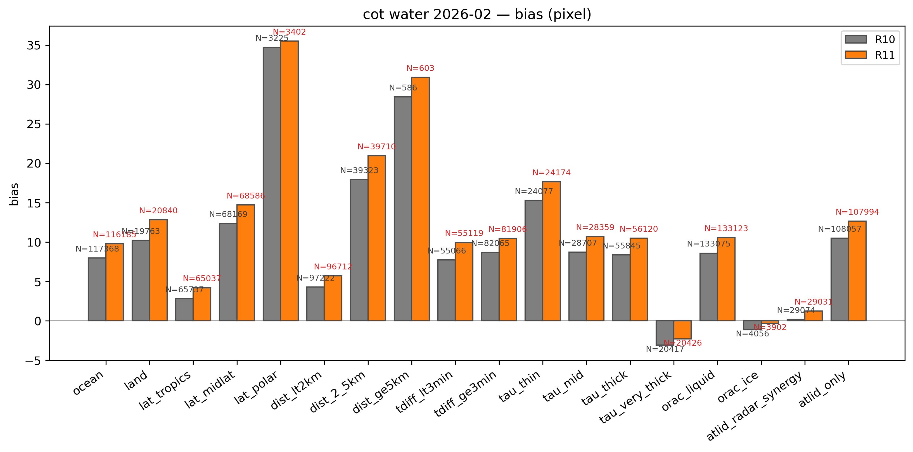
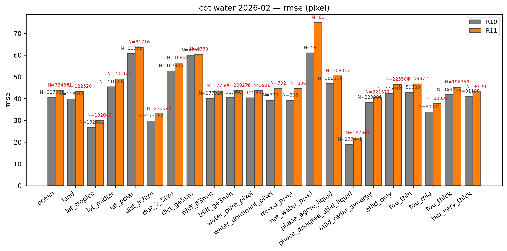

`figures/cot_water_2026-02_compare/compare_R10_R11_scatter_pixel.png` —
side-by-side joint histograms. The two retrieval streams give visually
indistinguishable distributions; R10 has a marginally smaller all-stratum
bias (+5.6 vs +6.9) and slightly lower RMSE (40.4 vs 43.7), but the
ordering is preserved across every stratum. R11 is therefore not a
regression on COT, but R10 retains a small edge.

`compare_R10_R11_bias_pixel.png` and `compare_R10_R11_rmse_pixel.png` —
bar charts confirming that R10 and R11 track each other closely, including
the polar maximum and the τ_very_thick negative excursion.

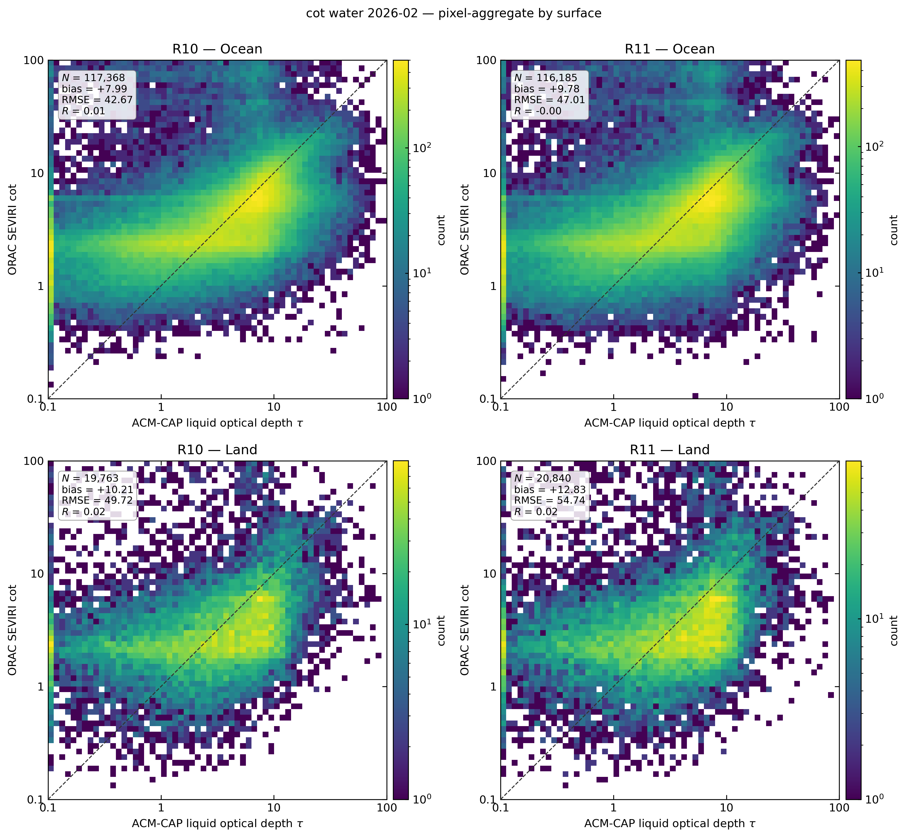

`compare_R10_R11_scatter_pixel_by_surface.png` — ocean (top) and land
(bottom). Ocean is ≈ 73 % of the sample; ocean bias (+6.2 R10 / +7.5 R11)
exceeds land (+3.9 / +5.3). The ocean / land contrast is the smaller
companion of the latitude effect.

### 1.6 Why is COT validation so much noisier than CTH?

Three structural reasons, in approximate order of importance:

1. **Phase ambiguity in ORAC's single-layer retrieval**. ACM-CAP gives a
   liquid τ even when there's overlying cirrus; ORAC, seeing the column,
   may retrieve ice or a mixed-phase τ that has no clean ACM-CAP analogue.
   `phase_agree_liquid` filters to the matched-phase subset and the
   correlation tightens, but the bias persists.
2. **Solar-illumination dependence**. ORAC's optical depth comes from
   visible / SWIR reflectance; ACM-CAP's liquid τ is anchored on lidar +
   radar with very different solar geometry sensitivity. The polar-bias
   signature is consistent with high-SZA forward-model error in ORAC.
3. **Sub-pixel inhomogeneity and the aggregation asymmetry**. The most
   physics-loaded of the three; worth unpacking.

   *Scales*: a SEVIRI full-disk pixel is ~ 3 km × 3 km at the sub-satellite
   point and grows to 5–7 km at 60° latitude (off-nadir geometry stretches
   the footprint). ATLID's nadir lidar samples every ~ 285 m along-track
   inside the pixel — typically 10–20 ATLID profiles per SEVIRI pixel.
   The two instruments do not measure the same volume.

   *The aggregation is asymmetric*. The pixel-aggregate view
   (`validation/statistics.py:343`, `aggregate_to_pixel_water`) builds the
   ATLID side as the mean of `liquid_optical_depth` **over only the
   strict-liquid profiles in the pixel** — mixed-phase, ice-only and clear
   ATLID profiles are masked out before the mean is taken. The ORAC side
   is the single retrieved value for the whole SEVIRI footprint; there is
   no sub-pixel filtering on the retrieval side, because ORAC sees the
   pixel-integrated radiance regardless of what is happening inside it.
   So we are comparing **the mean cloudy-only ATLID τ** to **the
   pixel-integrated ORAC τ**.

   Two mechanisms make this asymmetric comparison overestimate ORAC
   relative to ATLID:

   - **Partial-cloud + 1D forward model**. ORAC's forward model is
     plane-parallel — it assumes the pixel is fully cloud-filled. For
     pixels with cloud fraction f < 1, the observed TOA reflectance is a
     fraction-weighted sum of cloudy and clear contributions. Over bright
     surfaces (sea ice, snow, desert) the clear-sky contribution can be
     comparable to the cloudy part; the 1D model reproduces that extra
     reflectance by retrieving a *thicker* cloud than is actually present.
     ATLID's reference value, by construction, has had the clear-sky and
     non-liquid profiles purged before the mean is taken — so it is the
     true in-cloud τ. Whenever the pixel is partially cloudy and the
     surface is bright, ORAC > ATLID by construction. This is consistent
     with the latitude / surface gradient in the bias table (polar +18,
     land > ocean).
   - **3D / side-illumination effects on broken cumulus**. For broken
     cloud at moderate solar zenith angle, photons illuminate cloud sides
     and leak between adjacent cloud elements. The pixel is brighter than
     a 1D forward model of the cloudy column predicts. ORAC's 1D
     retrieval reproduces the extra brightness, again, with a thicker τ.

   Working in the opposite direction is the **plane-parallel albedo bias**
   (Cahalan et al. 1994): for sub-pixel τ heterogeneity the reflectance
   is a concave function of τ, so a single τ retrieved from a mean
   reflectance *underestimates* the cloudy-mean τ. This pushes
   ORAC < ATLID. The empirical sign of our bias (+7, growing to +18 at
   the pole) tells us the partial-cloud / surface-coupling mechanism wins
   over the plane-parallel albedo bias in the February 2026 SEVIRI
   sample.

These mechanisms add scatter on top of any genuine retrieval bias. The
all-stratum +7 bias is the net effect after pixel aggregation.

## 2. Ice-cloud COT vs A-EBD

### 2.1 Reference data

A-EBD (`ATL_EBD_2A`) is the ATLID-only Extinction-Backscatter-Depolarisation
product. The reference value is the **column-integrated 355 nm
extinction**:

```
τ_355 = Σ ext × Δh   over good-quality bins
```

(`validation/reference.py:cot_from_aebd` — `quality_status == 0` bins
only). This is genuinely an ATLID-only reference, not a synergy product;
ACM-CAP is not used here because its `ice_optical_depth` is a derived,
QC-fragile quantity that would shrink the sample drastically.

A profile is flagged **`attenuated`** when ATLID's 355 nm beam is
extinguished before the cloud column ends — typical for τ ≳ 3. For these
profiles the reported τ is a **lower bound** and they are excluded from the
headline view (`validation/cli.py:498` — "Headline view drops attenuated
(τ lower bounds, not point-comparable to ORAC)"). They are kept as a
diagnostic stratum.

The ice-only filter restricts to ORAC `phase_orac == 2` pixels. So this
section answers: *for SEVIRI pixels where ORAC retrieves an ice cloud, how
well does the retrieved τ match the ATLID column extinction?*

### 2.2 Headline numbers (R11, ice-only, qc_strict)

From `figures/validation/2026-02/ice/stats.csv`:

| stratum                  |   N    | bias  | RMSE | r_log |
| ------------------------ | ------ | ----- | ---- | ----- |
| **all (pixel)**          | 100 967 | +1.29 | 4.48 | 0.312 |
| **all (sample)**         | 332 097 | +0.96 | 4.22 | 0.380 |
| lat_tropics (sample)     | 153 448 | +0.96 | 3.59 | 0.319 |
| lat_midlat (sample)      | 142 052 | +0.92 | 4.58 | 0.377 |
| lat_polar (sample)       |  36 597 | +1.15 | 5.11 | 0.331 |
| ocean (sample)           | 219 925 | +0.89 | 4.20 | 0.408 |
| land (sample)            | 112 172 | +1.11 | 4.24 | 0.316 |
| tau_thin (0.15 ≤ τ < 1)  | 148 378 | +1.55 | 3.82 | 0.231 |
| tau_mid (1 ≤ τ < 3)      | 111 913 | +1.08 | 3.67 | 0.219 |
| tau_thick (3 ≤ τ < 10)   |  54 732 | −0.40 | 4.64 | −0.048 |
| tau_very_thick (τ ≥ 10)  |   2 780 | −12.88 | 16.46 | 0.105 |
| attenuated (sample)      | 567 773 | +3.33 | 8.13 | 0.175 |

The headline:

> **For ORAC's ice-phase pixels, ORAC overestimates ATLID column τ by ≈ 1
> with RMSE ≈ 4.2 (sample view) in February 2026. The bias is largely
> τ-band-dependent: thin ice +1.5, mid-thickness +1.1, thick ≈ 0,
> very-thick −13 (saturation against an attenuated lidar reference).
> r_log ≈ 0.38 (sample) — comparable to the water-cloud case once log
> scaling is used.**

Note the much smaller bias and RMSE compared to the water-cloud case (+1
vs +7, RMSE 4 vs 44). Both numbers are biased downward by the
**attenuated dropping**: optically thick ice columns are simply excluded
from the headline because the lidar can no longer measure them point-to-
point. The `attenuated` row in the stats table shows the world ATLID can't
fully resolve: 568 k profiles where τ is a lower bound; ORAC's τ exceeds it
by +3.3 on average, RMSE 8.1.

### 2.3 Figures — ice cloud

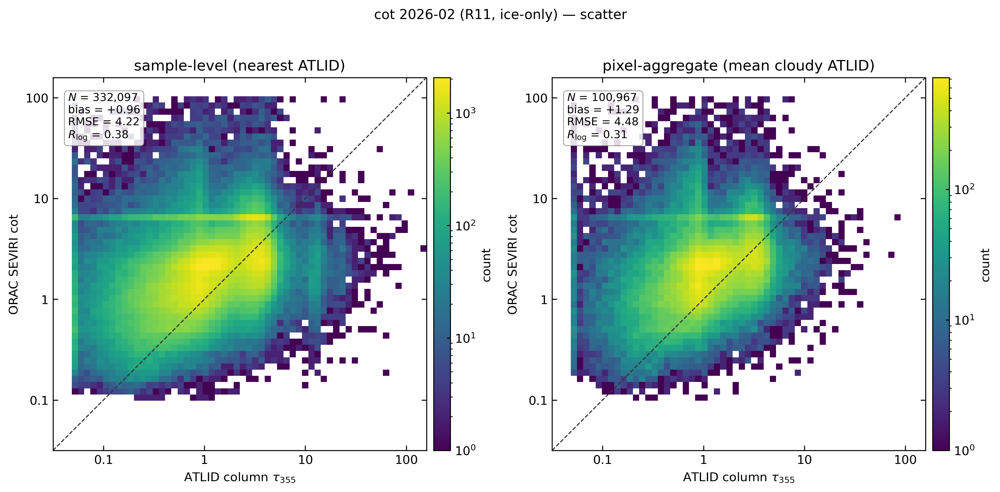

`figures/validation/2026-02/ice/cot_scatter.png` — sample (left) and pixel
(right) joint histograms on log axes for ORAC ice pixels vs ATLID column
τ. The principal ridge sits **right around the 1:1 line** for τ between 1
and 5 — the cleanly resolvable ice band. Above τ ≈ 5 the population
flattens horizontally because ATLID stops growing (saturation toward the
attenuation limit) while ORAC continues climbing. Below τ ≈ 0.5 the cloud
is broader and offset slightly above the diagonal — consistent with the
+1.5 bias in `tau_thin`.

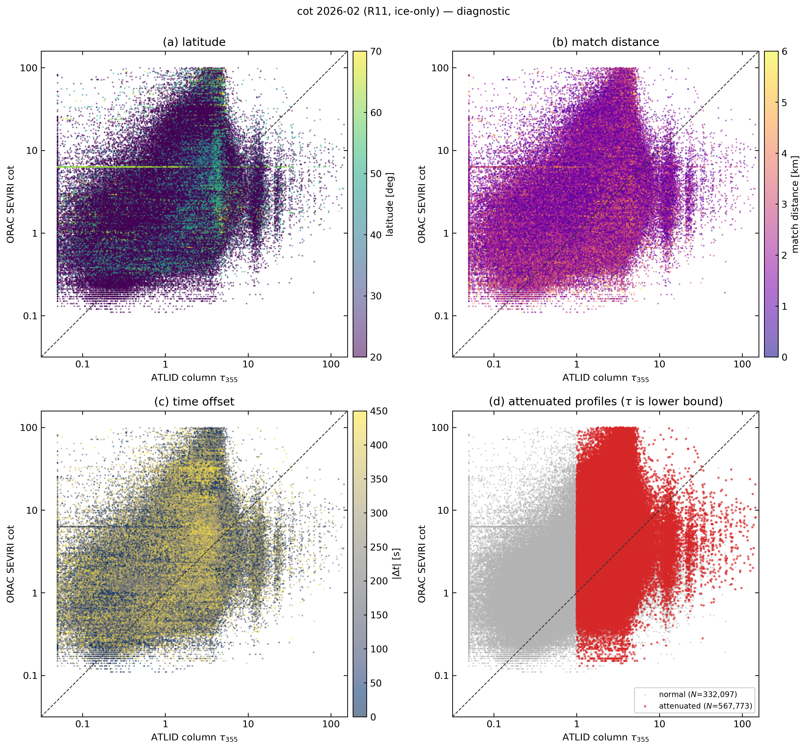

`figures/validation/2026-02/ice/cot_diagnostic.png` — coloured scatter
diagnostics.

- **(a) latitude** — bias does not have a clean latitudinal gradient (all
  three latitude strata sit within ±0.25 of each other). Different from
  the water-cloud case.
- **(b) match distance** and **(c) time offset** — flat. Geometry is not
  the issue.
- **(d) attenuated** — the red points (attenuated, N = 568 k) are
  the high-τ band the headline view excludes. They cluster at high ORAC τ
  with ATLID's column extinction stuck near the saturation level — the
  classic lower-bound shape. Including them flips the headline picture
  from "modest +1 bias" to "+3.3 bias, RMSE 8".

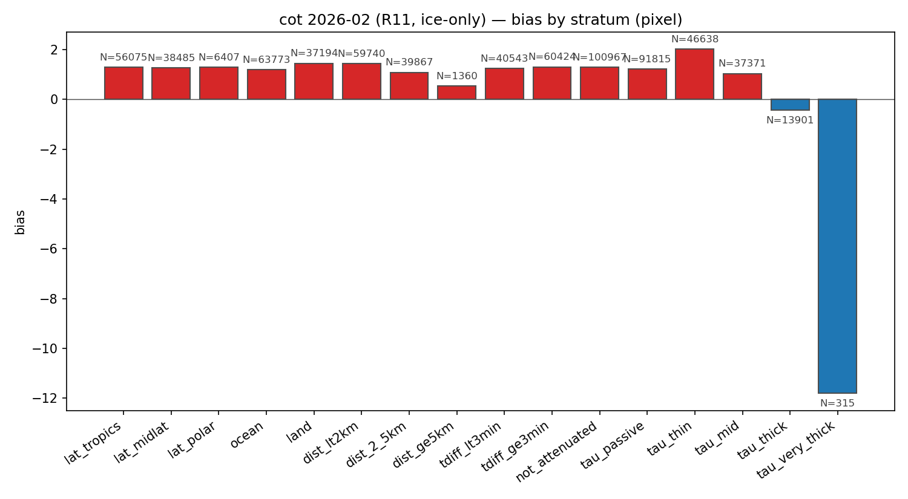

`cot_bias_by_stratum_pixel.png` — note the dominant feature: a small +1
ish bias across most strata, then a step change at `tau_very_thick` to
−12.9. That single bin (N = 315 in pixel view, 2 780 in sample) is the
ATLID-saturation regime; ORAC reports τ ~ 30 where ATLID can only
verify τ ≈ 5–10 because the lidar beam is gone. **It is a reference
limitation, not a retrieval failure.**

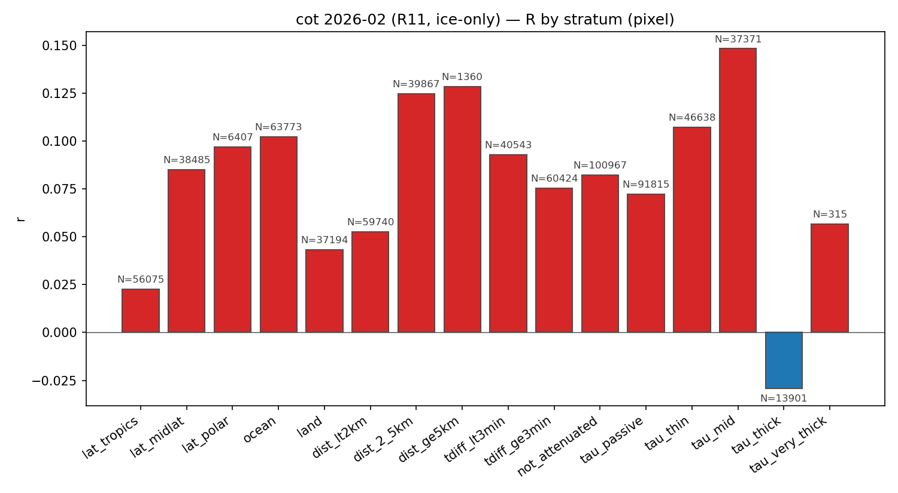

`cot_r_by_stratum_pixel.png` — linear r ranges 0 – 0.15 across strata, and
again, the meaningful number is `r_log` in the CSV (0.22 – 0.44 across
strata, with the highest r_log on the sub-3 km match-distance bin and the
synergy-anchored regimes).

### 2.4 Why ice COT looks better than water COT

1. The ice headline excludes the attenuated regime (τ ≳ 3 stop being
   point-comparable). The water case keeps the equivalent regime because
   ACM-CAP can retrieve τ through saturation by combining radar and
   lidar.
2. The ATLID column extinction is closer in physics to a passive optical
   depth than ACM-CAP's liquid scalar — both are integrals of extinction
   over a column.
3. Ice clouds are typically more spatially homogeneous on SEVIRI scales
   than broken stratocumulus, reducing sub-pixel scatter.

The ice section is therefore best read as: ORAC's ice optical depth is
within τ = 1 of the lidar reference for the τ < 5 regime where the
reference is reliable; above that the lidar saturates and the comparison
becomes a reference-side limitation rather than a retrieval-side one.

## 3. R10 vs R11 summary across cloud types

| metric                           | water-cloud τ R10  | water-cloud τ R11  | ice-only τ R11 |
| -------------------------------- | ------------------ | ------------------ | -------------- |
| all-stratum bias (pixel)         | +5.60              | +6.93              | +1.29          |
| all-stratum RMSE (pixel)         | 40.4               | 43.7               | 4.48           |
| all-stratum r_log (pixel)        | 0.363              | 0.335              | 0.312          |

R10 is marginally better than R11 on water-cloud τ (≈ 1.3 lower bias, 3
lower RMSE, 0.03 higher r_log). The R10-vs-R11 contrast on COT is small but
non-zero — unlike CTH, where the two streams are within rounding (see
`docs/reports/cth_validation_2026-02.md`). Any decision about which stream
to use for downstream COT applications should weigh this small advantage
against the other improvements baked into R11.

## 4. Conclusions

1. **Water-cloud τ is overestimated by ~ +7 (linear) with RMSE ~ 44** in
   February 2026, with `r_log ≈ 0.34`. The structural gradient is
   latitudinal: tropics +1.4 → midlat +9.7 → polar +18.1.
2. **The polar liquid bias is the single largest validation signal**.
   Likely drivers: high SZA, bright surfaces, and ACM-CAP's lower
   sensitivity to thin liquid in low-light conditions.
3. **Phase agreement matters**. Restricting to pixels where both ORAC and
   ACM-CAP agree the column is liquid (`phase_agree_liquid`, N = 308 k)
   keeps the bias high (+10.7) — i.e. the bias is *not* a phase-mismatch
   artefact; it is a real ORAC-vs-ACM-CAP disagreement on liquid τ.
4. **CPR contribution helps**. Pixels where ACM-CAP assimilated CPR
   (`atlid_radar_synergy`) show bias +3.7, vs +10.1 for ATLID-only. The
   synergy reference is more trusted.
5. **Ice-cloud τ is unbiased to within +1 for ORAC's ice pixels** at
   τ < 5. The −13 bias in `tau_very_thick` is a lidar-saturation effect,
   not an ORAC retrieval failure.
6. **R10 retains a small edge over R11 for water-cloud τ** (≈ 1.3 in
   linear bias, 3 in RMSE). For CTH the streams are statistically
   indistinguishable; on COT R11 is a small step backward but not a
   regression worth blocking deployment.
7. **Always read `r_log`, not `r`, for COT**. The linear correlation is
   uninformative on log-distributed data and is reported only because the
   shared statistics machinery emits it.

## 5. Reproducibility

```bash
# Water-cloud cot/cer collocation against R11 (uses ACM-CAP)
python -m validation collocate \
    --start 2026-02-01T00:00:00Z --end 2026-03-01T00:00:00Z \
    --driver ACM-CAP --retrieval R11 \
    --out validation_data/synergy_2026-02_R11

# Stats and figures
python -m validation cot-water-evaluate \
    --matches "validation_data/synergy_2026-02_R11/*.csv" \
    --out validation_data/cot_water_2026-02_R11.csv
python -m validation cot-water-figures \
    --matches "validation_data/synergy_2026-02_R11/*.csv" \
    --qc-mode qc_strict --label "cot water 2026-02 R11" \
    --out figures/cot_water_2026-02_R11

# Ice-only cot uses A-EBD (ATL_EBD_2A) and the standard cot CLI with the
# --ice-only flag. See validation/cli.py:_load_filtered for the filter.
python -m validation cot-figures \
    --matches "validation_data/cot_2026-02_R11/matches_*.csv" \
    --ice-only --label "cot 2026-02 (R11, ice-only)" \
    --out figures/validation/2026-02/ice
```

Inputs:

- `earthcare_data/ACM_CAP_2B/2026/0{1,2}/` (water-cloud reference, ATLID +
  CPR + MSI synergy).
- `earthcare_data/ATL_EBD_2A/2026/0{1,2}/` (ice-cloud reference,
  ATLID-only column extinction).
- ORAC SEVIRI L2 under `/gws/ssde/j25a/cloud_ecv/data_out/seviri/{R10,R11}/2026/02/`.

Tracked outputs:

- `validation_data/cot_water_2026-02_R{10,11}.csv` (water stats, all QC
  modes × views × strata).
- `figures/cot_water_2026-02_R{10,11}/` and `figures/cot_water_2026-02_compare/`.
- `figures/validation/2026-02/ice/` (ice-only figures and `stats.csv`).
