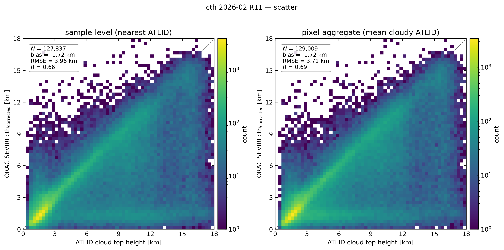
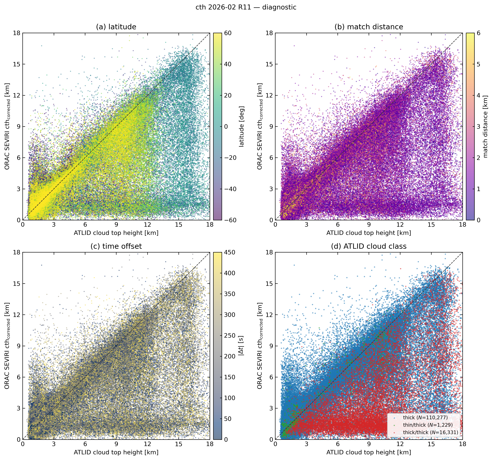
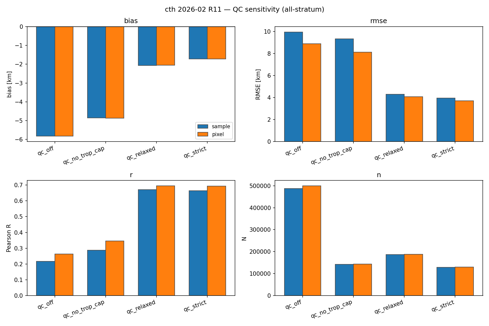
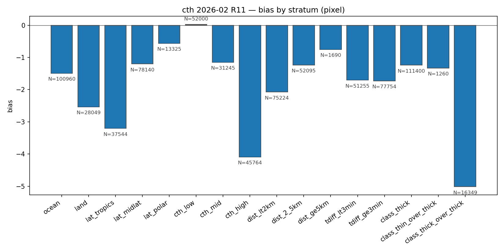
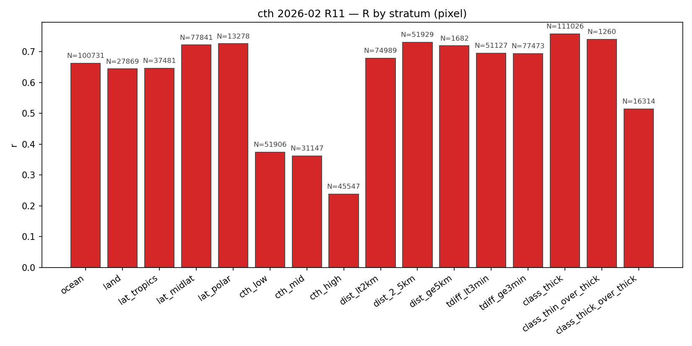
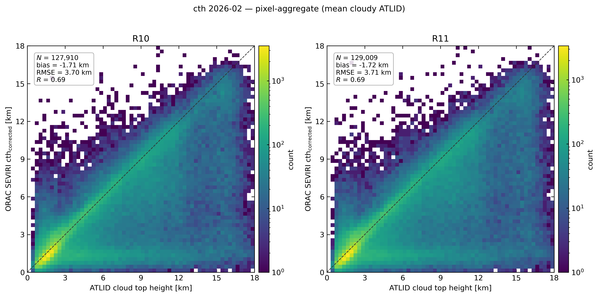
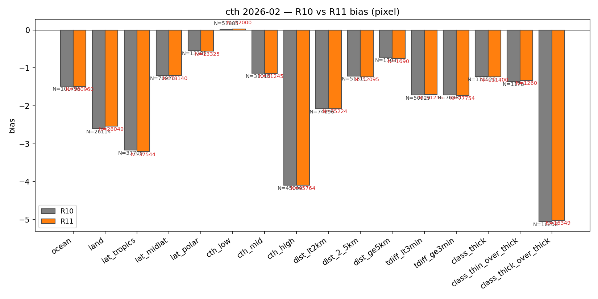
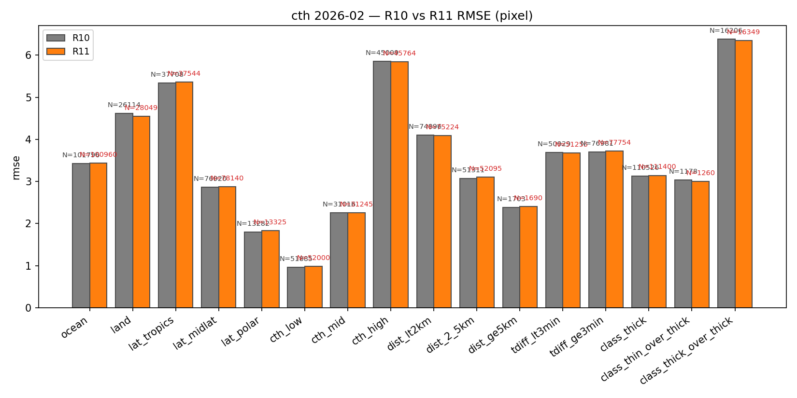
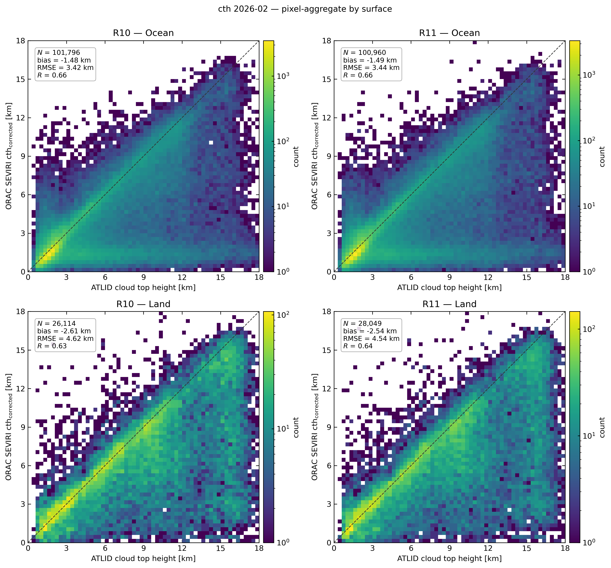

# ORAC SEVIRI cloud-top-height validation against EarthCARE A-CTH — February 2026

This report describes the cloud-top-height (CTH) validation of ORAC SEVIRI
retrievals against the EarthCARE ATLID-only level-2 product `ATL_CTH_2A`
(A-CTH) for the validation month **February 2026**, comparing the two
ORAC retrieval streams **R10** and **R11**.

## 1. Reference data and method

### 1.1 EarthCARE reference: A-CTH (ATL_CTH_2A)

A-CTH is the only EarthCARE product wired into the CTH validation path. It is
preferred over the synergy AM-CTH for two reasons:

1. The collocator (`validation/collocate.py:91`,
   `match_track_to_seviri`) is a 1-D nadir-track → SEVIRI-pixel match.
   ATLID's nadir lidar gives one CTH per profile, directly comparable to the
   SEVIRI grid; AM-CTH spans the 150-km MSI swath and would need
   footprint-area matching that has not been built.
2. The "thick" cloud-top from A-CTH is the **uppermost optically-thick top**
   — the surface a passive 0.6 / 1.6 / 11 µm retrieval like ORAC actually
   senses. It is the closest physical analogue to ORAC's `cth_corrected`.

Two A-CTH heights are kept per profile
(`validation/readers.py:56`, `validation/reference.py:179`):

| ATLID field                       | Stored as                | Role                                                      |
| --------------------------------- | ------------------------ | --------------------------------------------------------- |
| `ATLID_thick_cloud_top_height`    | `cth_atlid_thick_km`     | **Headline reference** — passive-equivalent thick top    |
| `ATLID_cloud_top_height`          | `cth_atlid_raw_km`       | Diagnostic — 11-profile averaged top, sees thin cirrus    |
| `ATLID_cloud_top_height_confidence` | `confidence_atlid`     | QC stratifier                                             |
| `quality_status`                  | `quality_status_atlid`   | QC stratifier (-1 no cloud, 0 good, 1–3 warnings, 4 bad)  |
| `simplified_uppermost_cloud_classification` | `cloud_class_atlid` | thick / thin / thin-over-thick / thick-over-thick         |
| `tropopause_height_wmo`           | `tropopause_km_atlid`    | Sanity cap (`cth ≤ trop + 2 km`)                          |

Heights are converted m → km AMSL by `cth_from_acth`. Both references are
above mean sea level so no geoid offset is applied.

### 1.2 Collocation

`match_track_to_seviri` pairs each ATLID profile with the nearest SEVIRI pixel
of the matching scan slot, with a default tolerance of
`max_time_diff_seconds = 450 s` (≈ 7.5 min). Matched columns are written
per A-CTH frame to `validation_data/cth_2026-02_R{10,11}/matches_cth_<frameID>.csv`
along with `distance_km`, `time_diff_s`, `valid_match`, ATLID QC fields, and
ORAC `cth`, `cth_corrected`, `cldmask`, `lsflag`, `phase`. **No QC is applied
during collocation** — QC is left as a stratifier so it can be re-tuned at
evaluate time without re-running the (expensive) match.

### 1.3 Two views: sample vs pixel

For each match table two derived views are built (`statistics.py`):

- **sample** — one row per SEVIRI pixel, the row whose ATLID profile is
  closest to the pixel centre (`dedupe_to_sample`).
- **pixel** — group by `sev_pixel_id` and average ATLID over cloudy profiles
  (`aggregate_to_pixel_cth`); ORAC is constant within a pixel, so its value is
  taken `first`. The mean over multiple ATLID profiles inside one SEVIRI
  footprint is the most representative comparison and is the **headline view**.

### 1.4 QC modes

Four QC pre-filters (`CTH_QC_MODES`) are applied as the base mask before
sample / pixel views are built:

| QC mode           | Definition                                                              |
| ----------------- | ----------------------------------------------------------------------- |
| `qc_off`          | All cloudy & paired rows                                                |
| `qc_strict`       | `quality_status == 0` & `confidence ≥ 5` & `cth_thick ≤ trop + 2 km`    |
| `qc_relaxed`      | `quality_status ∈ {0,1}` & `confidence ≥ 3` & `cth_thick ≤ trop + 2 km` |
| `qc_no_trop_cap`  | strict QS + confidence, no tropopause cap (exposes stratospheric tail)  |

The headline tables and figures use **`qc_strict`** unless stated otherwise.

### 1.5 Strata

`cth_strata` (`statistics.py:467`) cuts each filtered table into:

- **surface**: ocean / land (from ORAC `lsflag`)
- **latitude**: tropics (|lat| < 30°) / midlat (30°–60°) / polar (≥ 60°)
- **height bins** (binned on the ATLID reference): low (< 3 km) / mid
  (3–7 km) / high (≥ 7 km)
- **match distance**: < 2 km / 2–5 km / ≥ 5 km
- **time offset**: < 3 min / ≥ 3 min
- **ATLID cloud class**: thick / thin / thin-over-thick / thick-over-thick

Headline statistics for each stratum: `N`, `bias = ORAC − ATLID`, `RMSE`,
`MAE`, Pearson `R`, slope, intercept.

## 2. Headline results (R11, qc_strict, pixel view)

| stratum               |   N     | bias (km) | RMSE (km) |  R   |
| --------------------- | ------- | --------- | --------- | ---- |
| **all**               | 129 009 |  −1.72    |   3.71    | 0.69 |
| ocean                 | 100 960 |  −1.49    |   3.44    | 0.66 |
| land                  |  28 049 |  −2.54    |   4.54    | 0.64 |
| lat_tropics           |  37 544 |  −3.21    |   5.37    | 0.65 |
| lat_midlat            |  78 140 |  −1.20    |   2.87    | 0.72 |
| lat_polar             |  13 325 |  −0.56    |   1.83    | 0.72 |
| cth_low (< 3 km)      |  52 000 |  +0.03    |   0.99    | 0.37 |
| cth_mid (3–7 km)      |  31 245 |  −1.15    |   2.26    | 0.36 |
| cth_high (≥ 7 km)     |  45 764 |  −4.09    |   5.84    | 0.24 |
| class_thick           | 111 400 |  −1.24    |   3.14    | 0.76 |
| class_thin_over_thick |   1 260 |  −1.33    |   3.01    | 0.74 |
| class_thick_over_thick|  16 349 |  −5.02    |   6.35    | 0.51 |

R10 numbers are within 0.01 km of R11 in every stratum (full table:
`figures/cth_2026-02_compare/compare_R10_R11_stats.csv`).

The all-stratum headline:

> **ORAC SEVIRI underestimates ATLID thick-cloud-top height by ~1.7 km RMSE
> 3.7 km, R 0.69 in February 2026, with R10 and R11 effectively tied.**

The bias is overwhelmingly driven by deep tropical multi-layer clouds (the
`class_thick_over_thick`, `cth_high`, and `lat_tropics` strata).

## 3. Figures

All figure paths below are relative to the repository root.

### 3.1 Headline scatter (qc_strict)



`figures/cth_2026-02_R11/cth_scatter.png` — joint histogram of ORAC
`cth_corrected` vs ATLID thick-cloud-top, log-density colour bar, 0–18 km on
both axes.

- **Left (sample)** — one row per SEVIRI pixel, nearest ATLID profile
  (N ≈ 128 k, bias −1.72 km, RMSE 3.96 km, R 0.66).
- **Right (pixel)** — ATLID averaged over cloudy profiles inside each SEVIRI
  pixel (N ≈ 129 k, bias −1.72 km, RMSE 3.71 km, R 0.69). Pixel aggregation
  removes some of the small-scale ATLID noise; RMSE drops by ~0.25 km and
  R climbs by 0.03.

The dominant feature in both panels is a triangular cloud of points below the
1:1 line with ATLID heights between 9 and 18 km. ORAC's distribution is
truncated near 13–14 km, so any high tropical cloud above that ceiling
collapses onto the upper-mid SEVIRI heights — that is the structural source of
the negative bias.

### 3.2 Diagnostic panels



`figures/cth_2026-02_R11/cth_diagnostic.png` — same scatter coloured by four
covariates.

- **(a) latitude** — the population below the 1:1 line is overwhelmingly
  tropical (yellow, |lat| < 30°). Mid- and high-latitude points sit
  along the diagonal.
- **(b) match distance** — geometry is not the problem. Points within 2 km
  of the SEVIRI pixel centre and points 4–6 km away populate the same
  cloud; the bias is not a parallax or pointing artefact.
- **(c) time offset** — the bias is constant from ∆t = 0 to ∆t = 450 s.
  Cloud advection on 7-min timescales is not driving the disagreement.
- **(d) ATLID cloud class** — thick single-layer (blue, N = 110 277) sits on
  the diagonal. Thick-over-thick (red, N = 16 331) is the population that
  produces the strong negative bias: ATLID reports the upper top, ORAC
  retrieves the lower thick top — the classic passive-IR multi-layer
  ambiguity.

### 3.3 QC sensitivity



`figures/cth_2026-02_R11/cth_qc_sensitivity.png` — all-stratum bias / RMSE /
R / N for the four QC modes.

- `qc_off` and `qc_no_trop_cap` are *not* representative — they retain bins
  where ATLID flags low confidence or stratospheric heights, and produce
  apparent bias of −5 to −6 km and R below 0.35.
- `qc_relaxed` and `qc_strict` agree to within 0.1 km in bias and 0.4 km in
  RMSE; `qc_strict` retains 60 % of the relaxed sample (≈ 128 k vs 186 k),
  and is used as the headline.
- The bottom-right panel quantifies the cost of strict QC: it removes
  ~360 k of the 490 k available pairs.

### 3.4 Bias and R by stratum



`figures/cth_2026-02_R11/cth_bias_by_stratum_pixel.png` — bias (ORAC − ATLID,
km) per stratum.

- **`cth_high` and `class_thick_over_thick` are the worst** at −4.1 km and
  −5.0 km respectively. Together they account for almost the entire
  all-stratum bias.
- **Tropics −3.2 km, midlat −1.2 km, polar −0.6 km** — bias has a clean
  latitudinal structure that follows where deep / multi-layer clouds live.
- **Low cloud (cth < 3 km) bias ≈ 0** — passive SEVIRI gets the height of
  marine stratocumulus and shallow boundary-layer cloud essentially right.
- Distance and time-offset strata are flat — bias does not depend on
  collocation geometry.



`figures/cth_2026-02_R11/cth_r_by_stratum_pixel.png` — Pearson R per stratum.

- R is highest where the cloud population is mostly thick single-layer:
  **class_thick R = 0.76**, midlat R = 0.72, polar R = 0.72.
- R collapses in the height-bin strata (R = 0.24 / 0.36 / 0.37) because each
  bin has limited dynamic range — once the variable is restricted to a 3-km
  window the residual scatter dominates the signal.
- `class_thick_over_thick` falls to R = 0.51 — confirming this is the noisy,
  multi-layer regime.

## 4. R10 vs R11 comparison



`figures/cth_2026-02_compare/compare_R10_R11_scatter_pixel.png` — pixel-view
joint histograms side-by-side.

The two retrieval streams are visually indistinguishable at this resolution:
both have the same triangular tail, the same axis truncation at 13–14 km,
and the same all-stratum statistics (bias −1.71 / −1.72 km, RMSE 3.70 / 3.71
km, R 0.69 / 0.69).




`figures/cth_2026-02_compare/compare_R10_R11_bias_pixel.png` and
`compare_R10_R11_rmse_pixel.png` — bias / RMSE bar charts comparing the two
streams across all strata. **Every stratum agrees within 0.1 km bias and
0.05 km RMSE**, including `class_thick_over_thick` (R10 −5.05 km, R11
−5.02 km) and `cth_high` (R10 −4.09 km, R11 −4.09 km). The R10 → R11
upgrade does **not** materially change CTH performance.



`figures/cth_2026-02_compare/compare_R10_R11_scatter_pixel_by_surface.png` —
ocean (top) and land (bottom) for R10 and R11.

- **Ocean** dominates the sample (≈ 101 k pixels, 78 % of the total)
  with bias −1.49 km, RMSE 3.44 km, R 0.66.
- **Land** is noisier and has a stronger negative bias (≈ 28 k, bias
  −2.54 km, RMSE 4.54 km, R 0.64). This is consistent with the surface
  emissivity / lapse-rate sensitivity of passive split-window CTH.
- R10 and R11 are within rounding in both surface classes.

## 5. Conclusions

1. **Reference choice was sound.** A-CTH `ATLID_thick_cloud_top_height` is
   the right passive-equivalent target; the collocator's 1-D nadir match
   keeps geometry tight (the bias does not depend on `distance_km` or
   `time_diff_s`).
2. **ORAC CTH is unbiased for low cloud.** Marine stratocumulus and
   boundary-layer cloud (< 3 km) sit on the 1:1 line with bias ≈ 0 and
   RMSE < 1 km.
3. **The headline negative bias is a multi-layer / high-cloud effect.**
   Deep tropical convection (`cth_high`, `lat_tropics`) and overlapping
   thick-over-thick cloud generate the −1.7 km all-stratum bias. ORAC's
   ceiling near ~13–14 km truncates the upper distribution.
4. **R10 and R11 are statistically indistinguishable for CTH.** Differences
   are below 0.1 km in every stratum. Any retrieval-stream comparison should
   shift to optical depth and effective radius, where the streams differ.
5. **QC matters.** `qc_off` and `qc_no_trop_cap` look much worse than the
   retrieval really is — these include profiles flagged low-confidence or
   stratospheric by ATLID itself. Use `qc_strict` as the headline; report
   `qc_relaxed` as a sample-size sensitivity.

## 6. Reproducibility

```bash
# Collocate February 2026 against R11
python -m validation cth-collocate \
    --start 2026-02-01T00:00:00Z --end 2026-03-01T00:00:00Z \
    --retrieval R11 --out validation_data/cth_2026-02_R11

# Per-QC stats
python -m validation cth-evaluate \
    --matches "validation_data/cth_2026-02_R11/matches_cth_*.csv" \
    --out validation_data/cth_2026-02_R11.csv

# Figures (qc_strict, pixel)
python -m validation cth-figures \
    --matches "validation_data/cth_2026-02_R11/matches_cth_*.csv" \
    --qc-mode qc_strict --label "cth 2026-02 R11" \
    --out figures/cth_2026-02_R11
```

Inputs:

- A-CTH frames under `earthcare_data/ATL_CTH_2A/2026/0{1,2}/`
  (mirrored via `python -m earthcare download A-CTH …`).
- ORAC SEVIRI L2 under
  `/gws/ssde/j25a/cloud_ecv/data_out/seviri/{R10,R11}/2026/02/`.

Outputs (tracked in git):

- `validation_data/cth_2026-02_R{10,11}.csv` — stratified stats across QC
  modes × views.
- `figures/cth_2026-02_R{10,11}/` — single-stream figures.
- `figures/cth_2026-02_compare/` — R10 vs R11 figures and merged stats CSV.
