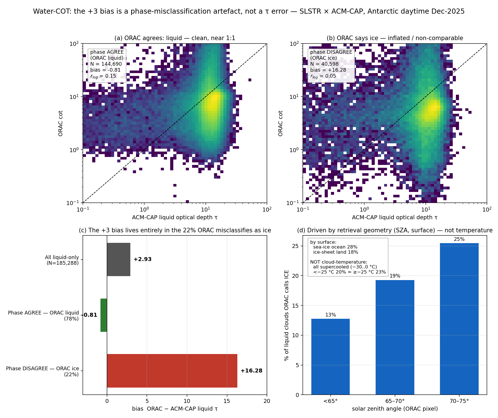
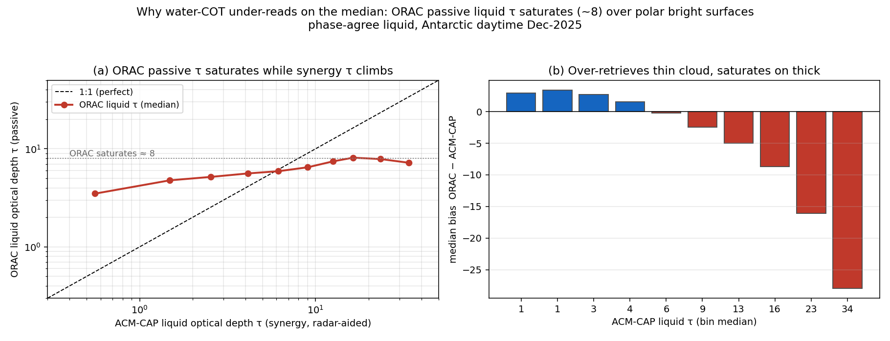
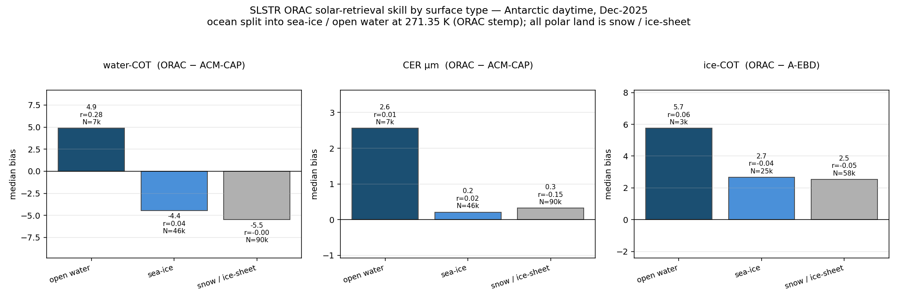
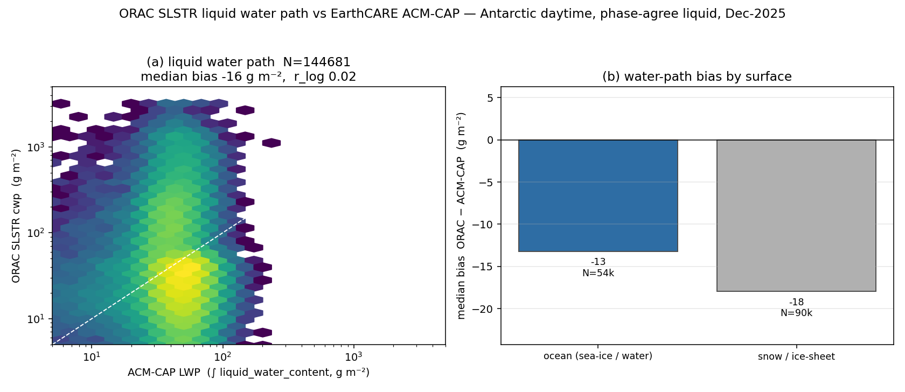

# ORAC SLSTR water-cloud optical-thickness validation against EarthCARE ACM-CAP — December 2025

Liquid-cloud optical thickness (COT) validation of **ORAC SLSTR** (Sentinel-3A)
against the ACM-CAP synergy `liquid_optical_depth` (`ACM_CAP_2B`, ATLID + CPR +
MSI), for **December 2025**. Completes the SLSTR trio with CTH
(`docs/reports/slstr_cth_2025-12.md`) and ice COT
(`docs/reports/slstr_cot_ice_2025-12.md`). Method inherited from the SEVIRI
water-COT study; collocation is the polar-crossing SLSTR × ATLID match (60-min,
~0.4 km).

## 1. Sample — Antarctic-summer daytime (as for ice COT)

The same two filters compound as in the ice-COT report: the collocation is
polar-only (~78–82°), and COT needs sunlight so night pixels are dropped
(`illum_orac == 1`, **14.9 % of matches kept**). In December this is the
**Antarctic in polar summer** — Southern hemisphere, solar zenith ~69°, over
sea-ice, ice shelf and open Southern Ocean. Read the numbers as the polar-summer
bright-surface behaviour, not a global water-COT verdict.

## 2. Reference and method

- **Reference**: ACM-CAP `liquid_optical_depth` — a per-profile scalar liquid τ
  from the variational ATLID+CPR+MSI retrieval (read directly, no integration).
- **Headline stratum** `water_pure_pixel`: SLSTR pixels where ≥ 80 % of the
  cloudy ATLID profiles are liquid-only — the apples-to-apples liquid comparison.
- **QC**: ACM-CAP `quality_status == 0` (`qc_strict`).
- **Compared quantity**: ORAC `cot` vs ACM-CAP liquid τ, log axes; **`r_log`** is
  the meaningful correlation.

Coverage: **N = 173 015 SLSTR pixels** (pixel view; sample-level identical to 3 sf).

## 3. Headline results (qc_strict, pixel, water-pure)

**Report the median bias, not the mean.** COT is heavy-tailed (log-distributed
over three decades); the mean in linear τ is dominated by a small high-τ tail and
here it even **flips sign** relative to the typical pixel. The median is the
robust headline; the mean is shown alongside as a skew-sensitive diagnostic.

| stratum                    |    N    | **median bias** | mean bias (skewed) | RMSE (τ) | r_log |
| -------------------------- | ------- | --------------- | ------------------ | -------- | ----- |
| **all (= S-polar)**        | 173 015 | **−4.78**       | +3.12              | 35.8     | 0.11  |
| ocean (sea-ice / S. Ocean) |  70 648 | −4.22           | +5.46              | 37.4     | 0.17  |
| land (ice shelf / coast)   | 102 367 | −5.16           | +1.50              | 34.6     | 0.07  |
| phase_agree_liquid         | 134 663 | −4.86           | −0.65              | 20.3     | 0.15  |

*95% confidence intervals are tight and exclude zero* (all-stratum median
**−4.78 [−4.81, −4.75]**, mean +3.12 [+2.95, +3.28], N = 173 015) — the biases
are statistically significant, not sampling noise. (Median CI is the
distribution-free order-statistic interval; mean CI is ±1.96 SE.)

The headline:

> **On the median (the typical pixel), ORAC SLSTR *underestimates* ACM-CAP liquid
> τ by ≈ 5 (median bias −4.8; ORAC median τ 6.9 vs ACM-CAP 12.1) throughout the
> polar-daytime sample.** The frequently-quoted "+3 mean bias" is a **skew
> artefact** — a minority of very-high-τ pixels drags the linear mean positive,
> even reversing its sign. Correlation is weak (r_log ≈ 0.11), the expected noise
> of polar-daytime COT.

Two distinct effects, which the mean conflates and the median/§3c separate:

1. **A typical underestimate (median −5).** ORAC's passive liquid τ sits below the
   ACM-CAP synergy τ for the bulk of pixels — visible as the density ridge
   *below* the 1:1 line in the scatter. This holds even in `phase_agree_liquid`
   (median −4.9), so it is a genuine liquid-τ difference, not a phase effect.
2. **A high-τ tail that inflates the mean**, concentrated in the pixels ORAC
   misclassifies as ice (§3c). This is what turns a −5 median into a +3 mean, and
   it is worst at the lower polar latitudes (70–75°: median +1 but mean +29).

> **Net:** ORAC liquid τ typically runs a few τ *low* against the synergy
> reference; the "+3 overestimate" seen in the mean is not representative and is
> driven by a skewed tail plus phase misclassification.

## 3b. Polar sub-band gradient

Splitting the polar band (qc_strict, pixel) shows the +3 all-stratum bias is not
uniform — it is concentrated at the **lower** polar latitudes:

| stratum    |   N    | bias (τ) | RMSE (τ) | r_log |
| ---------- | ------ | -------- | -------- | ----- |
| lat 70–75° | 10 735 | **+29.2**| 69.6     | 0.16  |
| lat 75–80° | 79 726 | +5.36    | 40.6     | 0.09  |
| lat 80–85° | 82 554 | **−2.44**| 21.6     | 0.15  |

At 80–85° the water-COT bias is actually near zero / slightly negative with RMSE
halved; the large positive bias lives at 70–75° (the sea-ice edge / more broken,
optically thicker cloud with the brightest partial-cloud contrast). The ice-COT
report shows the same monotonic improvement poleward (+13 → +5.8). This localises
the bright-surface / partial-cloud inflation to the marginal-ice-zone latitudes.

## 3c. Where the +3 bias comes from — phase misclassification

Decomposing the comparison by whether ORAC and ACM-CAP **agree on phase** shows
the +3 bias is not a τ-retrieval error at all — it is an artefact of ORAC
misclassifying some liquid clouds as ice. Restricting to ACM-CAP liquid-only,
qc_strict, daytime profiles (N = 185 288):



| Subset | Fraction | Bias (τ) | r_log |
| ------ | -------- | -------- | ----- |
| All liquid-only | 100 % | **+2.93** | 0.11 |
| **Phase agree** (ORAC also liquid) | **78 %** | **−0.81** | 0.15 |
| **Phase disagree** (ORAC says ice) | **22 %** | +16.3 (skewed) | 0.05 |

- **(a) Where ORAC agrees it is liquid** (78 %), its liquid τ tracks ACM-CAP on
  the 1:1 line — **bias −0.81**. This is a genuinely good liquid-COT result.
- **(b) Where ORAC misclassifies the cloud as ice** (22 %), the comparison is
  ORAC's *ice*-cloud τ against ACM-CAP's *liquid* τ — a different physical
  quantity. It is **decorrelated (r_log 0.05)**: the bulk actually sits *below*
  the 1:1 line, but a heavy high-τ tail pulls the **mean** to +16. It is noise,
  not a systematic offset.
- **(c)** The all-stratum +2.93 is just the weighted mean:
  0.78 × (−0.81) + 0.22 × (+16.3) ≈ +2.9 — **the entire bias is carried by the
  22 % misclassified subset**.
- **(d) What drives the misclassification — retrieval geometry, not cloud
  temperature.** Augmenting the matches with ORAC cloud-top temperature shows
  these are *all* supercooled-liquid clouds (−30 to 0 °C), and the
  misclassification rate is **flat across that range** (20 % below −25 °C ≈ 23 %
  above) — so it is **not** a "cold top read as ice" effect. Instead it tracks
  where the passive retrieval is *hardest*: the rate **more than doubles with
  solar-zenith angle** (13 % at SZA < 65° → 25 % at 70–75°) and is worse over
  bright **sea-ice ocean (28 %)** than the ice sheet (18 %). It is a low-sun /
  bright-surface retrieval-difficulty effect on a genuinely supercooled-liquid
  population.

**Phase-detection skill.** Treated as a validation target in its own right, ORAC
correctly identifies **78 %** of ACM-CAP-confirmed liquid clouds as liquid
(POD_liquid; N = 185 658). This skill **degrades with sun-zenith** (87 % at
SZA < 65° → 75 % at 70–75°) and is **worse over sea-ice ocean (72 %) than the ice
sheet (82 %)**. *This one-way, liquid-only estimate has since been superseded* by a
full two-way contingency against **A-TC** (ATLID Target Classification) —
`docs/reports/slstr_phase_2025-12.md`. With that proper reference **POD_liquid =
89.5 %** and, for the first time, **POD_ice = 62.4 %**: ORAC misclassifies **38 % of
ice cloud tops as liquid**, a larger and more consequential error than the
liquid→ice confusion discussed here. The liquid bias is the same mechanism, now
measured on both sides.

**Two stacked effects (not one).** Note this section (phase) and §3d (saturation)
are *different*: even where phase agrees, ORAC's liquid τ still under-reads on the
median (−4.9) because of the saturation in §3d. So the water-COT picture is:
(1) ORAC's passive liquid τ **saturates** (median −5, §3d), *and* (2) it
**misclassifies 22 % of liquid cloud as ice** (this section), which adds a high-τ
tail that flips the *mean* to +3. The mean's positive sign is the misclassification
artefact; the median's negative sign is the real, saturation-driven behaviour.

## 3d. Root cause of the median underestimate — ORAC passive τ saturates

The median −5 underestimate (§3) is attributed to **ORAC's passive liquid τ having
almost no dynamic range** over polar bright surfaces at high sun-zenith. Binning
the phase-agree liquid pixels by ACM-CAP τ:



| ACM-CAP τ (synergy) | ORAC median τ | median bias |
| ------------------- | ------------- | ----------- |
| 0.6  | 3.5 | **+2.9** |
| 6.2  | 5.9 | −0.2 |
| 12.5 | 7.4 | −5.0 |
| 16.3 | 8.1 | −8.7 |
| 33.9 | 7.2 | **−27.9** |

- **ORAC liquid τ is pinned near ~5–8 across the *entire* ACM-CAP range (0.6 to
  34)** — it cannot tell a τ = 6 cloud from a τ = 34 cloud; both come out ≈ 7.
- This single fact explains the whole water-COT result:
  (i) it **over-retrieves thin cloud** (+3 at τ < 3),
  (ii) it **saturates and under-retrieves thick cloud** (−28 at τ ≈ 34),
  (iii) the **median is −5** because most polar liquid cloud sits in the τ 7–15
  band where ORAC caps at ~7, and
  (iv) the **near-zero correlation** (r_log 0.11, R −0.04) follows directly — a
  retrieval with no dynamic range cannot correlate with anything.
- **It is ORAC that saturates, not ACM-CAP that is high**: whether the synergy
  used CPR changes the bias by only ~1 τ (−5.5 with CPR vs −4.4 without), so the
  radar is not inflating ACM-CAP; the passive retrieval has genuinely lost
  sensitivity.

**Physical cause:** over a bright snow/ice surface at high solar zenith the
cloud-to-surface reflectance contrast is small, so adding optical depth barely
changes the TOA reflectance — the visible/SWIR retrieval loses the information it
needs and collapses toward a near-constant τ. This is the polar-bright-surface
limit of passive COT, and it is the deepest limitation the SLSTR × EarthCARE
comparison exposes.

## 3e. Surface-type stratification — the deficit is cryospheric, and it is the surface, not the phase

§3d argues the underestimate is a *bright-surface* effect. §3e proves it by
splitting every matched pixel by its ORAC surface class (surface temperature
`stemp` + land/sea flag). In the Antarctic-summer daytime sample **95 % of pixels
are sub-freezing and every land pixel is ice sheet**, so the only cryosphere
contrast lives inside the ocean: **sea-ice** (frozen ocean, `stemp` < 271.35 K)
vs the rare **open water** (`stemp` ≥ 271.35 K, ~5 %), against the **snow /
ice-sheet** land.



| product | surface | N | **median bias** | mean bias | RMSE | r |
| ------- | ------- | -- | --------------- | --------- | ---- | -- |
| **water-COT** | open water        |  7 k | **+4.9** | +20.5 | 45.0 | **+0.28** |
|               | sea-ice           | 47 k | **−4.4** |  +1.1 | 24.1 |  +0.04 |
|               | snow / ice-sheet  | 91 k | **−5.5** |  −3.6 | 13.1 |  −0.00 |
| **CER** | open water        |  7 k | +2.6 | +3.2 | 6.2 | +0.01 |
|         | sea-ice           | 47 k | **+0.2** | +1.1 | 4.4 | +0.02 |
|         | snow / ice-sheet  | 91 k | **+0.3** | +3.4 | 8.3 | −0.15 |
| **ice-COT** | open water        |  4 k | +5.7 | +34.3 | 81.2 | +0.06 |
|             | sea-ice           | 26 k | +2.7 | +18.2 | 58.7 | −0.04 |
|             | snow / ice-sheet  | 58 k | +2.5 | +36.4 | 86.1 | −0.05 |

**The single clearest result of the whole comparison:** water-COT is the *only*
stratum anywhere that shows a **positive correlation — and it is open water**
(r = +0.28), where ORAC even swings to a **+5 median overestimate**. The instant
the surface turns to sea-ice or ice sheet, the correlation **collapses to zero**
(r 0.04, −0.00) and the bias flips to the **−4 to −5 underestimate** of §3. This
is exactly the fingerprint §3d predicted: over a **dark** ocean background the
passive solar retrieval has cloud-to-surface reflectance contrast and behaves like
a working τ retrieval; over the **bright** cryosphere it loses that contrast,
saturates (§3d), and decorrelates. **The deficiency is the radiative regime of the
surface, not an algorithm bug and not the cloud phase** — over the same clouds,
only the background changed.

Two corollaries for the meeting:

- **CER is surface-robust where COT is not.** Effective radius is near-perfect
  over the cryosphere (median +0.2 µm sea-ice, +0.3 µm ice sheet) and only drifts
  over open water (+2.6). CER comes from the 1.6/2.1 µm absorption *ratio*, which
  is far less sensitive to surface-albedo contrast than the τ magnitude — so the
  `new_snowice` retrieval delivers trustworthy droplet size over snow/ice even
  where it cannot constrain optical depth.
- **Ice-COT is only weakly surface-differentiated** (median +2.5 to +2.7 across
  sea-ice and ice sheet, +5.7 over open water): the A-EBD ice reference and the
  thermally-anchored ice retrieval are less hostage to solar surface contrast than
  the liquid solar retrieval, though the wide RMSE (59–86) shows large per-pixel
  scatter remains.

**Bottom line:** the `new_snowice` build's water optical-depth skill is
**surface-limited** — usable (positive-correlation) only over open water, which is
~5 % of the polar-daytime scene; over the 95 % that is sea-ice or ice sheet it
provides a robust *droplet size* but a saturated, decorrelated optical depth.
Improving polar liquid τ therefore requires a surface-albedo / snow-BRDF advance,
not a phase or QC fix.

## 3f. Liquid water path — the τ saturation propagates into the water budget

The last synergy variable. ORAC's `cwp` (total cloud water path, g m⁻²) is
compared against an **independent** ACM-CAP reference — the radar+lidar
`liquid_water_content` profile integrated to a liquid water path (LWP), *not* a
τ-derived quantity — for the phase-agree liquid, qc_strict, daytime sample. Each
matched pixel is joined to its ACM-CAP profile by `ec_time` (exact match, |Δt| =
0 s).



| stratum | N | ORAC median | ACM-CAP median | **median bias** | mean bias | r_log |
| ------- | -- | ----------- | -------------- | --------------- | --------- | ----- |
| all (phase-agree liquid) | 145 k | 30 | 47 | **−16** (−34 %) | +28 | 0.02 |
| ocean (sea-ice / water)  |  54 k | — | — | −13 | — | — |
| snow / ice-sheet         |  90 k | — | — | −18 | — | — |

- **ORAC underestimates liquid water path by ~one third on the median** (30 vs
  47 g m⁻²) — the *same signature as the optical depth*: a median underestimate, a
  mean flipped positive (+28) by a high-LWP tail, and **zero correlation**
  (r_log 0.02). Because `cwp ≈ (5/9) ρ_w τ r_e` and CER is unbiased (§3e), the
  water-path deficit is **inherited directly from the τ saturation** (§3d) — now
  confirmed against a water-content reference that never sees τ.
- **The deficit is worse over the ice sheet (−18) than the ocean (−13)** — the
  same bright-surface ordering as the COT (§3e), closing the loop: the polar
  liquid-water *budget* retrieved by ORAC runs low wherever the surface is bright.

**Meaning for users:** SLSTR ORAC liquid water path over the polar cryosphere is
biased low by ~30 % and carries no pixel-level skill — a direct water-budget
consequence of the passive optical-depth saturation, not an independent CWP
problem. It is fixed by the same surface-albedo advance, not by a CWP-specific
change.

## 4. Figures

`figures/slstr_cot_water_2025-12/`:

- `cot_water_scatter.png` — sample/pixel joint histograms, log axes. Principal
  density near ACM-CAP τ ≈ 10 / ORAC τ ≈ 7 (close to 1:1), with an upper-left
  spray of ORAC-high / ACM-CAP-low points that drives the positive tail — the
  partial-cloud / bright-surface inflation.
- `cot_water_bias_by_stratum_pixel.png`, `cot_water_r_by_stratum_pixel.png` —
  ocean-vs-land and the phase-agreement contrast.
- `cot_water_qc_sensitivity.png` — bias/RMSE across QC modes.
- `../slstr_surface_2025-12/surface_type_bias.png` — median bias / r by surface
  type (open water · sea-ice · snow-ice-sheet) for water-COT, CER and ice-COT
  (§3e). The open-water positive correlation for water-COT is the standout panel.
- `../slstr_cwp_2025-12/cwp_validation.png` — ORAC `cwp` vs ACM-CAP LWP scatter
  and surface-stratified water-path bias (§3f): density ridge below 1:1, worse
  over ice sheet.

## 5. Conclusions

1. **On the median (the typical pixel) ORAC *underestimates* liquid τ by ≈ 5**
   (median −4.8; §3). The often-quoted "+3" is the *mean*, a skew artefact of a
   high-τ tail (§3c) — report the median. The underestimate persists on matched
   phase (−4.9), so it is a genuine τ difference, not phase.
2. **The underestimate is a saturation, not a scale error** (§3d): ORAC's passive
   liquid τ is pinned near ~5–8 across the entire ACM-CAP range (0.6–34), so it
   over-reads thin cloud, under-reads thick, and cannot correlate.
3. **The saturation is cryospheric — it is the surface, not the phase** (§3e):
   water-COT correlates (r = +0.28) and over-reads (+5) only over **open water**;
   over sea-ice and ice sheet (95 % of the scene) r → 0 and the bias is −4 to −5.
   Same clouds, only the background changed.
4. **CER is surface-robust** (median +0.2/+0.3 µm over sea-ice/ice sheet): the
   `new_snowice` build gives trustworthy droplet size over the cryosphere even
   where it cannot constrain optical depth.
5. **The saturation propagates into the water budget** (§3f): validated against an
   independent radar+lidar water-path reference, ORAC liquid water path runs ~34 %
   low on the median (30 vs 47 g m⁻²), decorrelated, worse over ice sheet — a
   direct consequence of the τ saturation, not a separate CWP problem.
6. Combined message across the variables: **thermal CTH is excellent in the polar
   regime (−0.57 km); the solar optical-depth retrievals are surface-limited** —
   ice COT inflated (+7, bright ice sheet), water COT saturated/decorrelated over
   the cryosphere and only usable over the rare open-water pixels; liquid water
   path inherits the deficit. Improving polar liquid τ (and hence CWP) needs a
   surface-albedo / snow-BRDF advance, not a phase or QC fix.

## 6. Reproducibility

```bash
python -m validation slstr-synergy-collocate \
    --start 2025-12-01 --end 2026-01-01 --max-time-diff-min 60 \
    --out validation_data/slstr_synergy_2025-12
python scripts/slstr_filter_day.py \
    'validation_data/slstr_synergy_2025-12/matches_synergy_*.csv' \
    validation_data/slstr_synergy_2025-12_day
python -m validation cot-water-evaluate \
    --matches 'validation_data/slstr_synergy_2025-12_day/matches_synergy_*.csv' \
    --out validation_data/slstr_cot_water_2025-12.csv
python -m validation cot-water-figures \
    --matches 'validation_data/slstr_synergy_2025-12_day/matches_synergy_*.csv' \
    --qc-mode qc_strict --label "SLSTR cot water Dec-2025 (polar, day)" \
    --out figures/slstr_cot_water_2025-12
```

Inputs: ACM-CAP under `earthcare_data/ACM_CAP_2B/2025/12/`; ORAC SLSTR L2 under
`/gws/ssde/j25a/cloud_ecv/data_out/slstr/v5.1_new_snowice/slstra/l2b/2025/12/`.
Daytime restriction via `scripts/slstr_filter_day.py` (`illum_orac == 1`).

Surface-type (§3e) and CWP (§3f) reuse the day matches without re-collocating:

```bash
# augment matched pixels with ORAC stemp+cwp, then stratify by surface type
python scripts/slstr_surface_augment.py
python scripts/slstr_surface_type_figure.py         # -> figures/slstr_surface_2025-12/
# build the CWP pair (ORAC cwp vs ACM-CAP integrated LWP), match by ec_time
python scripts/slstr_cwp_augment.py
python scripts/slstr_cwp_figure.py                  # -> figures/slstr_cwp_2025-12/
```
