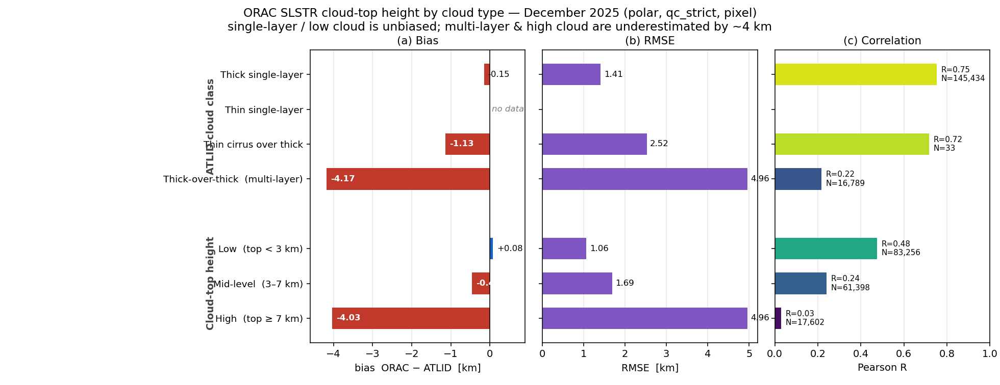

# ORAC SLSTR cloud-top-height validation against EarthCARE A-CTH — December 2025

Cloud-top-height (CTH) validation of **ORAC retrievals on SLSTR** (Sentinel-3A)
against the EarthCARE ATLID-only product `ATL_CTH_2A` (A-CTH) for **December
2025**. This is the SLSTR counterpart to the SEVIRI CTH study
(`docs/reports/cth_validation_2026-02.md`); the method, reference choice,
aggregation, QC modes and stratification are inherited unchanged. What differs
is the **collocation geometry** — and it changes the character of the result.

## 1. The defining feature: SLSTR × EarthCARE is a polar comparison

SEVIRI is geostationary, so every on-disk ATLID profile has a pixel available
every 15 min. SLSTR is a **polar-orbiter swath**: EarthCARE and Sentinel-3A are
both sun-synchronous at *different* local times, so they view the same ground
point simultaneously only near orbit-track crossings — which, for two polar
orbiters, occur essentially **only at high latitude**.

The Δt sweep (`figures/slstr_dt_sweep/`, one week collocated at a wide 120-min
window then filtered) quantifies this:

| Δt window | valid profiles | median \|lat\| | % polar (≥60°) | % tropics | median dist |
| --------- | -------------- | -------------- | -------------- | --------- | ----------- |
| 5 min     | 12 258         | 81.7°          | **100 %**      | 0 %       | 0.29 km     |
| 30 min    | 93 247         | 81.4°          | **100 %**      | 0 %       | 0.32 km     |
| 60 min    | 220 056        | 81.1°          | **100 %**      | 0 %       | 0.34 km     |
| 120 min   | 497 996        | 80.4°          | **100 %**      | 0 %       | 0.36 km     |

**Every match is polar (~81°), at every window** — ~60 % southern, ~40 %
northern. There is no tropical or mid-latitude coverage to be had from this
sensor pairing; the SLSTR validation is intrinsically a **polar snow/ice/ocean**
study. (This is a good match to the `v5.1_new_snowice` build, whose purpose is
improved bright-cold-surface handling.)

### 1.1 Choice of temporal window (60 min)

Because the matches are so tightly co-located in space (median nearest-pixel
distance ~0.3 km at every window — SLSTR's ~1 km nadir pixels sit almost on the
ATLID track at a crossing), **CTH agreement does not degrade with Δt**: bias
−4.6…−4.7 (pre-QC) and RMSE/R are flat from 5 to 120 min. Cloud advection is not
the limiting factor. We therefore use a generous **60-min** window for the
headline (median actual offset 35 min), which maximises the polar sample without
any measurable cost in quality. 30-min and 120-min are reported as sensitivities.

## 2. Reference and method (inherited from SEVIRI)

- **Reference**: A-CTH `ATLID_thick_cloud_top_height` (`cth_atlid_thick_km`) —
  the uppermost optically-thick top, the passive-equivalent surface ORAC senses.
- **Collocation**: `validation/collocate_slstr.py:match_track_to_slstr` — each
  ATLID profile matched to its nearest in-time SLSTR pixel (3-D unit-vector
  KD-tree, dateline/pole-safe), `|Δt| ≤ 60 min`, distance/time recorded, no QC at
  match time.
- **Two views**: *sample* (nearest ATLID per pixel) and *pixel* (mean cloudy
  ATLID per SLSTR pixel; headline). Because SLSTR pixels are ~1 km, the two views
  are nearly identical (few ATLID profiles per pixel).
- **QC**: A-CTH `qc_strict` (`quality_status==0` & confidence ≥ 5 & thick-top ≤
  tropopause + 2 km) is the headline, as for SEVIRI.
- **Compared quantity**: ORAC `cth_corrected` (km) vs A-CTH thick top (km).

Coverage: **953 A-CTH frames** matched (of ~3 700 in the month; the rest had no
SLSTR crossing within 60 min), **1.71 M valid ATLID profiles → 162 256 SLSTR
pixels** after `qc_strict`.

## 3. Headline results (qc_strict, pixel view)

| stratum                  |   N     | bias (km) | RMSE (km) |  R    |
| ------------------------ | ------- | --------- | --------- | ----- |
| **all (= polar)**        | 162 256 | **−0.57** | **2.08**  | **0.58** |
| ocean                    | 106 781 | −0.68     | 2.24      | 0.53  |
| land                     |  55 475 | −0.36     | 1.73      | 0.61  |
| cth_low (< 3 km)         |  83 256 | +0.08     | 1.06      | 0.48  |
| cth_mid (3–7 km)         |  61 398 | −0.46     | 1.69      | 0.24  |
| cth_high (≥ 7 km)        |  17 602 | −4.03     | 4.96      | 0.03  |
| class_thick (1-layer)    | 145 434 | **−0.15** | 1.41      | **0.75** |
| class_thick_over_thick   |  16 789 | −4.17     | 4.96      | 0.22  |
| dist < 2 km              | 162 256 | −0.57     | 2.08      | 0.58  |
| Δt < 3 min               |   9 414 | −0.59     | 2.18      | 0.59  |

Sample view is within 0.02 km / 0.01 R of pixel view in every stratum.

The headline:

> **Over polar scenes in December 2025, ORAC SLSTR cloud-top height agrees with
> ATLID to bias −0.57 km, RMSE 2.08 km, R 0.58. Single-layer thick cloud is
> essentially unbiased (−0.15 km, R 0.75); the error is concentrated in high and
> multi-layer cloud (≈ −4 km), the classic passive multi-layer ambiguity.**

Notable structure:

- **Low cloud is excellent.** `cth_low` bias +0.08 km, RMSE 1.06 km — polar
  boundary-layer / stratus tops (the dominant regime, half the sample) are
  retrieved almost exactly. This is the marine-stratocumulus result from SEVIRI,
  reproduced over the polar oceans.
- **Single-layer thick cloud carries the correlation** (R 0.75).
- **High / thick-over-thick cloud is underestimated by ~4 km** — ORAC retrieves
  the lower thick top where ATLID reports the upper one. Same mechanism as
  SEVIRI's `class_thick_over_thick` (−5.0 km there).
- **Land beats ocean here** (bias −0.36 vs −0.68, R 0.61 vs 0.53) — the opposite
  of SEVIRI, and plausibly a snow-surface effect worth a closer look.
- **Geometry is not a driver**: every match is < 2 km and the bias is flat in the
  Δt < 3 min subset, confirming the crossing collocation is tight.

## 3b. Polar sub-bands, hemisphere, and threshold sensitivity

Because the whole sample is polar, the single `lat_polar` bin is coarse. Splitting
it (qc_strict, pixel) exposes structure:

| stratum      |   N    | bias (km) | RMSE (km) |  R   |
| ------------ | ------ | --------- | --------- | ---- |
| lat 70–75°   | 20 975 | −0.34     | 1.75      | 0.65 |
| lat 75–80°   | 50 079 | −0.52     | 1.99      | 0.61 |
| lat 80–85°   | 91 202 | −0.65     | 2.19      | 0.55 |
| **NH (Arctic)**  | 75 443 | **−0.90** | 2.41  | 0.58 |
| **SH (Antarctic)** | 86 813 | **−0.28** | 1.74 | 0.59 |

Two findings the aggregate hid:

1. **Underestimation grows poleward** — −0.34 km at 70–75° to −0.65 km at 80–85°.
2. **Hemispheric asymmetry**: the **Arctic CTH is ~3× more underestimated than the
   Antarctic** (−0.90 vs −0.28 km). December is Arctic polar night / Antarctic
   polar day, so this is a night-vs-day and surface (winter sea-ice vs summer
   ice-sheet/ocean) contrast worth following up — a candidate `v5.1_new_snowice`
   signal.

**Threshold sensitivity.** The headline is insensitive to the collocation
thresholds. Sweeping Δt ∈ {15, 30, 45, 60} min × distance cap ∈ {1, 2, 3} km
(`figures/slstr_sensitivity/slstr_cth_sensitivity.png`, `qc_strict`):

- **bias −0.55 … −0.57 km**, **RMSE 2.08 … 2.11 km**, **R 0.58 … 0.60** across the
  entire grid.
- The distance cap barely changes N (matches are almost all < 1 km), and Δt
  15→60 min moves bias by < 0.03 km. The 60-min / nearest-pixel choices do not
  drive the result. (The Δt sweep to 120 min, `figures/slstr_dt_sweep/`, extends
  this — agreement is flat there too.)

## 3c. Results by cloud type

The error is entirely a function of cloud type. Broken out by ATLID cloud class
and by cloud-top-height band (qc_strict, pixel):



| Cloud type | Definition (ATLID) | N | bias (km) | RMSE (km) | R |
| ---------- | ------------------ | --- | --------- | --------- | --- |
| **Thick single-layer** | one optically-thick layer | 145 434 | **−0.15** | 1.41 | **0.75** |
| Thin single-layer | one optically-thin layer only | 0¹ | — | — | — |
| Thin cirrus over thick | thin cirrus above a thick layer | 33 | −1.13 | 2.52 | 0.72 |
| **Thick-over-thick** | two optically-thick layers (multi-layer) | 16 789 | **−4.17** | 4.96 | 0.22 |
| **Low** | cloud-top height < 3 km | 83 256 | **+0.08** | 1.06 | 0.48 |
| Mid-level | 3–7 km | 61 398 | −0.46 | 1.69 | 0.24 |
| **High** | cloud-top height ≥ 7 km | 17 602 | **−4.03** | 4.96 | 0.03 |

¹ *Pure thin single-layer cloud has no optically-thick top, so `cth_thick` is
undefined and the class is empty under the headline (thick-top) reference.*

**The whole CTH story in one line:** ORAC SLSTR retrieves **single-layer and low
cloud tops essentially perfectly** (thick single-layer −0.15 km, R 0.75; low
cloud +0.08 km) and **underestimates high / multi-layer cloud by ~4 km** — it
locks onto the lower optically-thick top and misses the upper one, the classic
passive-IR multi-layer ambiguity. This is not a polar or collocation effect
(geometry strata are flat); it is intrinsic to passive cloud-top retrieval.

## 4. Figures

All under `figures/slstr_cth_2025-12/` (full month) and
`figures/slstr_cth_dec2025_week1/` (week-1 preview, identical structure).

- `cth_scatter.png` — sample vs pixel joint histograms. A dense ridge on the 1:1
  line for cloud tops below ~5 km, with the characteristic triangular
  underestimation tail for ATLID tops above ~9 km. ORAC's distribution rolls off
  near 11–12 km.
- `cth_diagnostic.png` — coloured by latitude (all polar), match distance (all
  < 2 km), time offset (adaptive colourbar to 60 min), and ATLID cloud class:
  single-layer thick (blue) on the diagonal, thick-over-thick (red) below it.
- `cth_bias_by_stratum_pixel.png`, `cth_r_by_stratum_pixel.png` — the −4 km
  high/multi-layer excursion against the near-zero low-cloud bias.
- `cth_qc_sensitivity.png` — `qc_off`/`qc_no_trop_cap` are misleadingly worse
  (they keep low-confidence and stratospheric ATLID bins); `qc_strict` /
  `qc_relaxed` agree closely.
- `figures/slstr_dt_sweep/slstr_dt_sweep.png` — the crossing-geometry sweep.

## 5. SLSTR vs SEVIRI (both against A-CTH)

| metric (qc_strict, pixel, all) | SEVIRI Feb-2026 | SLSTR Dec-2025 (polar) |
| ------------------------------ | --------------- | ---------------------- |
| bias (km)                      | −1.72           | **−0.57**              |
| RMSE (km)                      | 3.71            | **2.08**               |
| R                              | 0.69            | 0.58                   |
| coverage                       | full disk (±60°)| polar only (~81°)      |

The two are **not** measuring the same population: SEVIRI's −1.72 km is dominated
by deep *tropical* multi-layer convection (its worst stratum), which SLSTR ×
EarthCARE never samples. Restricted to what SLSTR sees — polar cloud, mostly low
single-layer — the bias and RMSE are smaller. Where the regimes do overlap
(thick single-layer, and the high/multi-layer underestimation), the two agree in
sign and mechanism. The lower R for SLSTR reflects the compressed dynamic range
of a polar-only, low-cloud-dominated sample, not worse retrieval.

## 6. Conclusions

1. **SLSTR × EarthCARE is a polar validation** (~81°, both poles) — an intrinsic
   property of the two polar orbits, not a coverage gap. Report it as such.
2. **ORAC SLSTR CTH is essentially unbiased for polar low and single-layer cloud**
   (−0.15 km, R 0.75 for thick single-layer; +0.08 km for < 3 km cloud).
3. **The residual error is high/multi-layer cloud** (≈ −4 km), the same passive
   multi-layer ambiguity seen in SEVIRI.
4. **The crossing collocation is tight** — every match < 2 km, quality flat with
   Δt to 120 min, so a 60-min window is well justified.
5. **Land < ocean bias over the poles** is the one qualitative difference from
   SEVIRI and a candidate snow/ice-surface signal for the `v5.1_new_snowice`
   discussion.

## 7. Reproducibility

```bash
# Collocate A-CTH → SLSTR ORAC for December 2025 (60-min window)
python -m validation slstr-cth-collocate \
    --start 2025-12-01 --end 2026-01-01 --max-time-diff-min 60 \
    --out validation_data/slstr_cth_2025-12

# Stats (QC × view × stratum) and figures
python -m validation cth-evaluate \
    --matches 'validation_data/slstr_cth_2025-12/matches_cth_*.csv' \
    --out validation_data/slstr_cth_2025-12.csv
python -m validation cth-figures \
    --matches 'validation_data/slstr_cth_2025-12/matches_cth_*.csv' \
    --qc-mode qc_strict --label "SLSTR cth Dec-2025 (polar)" \
    --out figures/slstr_cth_2025-12

# Δt crossing-geometry sweep (one week, wide window)
python -m validation slstr-cth-collocate --start 2025-12-01 --end 2025-12-08 \
    --max-time-diff-min 120 --out validation_data/slstr_dtsweep_cth
python scripts/slstr_dt_sweep.py \
    --matches 'validation_data/slstr_dtsweep_cth/matches_cth_*.csv' \
    --out figures/slstr_dt_sweep
```

Inputs: A-CTH under `earthcare_data/ATL_CTH_2A/2025/12/`; ORAC SLSTR L2 under
`/gws/ssde/j25a/cloud_ecv/data_out/slstr/v5.1_new_snowice/slstra/l2b/2025/12/`.
Tracked outputs: `validation_data/slstr_cth_2025-12.csv`,
`figures/slstr_cth_2025-12/`, `figures/slstr_dt_sweep/`.
