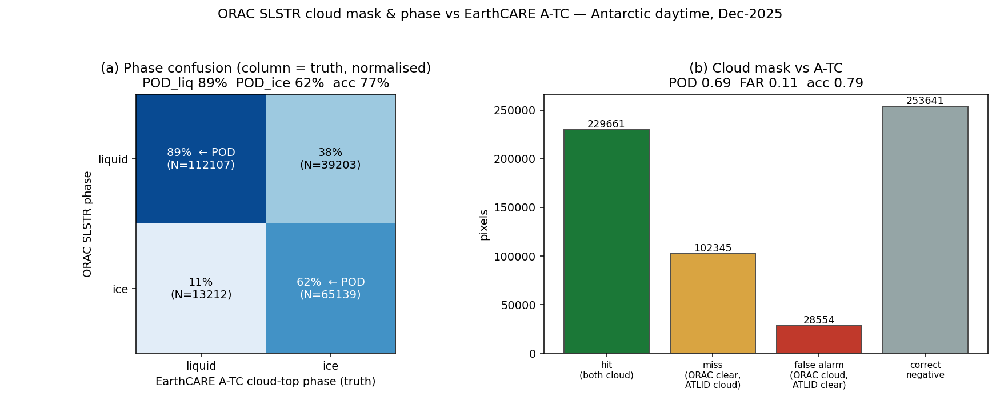

# ORAC SLSTR cloud-mask & cloud-phase validation against EarthCARE A-TC — December 2025

Categorical (yes/no) validation of ORAC SLSTR (Sentinel-3A) **cloud detection** and
**cloud phase** against **EarthCARE A-TC** (ATLID Target Classification, `ATL_TC__2A`).
This is the two-way contingency — including **POD_ice** — that the continuous COT/CER
reports could not provide, because ACM-CAP's phase flags are liquid-centric (its
`ice_present` fires on almost nothing: in the matched sample there were **zero**
clean ice-only profiles, so ice-detection skill was previously unmeasurable).

## 1. Why A-TC, and what it measures

A-TC classifies **every ATLID bin** as
`0 clear · 1 warm-liquid · 2 supercooled-liquid · 3 ice · <0 missing/surface/attenuated`.
A passive imager retrieves the phase it sees from the top of the atmosphere, so each
ATLID column is reduced to its **cloud-top phase** (the highest cloud bin) and its
**cloud presence** (any cloud bin). ORAC's `cldmask_orac` and `phase_orac`
(1 liquid / 2 ice) are compared against these.

## 2. Sample

- **Reference**: A-TC `ATL_TC__2A`, Dec 2025 (29 of 31 days downloaded; days 30–31
  pending — a ~6 % sample addition that does not move the metrics).
- Augmented onto the existing day matches by `frame_id` + **exact** `ec_time`
  (profile-match |Δt| = 0.000 s), no re-collocation.
- **N = 614 201** matched pixels with an A-TC classification (95 % of valid day
  matches); **229 661** where both ORAC and A-TC see cloud (the phase sample).
- Antarctic-summer daytime, as for every solar variable (§ orbital + illumination
  constraint).



## 3. Cloud mask — conservative, thin-cirrus-limited

| | A-TC cloud | A-TC clear |
| --- | --- | --- |
| **ORAC cloud** | 229 661 (hit) | 28 554 (false alarm) |
| **ORAC clear** | 102 345 (miss) | 253 641 (correct neg) |

**POD = 0.69 · FAR = 0.11 · accuracy = 0.79 · bias ratio = 0.78.**

- **ORAC detects 69 % of the clouds ATLID sees, with a low 11 % false-alarm ratio**
  — the mask is **conservative** (bias ratio 0.78 < 1: it under-calls cloud rather
  than over-calls).
- **The 31 % of missed clouds are 88 % ice-topped** (vs 45 % ice in the hits) — i.e.
  the misses are overwhelmingly **optically-thin cirrus that the lidar detects and
  the passive imager cannot**. This is the expected, physically-correct
  passive-vs-lidar limitation, not a mask defect.
- The 28 554 false alarms (ORAC cloud where ATLID is clear) are the counter-case —
  likely blowing snow, bright-surface artefacts, or sub-visible cloud below ATLID's
  threshold; at 4.6 % of the sample they are a minor term.

## 4. Cloud phase — a liquid bias, ice under-detected

Restricting to pixels where **both** see cloud and ORAC has a definite phase
(N = 229 661), against A-TC cloud-top phase:

| | A-TC liquid (truth) | A-TC ice (truth) |
| --- | --- | --- |
| **ORAC liquid** | 112 107 | 39 203 |
| **ORAC ice** | 13 212 | 65 139 |

- **POD_liquid = 89.5 %** — ORAC correctly identifies liquid cloud tops nearly nine
  times in ten.
- **POD_ice = 62.4 %** — ORAC correctly identifies only ~⅗ of ice cloud tops; **it
  misclassifies 38 % of ice cloud as liquid.** This is the number that was
  previously unmeasurable.
- **Overall phase accuracy = 77 %.** The error is **asymmetric: a liquid bias** —
  ORAC over-assigns the liquid phase, converting ice tops to liquid far more often
  (38 %) than liquid tops to ice (11 %).

This **supersedes and refines** the earlier one-way estimate in the water-COT report
(§3c, POD_liquid = 78 % from ACM-CAP's liquid-only flag): with a proper two-way
reference the liquid detection is better (89.5 %) and — crucially — we can now state
the ice side (62.4 %).

### 4a. Almost all polar liquid is supercooled

A-TC splits liquid into warm (class 1) and supercooled (class 2). In the
Antarctic-summer sample the liquid population is **essentially 100 % supercooled**
(warm-liquid N = 2 vs supercooled N = 125 317). ORAC correctly calls this
supercooled liquid "liquid" **89.5 %** of the time — so the liquid-detection skill is
really *supercooled*-liquid-detection skill, a demanding regime it handles well.

### 4b. Stratification

| stratum | POD_liquid | POD_ice | accuracy | N |
| ------- | ---------- | ------- | -------- | -- |
| **all** | 89.5 % | **62.4 %** | 77 % | 229 661 |
| ocean (sea-ice / water) | 84.5 % | 64.0 % | 77.0 % | 83 242 |
| snow / ice-sheet | 93.1 % | 61.8 % | 77.3 % | 146 419 |
| SZA 60–70° | — | 60.7 % | 77.6 % | 115 939 |
| SZA 70–75° | — | 64.1 % | 76.8 % | 113 722 |

- **Ice detection is essentially surface-independent** (POD_ice 62–64 % over both
  ocean and ice sheet) — the liquid bias is intrinsic to the passive phase
  discrimination, not a bright-surface effect (unlike the *optical-depth*
  saturation, which is surface-driven — see water-COT §3e).
- **Liquid detection is better over the ice sheet** (93 % vs 85 % over ocean).
- Skill is **flat in sun-zenith** across the available 60–75° range (~77 %).

## 5. Conclusions

1. **Cloud mask is conservative and physically sane**: POD 0.69, FAR 0.11; the
   missed 31 % is 88 % thin cirrus (lidar-only), the irreducible passive limit.
2. **ORAC has a liquid phase bias**: POD_liquid 89.5 % but **POD_ice 62.4 %** — 38 %
   of ice cloud tops are called liquid. This closes the phase story the COT reports
   left open (POD_ice was unmeasurable from ACM-CAP).
3. **The liquid bias is intrinsic, not cryospheric** (surface-independent POD_ice),
   in contrast to the optical-depth saturation which *is* surface-driven — two
   distinct limitations.
4. **Polar liquid is supercooled**, and ORAC handles it well (89.5 %).

**Link to the optical-depth results:** the 38 % ice→liquid misclassification is the
mechanism behind the high-τ tail that flips the *mean* water-COT bias positive
(water-COT §3c) — an ice cloud retrieved as a thick liquid cloud. The phase bias and
the τ saturation are the two independent limitations of the polar-daytime solar
retrieval.

## 6. Reproducibility

```bash
# download A-TC for the month (outage-resilient)
scripts/download_ec_month.sh 2025 12 A-TC
# augment matches with A-TC cloud-top phase + cloud presence (by frame_id + ec_time)
python scripts/slstr_atc_phase_augment.py
# cloud-mask + phase contingency, figure, stratification
python scripts/slstr_atc_phase_figure.py     # -> figures/slstr_phase_2025-12/
```

Inputs: A-TC under `earthcare_data/ATL_TC__2A/2025/12/`; matches under
`validation_data/slstr_synergy_2025-12_day/`. A-TC cloud-top phase = class of the
highest cloud bin (1/2 → liquid, 3 → ice); cloud mask = any cloud bin in a
non-attenuated column.
