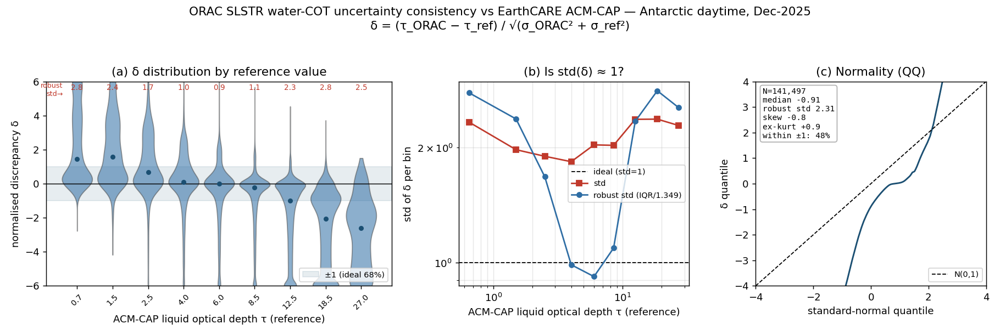
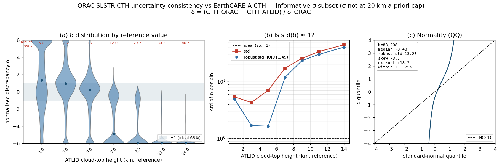

# ORAC SLSTR retrieval-uncertainty validation against EarthCARE — December 2025

Do ORAC's **reported per-pixel uncertainties** actually describe its errors? This is
the error-consistency (z-score) test of Sayer et al. (2020, AMT, §3.1) / the
normalised-discrepancy diagnostic. For a retrieved quantity `x` with reported
1-σ uncertainties on both sides,

```
delta = (x_ORAC - x_ref) / sqrt(sigma_ORAC^2 + sigma_ref^2)
```

If the uncertainties are **calibrated** and the errors **Gaussian**, `delta ~ N(0,1)`:
centred on 0, standard deviation 1, ~68 % within ±1. We bin `delta` by the
reference value `x_ref`, show its distribution (violin), and read off the two
diagnostics:

- **std(delta) ≈ 1?** — are the uncertainty *magnitudes* right? std > 1 →
  **over-confident** (stated sigma too small); < 1 → under-confident.
- **is delta Gaussian?** — QQ plot + skew/kurtosis; heavy tails / skew mean the
  errors are not the shape a single sigma can summarise.
- **mean(delta) ≈ 0?** — a residual bias the uncertainty does not account for.

## 1. What uncertainties are available

| side | source | form |
| ---- | ------ | ---- |
| ORAC | `cot_uncertainty`, `cer_uncertainty`, `cth_uncertainty`, `cwp_uncertainty`, … | per-pixel, absolute (retrieval a-posteriori) |
| ACM-CAP | `liquid_optical_depth_error`, `*_effective_radius_error`, `ice_water_path_error` | per-profile, **fractional** (× value → absolute) |
| A-CTH | — (only confidence/consistency flags) | none → ATLID treated as truth (sigma_ref ≈ 0) |

So **water-COT** is the clean two-sided case; **CTH** is ORAC-sigma-only against a
near-truth lidar. (CER needs tau-weighted propagation of the per-bin radius error —
a follow-on.)

## 2. Water-cloud optical depth — calibrated only in the mid-τ sweet spot

Phase-agree liquid, qc_strict, daytime. sigma_ORAC (median 3.95 τ) and
sigma_ref = fractional_error × τ (median 1.35 τ). **N = 141 497.**



| τ (reference) band | median δ | robust std(δ) | reading |
| ------------------ | -------- | ------------- | ------- |
| thin (τ ≈ 0.7–2.5) | **+1 to +1.6** | 1.7–2.8 | over-reads thin cloud, over-confident |
| **mid (τ ≈ 4–8)**  | **≈ 0** | **≈ 1.0** | **well-calibrated** |
| thick (τ ≈ 12–27)  | **−1 to −2.6** | 2.3–2.8 | saturates, σ does not widen enough |

- **std(δ) traces a clear U** (panel b): it dips to **~1.0 at τ 4–8** — ORAC's COT
  uncertainty is *honest* there — and rises to **~2.5–3 at both the thin and thick
  ends**. The uncertainty is **over-confident wherever the retrieval is hardest.**
- **Overall δ: median −0.91, robust std 2.31, 48 % within ±1** (vs 68 %). Two
  failures compound: a **~1σ negative bias** (the saturation underestimate is *not*
  absorbed by the stated uncertainty) and **~2.3× over-dispersion**.
- **Not Gaussian** (panel c): skew −0.8, excess kurtosis +0.9; the QQ curve is
  S-shaped — a near-flat core (the mid-τ pile at δ≈0) with heavy tails.
- **Bottom line:** ORAC's COT uncertainty **does not "know about" its own
  saturation** — at high τ the error reaches −2.6 σ, far outside the stated 1 σ.
  It is trustworthy only for mid-optical-depth liquid cloud.

## 3. Cloud-top height — the uncertainty is a-priori-saturated and over-confident for high cloud

ATLID CTH is treated as truth (its precision ≈ one range bin ≪ ORAC's km-level σ).

- **The stated σ is largely non-informative:** it is pinned at a **20 km a-priori
  cap for 51 % (raw) / 63 % (corrected) of pixels** — the thermal retrieval added
  no height information there. Only ~36–46 % of pixels carry an informative σ.
- **On that informative subset** (σ not at the cap), the test still fails hard:



| ATLID CTH band | robust std(δ) | reading |
| -------------- | ------------- | ------- |
| low (1–5 km)   | 1.7–5 | roughly plausible for low tops |
| high (7–14 km) | **12 → 40** | massively over-confident |

- **std(δ) climbs monotonically with cloud height**, from ~1.7 at 3–5 km to **~40
  at 14 km**, with δ medians reaching **−5 to −6** and a strong negative skew
  (−3.7, ex-kurt +18). ORAC places **high thin-cirrus tops too low with
  unwarranted confidence** — the same missed-cirrus mechanism seen in the
  cloud-mask validation (88 % of missed cloud is thin ice).
- **Bottom line:** ORAC's CTH uncertainty is **not a usable per-pixel Gaussian σ** —
  non-informative (a-priori-capped) for most pixels, and where informative it is
  reliable only for low cloud and wildly over-confident for high cloud.

## 4. Conclusions

1. **ORAC's uncertainties are optimistic in exactly the hard regimes.** COT σ is
   calibrated for mid-τ liquid but over-confident for thin and (especially)
   saturated-thick cloud; CTH σ is a-priori-capped and over-confident for high
   cloud. Where the retrieval physics is easy the error bars are honest; where it
   struggles they are too tight.
2. **The stated uncertainty does not capture the two structural limitations** found
   earlier — the bright-surface τ saturation (a −2.6 σ effect at high τ) and the
   missed high cirrus (a −5 σ effect in CTH). A user propagating ORAC's σ would be
   over-confident about precisely the pixels that are worst.
3. **Method is general and re-runnable** — CER (needs τ-weighted reference-error
   propagation) and ice-COT / IWP are natural follow-ons using the same augment.

## 5. Reproducibility

```bash
# ORAC sigma (cot_uncertainty) + ACM-CAP fractional error, matched by ec_time
python scripts/slstr_uncertainty_augment.py          # -> .uncertainty_cache/cot_unc_pairs.parquet
# CTH sigma diagnostic (caches cth_unc.parquet)
python scripts/slstr_uncertainty_cth.py
# violin / std-vs-x_ref / QQ figures for COT and CTH
python scripts/slstr_uncertainty_figure.py           # -> figures/slstr_uncertainty_2025-12/
```

δ is the normalised discrepancy `(x_ORAC − x_ref)/sqrt(σ_ORAC² + σ_ref²)`; for CTH
σ_ref ≈ 0 (ATLID truth) and only the informative-σ subset (σ below the 20 km
a-priori cap) is shown. Reference: Sayer et al. (2020), *AMT* 13, 373 (§3.1).
