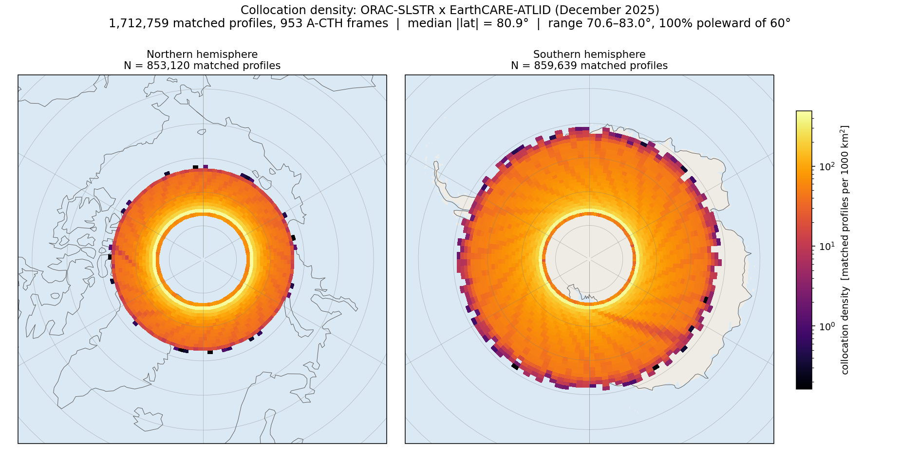
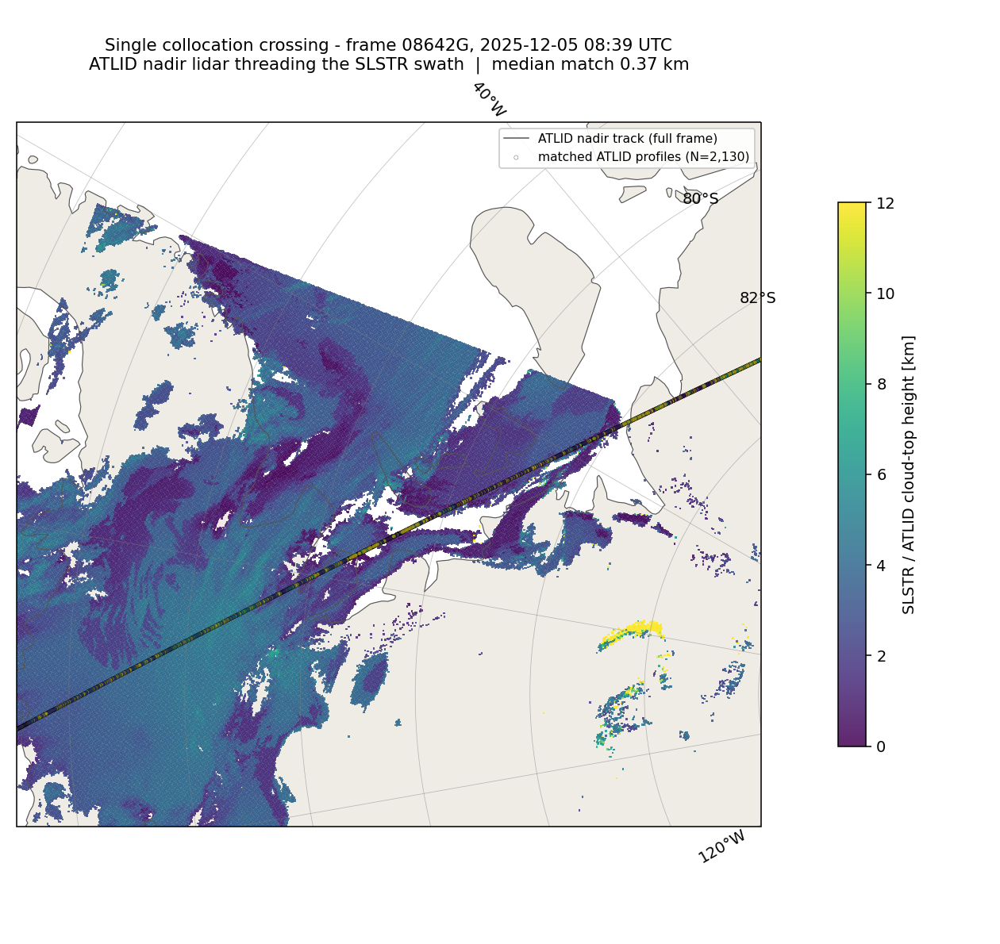
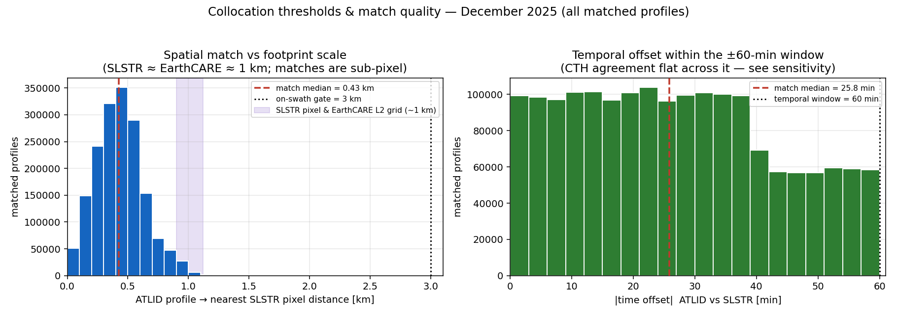
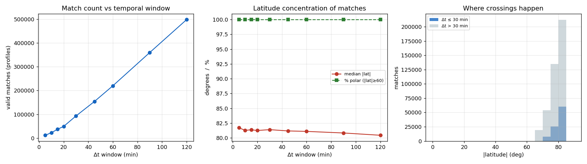
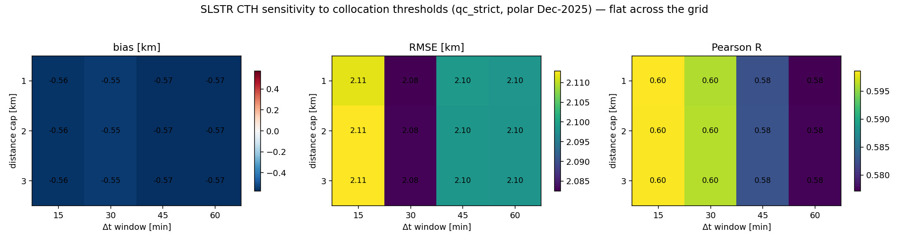
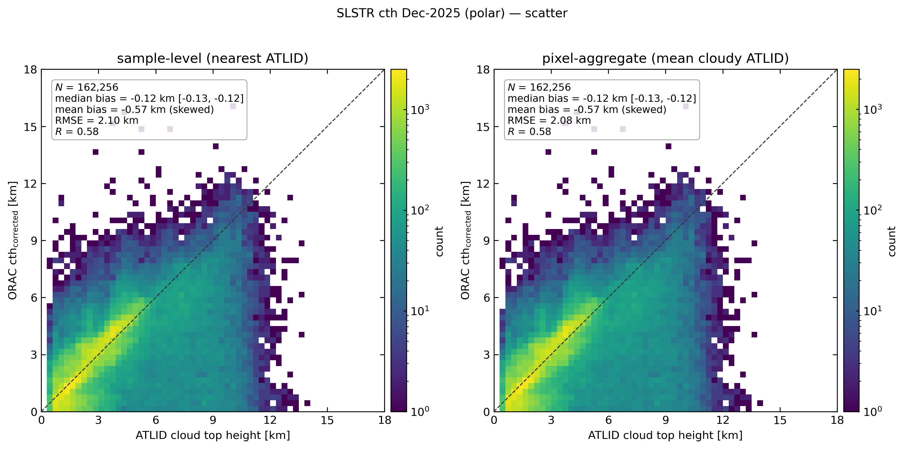
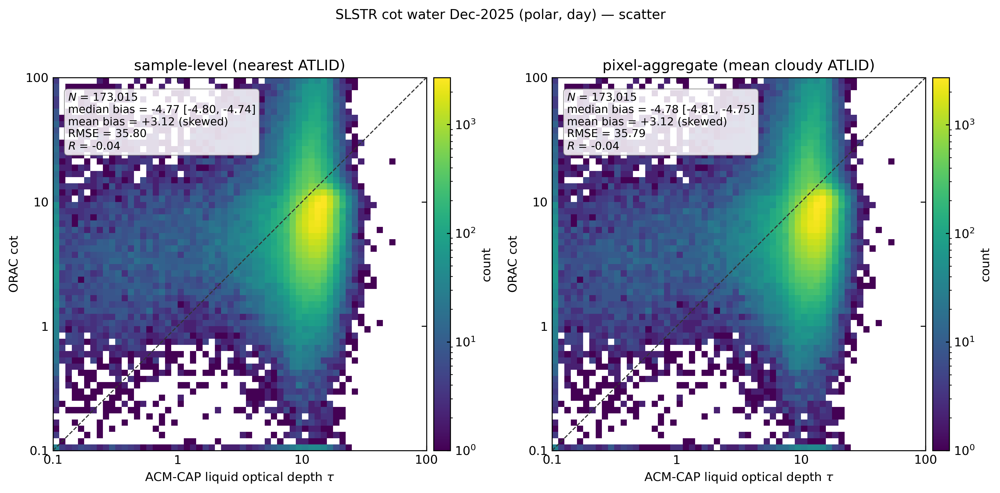
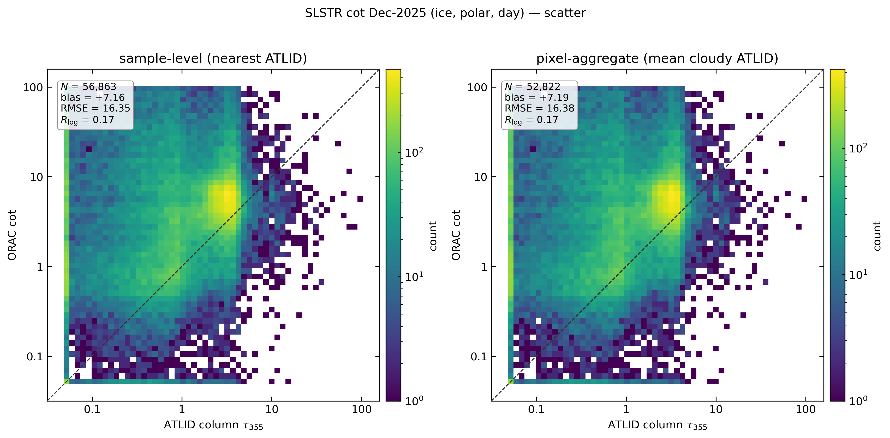
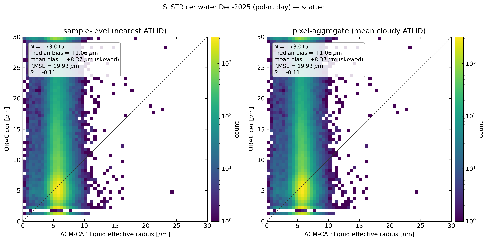

# Validating ORAC SLSTR cloud retrievals with EarthCARE — December 2025 summary

**Comprehensive overview** of the SLSTR × EarthCARE validation for the project
review. It synthesises the collocation strategy and the four validated variables;
the per-variable detail lives in the companion reports:
[CTH](slstr_cth_2025-12.md) · [water COT](slstr_cot_water_2025-12.md) ·
[ice COT](slstr_cot_ice_2025-12.md) · [CER](slstr_cer_water_2025-12.md), and the
method in [the plan](../slstr_validation_plan.md).

---

## 1. Executive summary

We validated ORAC cloud retrievals on **SLSTR (Sentinel-3A)**, version
`v5.1_new_snowice`, against **EarthCARE** active/synergy references (ATLID A-CTH,
ATLID A-EBD, ATLID+CPR+MSI ACM-CAP) for **December 2025** — the one full month of
this ORAC stream. Reusing the collocation framework proven on SEVIRI, only a new
SLSTR granule reader and a polar-crossing collocator were added.

| Variable | Reference | Regime | Headline (qc_strict, pixel) | Verdict |
| -------- | --------- | ------ | --------------------------- | ------- |
| **CTH**       | A-CTH (ATLID)   | polar, day+night | bias **−0.57 km**, RMSE 2.08 km, R **0.58** | **good** |
| **Water COT** | ACM-CAP liquid τ | polar, day (Antarctic) | bias **+3.1** (−0.65 phase-agreed), r_log 0.11 | modest |
| **Ice COT**   | A-EBD column τ  | polar, day (Antarctic) | bias **+7.2**, r_log 0.17 | poor |
| **CER**       | ACM-CAP liquid rₑ | polar, day (Antarctic) | bias **+8 µm**, R ≈ **−0.1** | weakest |

**One-line message:** in the polar regime this sensor pairing can access, the
**thermal** cloud-top retrieval is nearly unbiased, while the **solar** optical
retrievals (COT, and especially the SWIR-based CER) degrade over bright ice at
high sun-zenith — a coherent snow/ice-surface signal for the `v5.1_new_snowice`
build.

---

## 2. The collocation strategy (the methodological core)

### 2.1 It is a polar comparison — by orbital mechanics, not by choice

The collocator runs **globally** (no latitude filter): every EarthCARE profile,
pole to equator, is matched to the nearest SLSTR pixel within ±60 min. But
EarthCARE and Sentinel-3A are both **sun-synchronous polar orbiters at different
local overpass times**, so they image the same ground point *simultaneously* only
where their orbit planes converge — near the poles. Everywhere else they pass
hours apart.

Result: of **1.71 M matches, every one is at |lat| 70.6–83.0°**; the tropical and
mid-latitude bands come back **N = 0**. This is the standard "simultaneous nadir
overpass" geometry, not a processing decision.

*Collocation density (matched profiles per 1000 km², area-normalised) rings
70–82° in both hemispheres (853 k N, 860 k S). Density peaks in a band around
75–80° and falls to zero at the pole itself — EarthCARE's orbit inclination does
not overfly it.*

**Complementarity:** the geostationary **SEVIRI** validation covers ±60°; SLSTR
covers the poles. Together they span pole-to-tropics against the same ATLID truth.

### 2.2 What a single collocation looks like

*Frame 08642G over Antarctica: the SLSTR swath (coloured by cloud-top height) with
the 1-D ATLID nadir track threading across it. Each match pairs one lidar profile
with the SLSTR pixel it falls in — here at 0.37 km median separation.*

### 2.3 The two thresholds

Each matched pair must satisfy a **temporal** and a **spatial** condition:

| Threshold | Value | What the matches actually are |
| --------- | ----- | ----------------------------- |
| **Temporal** | \|Δt\| ≤ **60 min** | median offset **26 min**; offsets fill the window |
| **Spatial** | nearest pixel, **≤ 3 km** on-swath gate | median **0.43 km**, max ~1.1 km — sub-pixel |

#### Spatial threshold vs the instrument footprints

The 3 km gate is not an averaging radius — it is a swath-membership test. Its
value is best read against the horizontal resolution of the two datasets, which
we **measured from the data** (adjacent-pixel / adjacent-profile spacing):

| Dataset | Nominal instrument footprint | Measured L2 horizontal grid |
| ------- | ---------------------------- | --------------------------- |
| **SLSTR** (nadir, ORAC cloud) | 1 km TIR / 0.5 km solar | **1.1 × 0.9 km** |
| **ATLID** (A-CTH, A-EBD)      | ~30 m spot, ~285 m sampling | **0.99 km** along-track |
| **ACM-CAP** (ATLID+CPR+MSI synergy) | CPR ~750 m, MSI 500 m | **0.99 km** along-track |

The two datasets are matched at **~1 km each**, so the ~0.43 km median separation
is **sub-pixel for both** — there is essentially no footprint-scale mismatch. This
is a marked contrast with the SEVIRI validation, where 3–7 km geostationary pixels
had to be matched to the ~1 km ATLID track. The 3 km gate simply excludes profiles
that fall *outside* a swath (nearest pixel then jumps to tens of km); it is ~3×
the pixel and, being far above the 0.43 km match median, is not a tuning knob —
loosening or tightening it 2–3× changes nothing (§2.4).

#### Temporal threshold — why 60 min

Agreement is flat with Δt: the crossing-geometry sweep shows the matches stay
polar and the CTH statistics do not degrade from 5 to 120 min — the tight ~1 km
spatial match dominates, and polar clouds evolve slowly.

### 2.4 Both thresholds are non-binding — sensitivity

Across Δt ∈ {15, 30, 45, 60} min × distance cap ∈ {1, 2, 3} km, the CTH statistics
barely move: **bias −0.55…−0.57 km, RMSE 2.08…2.11 km, R 0.58…0.60**. The distance
cap hardly changes N (matches are almost all < 1 km already).

*And neither threshold can be relaxed to reach lower latitudes without breaking
the comparison: a mid-latitude match would require Δt of hours (clouds change) or
a distance of hundreds of km (different clouds). The poles are the only place both
can be small at once.*

---

## 3. Results by variable

### 3.1 Cloud-top height — the strong result

Bias **−0.57 km**, RMSE **2.08 km**, R **0.58** (N = 162 k). Single-layer thick
cloud is essentially unbiased (−0.15 km, R 0.75); the error is concentrated in
high / multi-layer cloud (≈ −4 km) — the classic passive multi-layer ambiguity,
as in SEVIRI.

*Broken out by cloud type: single-layer and low cloud are near-perfect (thick
single-layer −0.15 km, R 0.75); high and multi-layer cloud are underestimated by
~4 km.*

### 3.2 Water-cloud optical thickness

Bias **+3.1** overall, but **−0.65 (RMSE 20)** once both instruments agree the
column is liquid — the all-stratum bias is largely phase-mismatch, not systematic
τ error. Better than the SEVIRI polar water-COT (+18).

### 3.3 Ice-cloud optical thickness

Bias **+7.2** (RMSE 16, r_log 0.17), worse over the ice sheet (+8.4) than sea-ice
(+5.3). Bright-surface + partial-cloud + high-SZA inflation — the same mechanism
as the SEVIRI polar water bias, hitting ice COT over Antarctica.

### 3.4 Cloud effective radius — the weakest

Bias **+8 µm** with essentially no skill (**R ≈ −0.1**). ORAC's SWIR radius
retrieval loses information over bright snow/ice at high sun-zenith.

---

## 4. Cross-cutting findings (from the refined stratification)

Splitting the single "polar" bin into sub-bands and hemispheres exposes structure
the aggregate hid:

1. **Thermal beats solar.** The gradient CTH → water COT → ice COT → CER tracks
   thermal-vs-solar and surface brightness: the thermal cloud-top retrieval
   survives the polar regime; the solar retrievals degrade, CER most.
2. **Hemispheric asymmetry (CTH):** Arctic **−0.90 km** vs Antarctic **−0.28 km**
   — the Arctic top is ~3× more underestimated. December = Arctic night / Antarctic
   day, so this is a night-vs-day + winter-sea-ice-vs-summer contrast.
3. **COT bias lives at the marginal ice zone (70–75°).** Water COT runs
   **+29 → +5.4 → −2.4** from 70–75° to 80–85°; ice COT +13 → +5.8. The
   bright-surface / partial-cloud inflation is a lower-polar-latitude effect;
   by 80–85° water COT is near-zero.
4. **Geometry is never the issue.** Every match is < 2 km and the bias is flat in
   the Δt < 3 min subset — the collocation is tight; the residuals are retrieval
   physics.

---

## 5. What is validated, and what remains

| Dimension | Status |
| --------- | ------ |
| Variables: CTH, water COT, ice COT, CER | ✅ done |
| Collocation strategy + case study + sensitivity | ✅ done |
| Stratification: ocean/land · polar sub-bands · hemisphere · distance · time · cloud-class · phase | ✅ done |
| **Surface type** (sea-ice / snow / ice-sheet / open water) | ⏳ next (needs `stemp`/`lusflag` augment) |
| **CWP** (last synergy variable) | ⏳ next |
| Phase & cloud-mask (categorical) | ⚪ needs A-FM download |
| Per-orbit case studies, uncertainty validation | ⚪ optional depth |

**Data ceilings (cannot be closed):** low latitudes (orbital mechanics);
multi-season (only Dec 2025 processed); Sentinel-3B (not processed).

**Assessment:** the two most important variables (CTH, COT) plus CER and the full
collocation methodology are complete, defensible and meeting-ready. Completing the
surface-type + CWP step (§9 of the workplan) would make it comprehensive across
the synergy-available variables.

---

## 6. Reproducibility

All code, stats and figures are on branch `codex-earthcare-sampling-plots`.
Per-variable commands are in each companion report; the collocation entry points
are `python -m validation slstr-cth-collocate | slstr-synergy-collocate |
slstr-collocate`, and the strategy figures come from
`scripts/slstr_collocation_figures.py`, `scripts/slstr_dt_sweep.py`,
`scripts/slstr_sensitivity_table.py`. ORAC SLSTR L2:
`/gws/ssde/j25a/cloud_ecv/data_out/slstr/v5.1_new_snowice/slstra/l2b/2025/12/`;
EarthCARE references under `earthcare_data/{ATL_CTH_2A,ATL_EBD_2A,ACM_CAP_2B}/2025/12/`.
