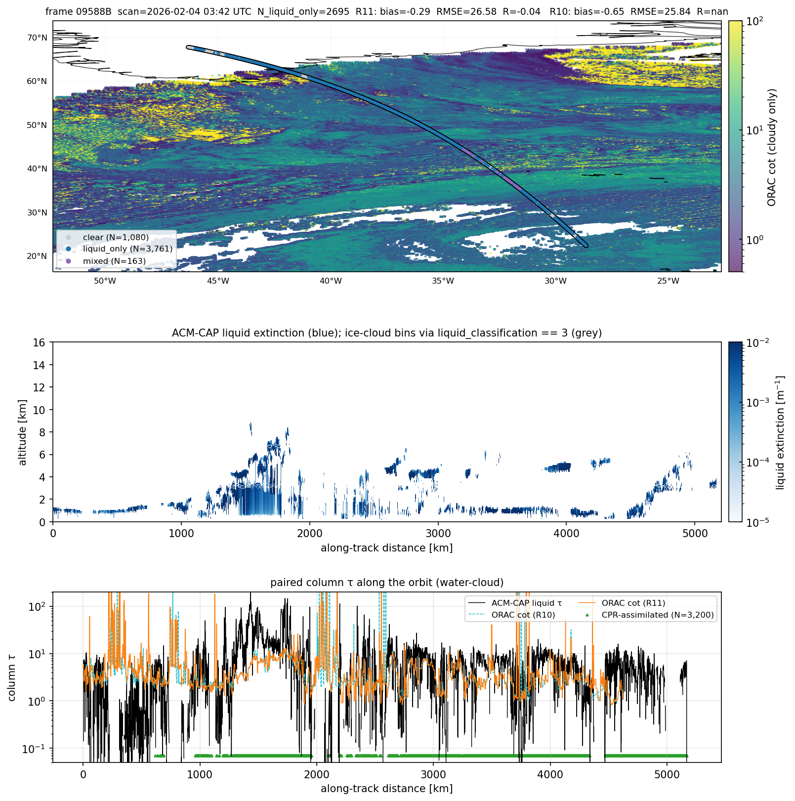
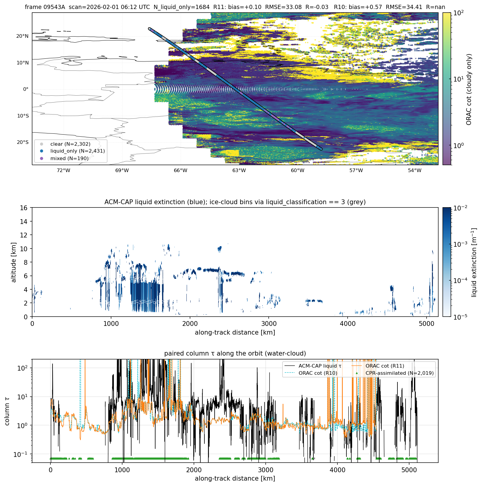
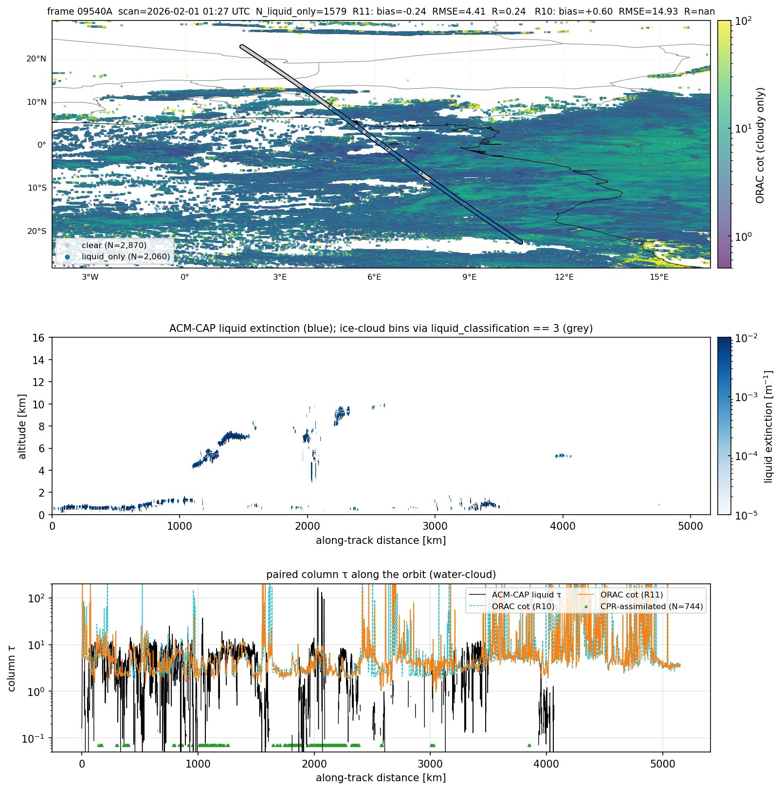
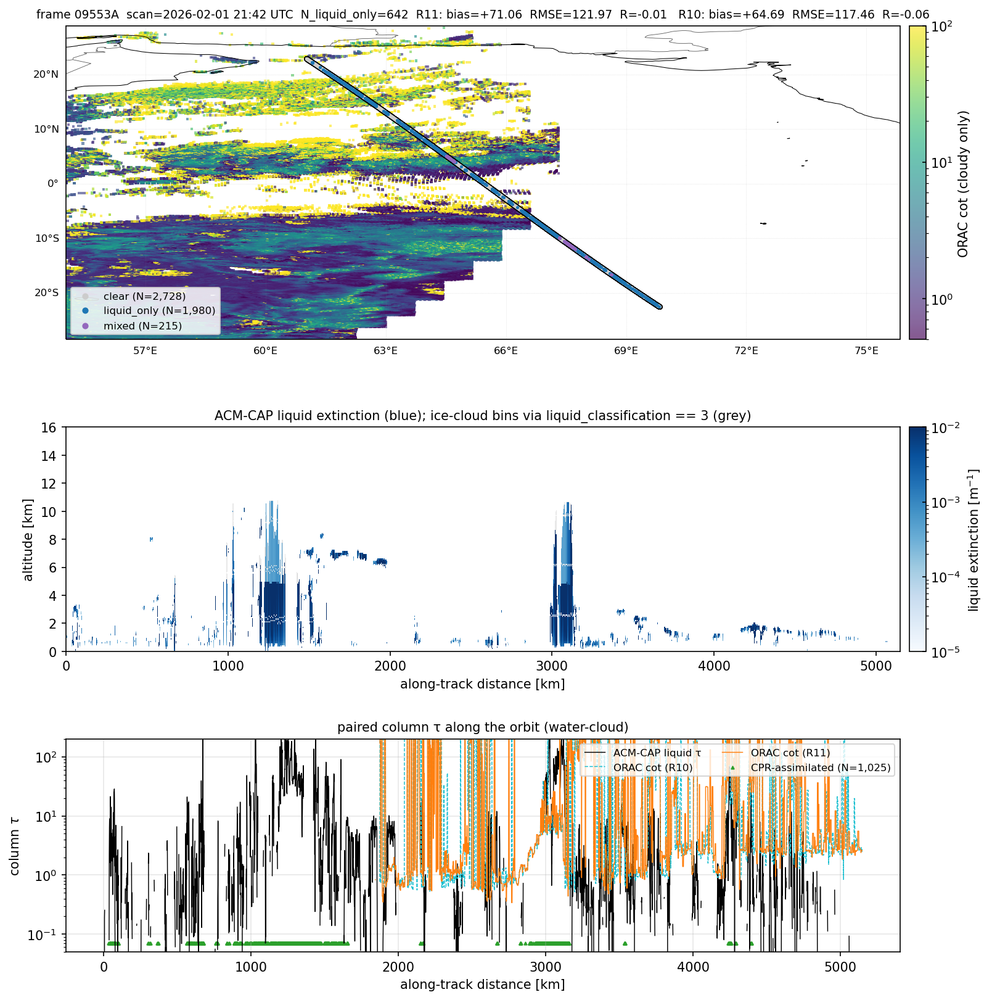
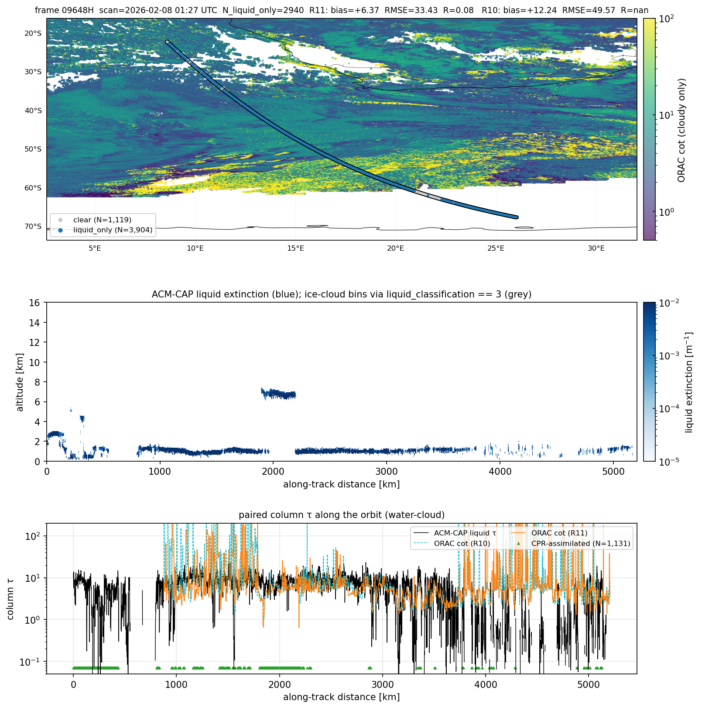
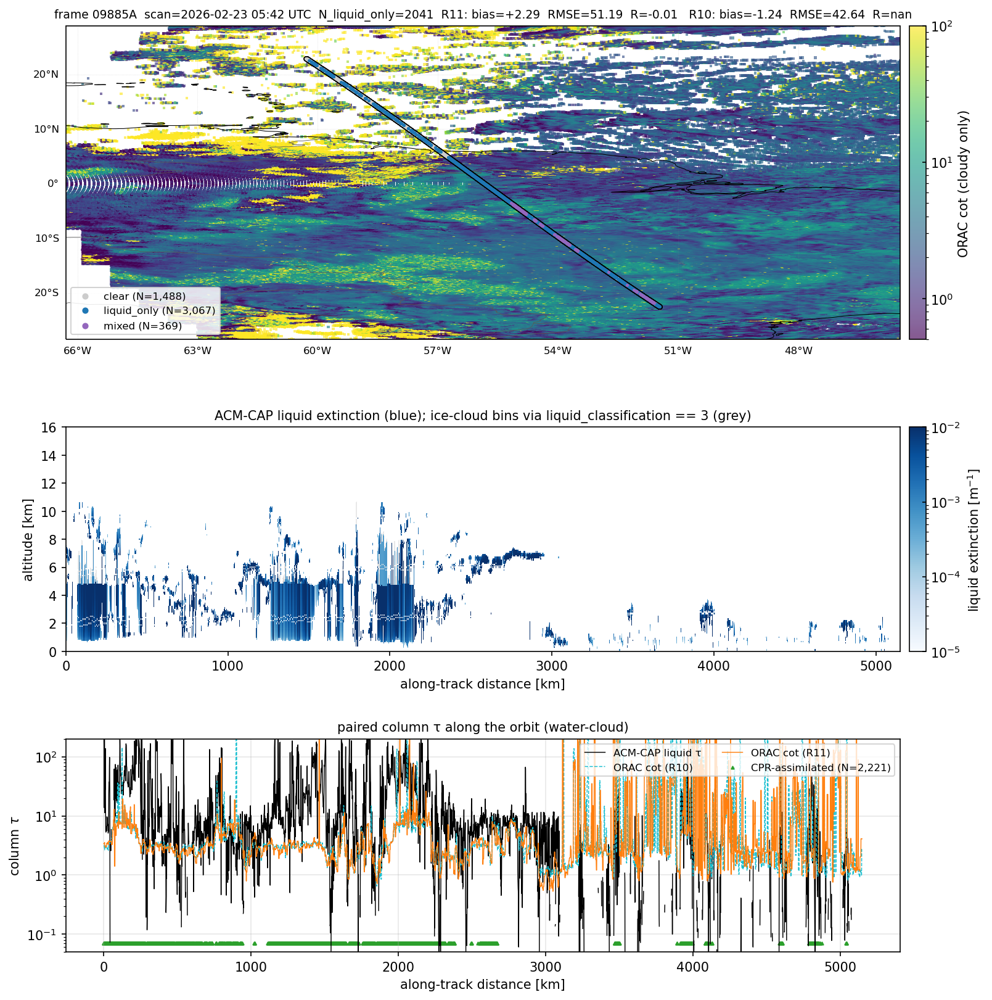

# ORAC SEVIRI track-study report — February 2026

This report documents the **per-orbit case-study figures** that sit
alongside the population-level CTH and COT validation. Track studies are
the qualitative complement to the bias / RMSE / R tables: they show what
the matched comparison actually looks like for one EarthCARE frame at a
time, with ATLID's vertical structure displayed alongside the ORAC SEVIRI
optical depth on the same horizontal axis.

Two flavours of track-study figure exist, both used here:

1. **Synergy track panels** (`validation/track_figures.py:track_panel_synergy`)
   — ACM-CAP frames. Three panels: SEVIRI cot map with the ACM-CAP nadir
   track coloured by phase; ACM-CAP liquid-extinction curtain with
   ice-cloud overlay; along-track liquid τ from ACM-CAP vs ORAC cot.
   Optionally overlays the R10 retrieval on the bottom panel.
2. **A-EBD track panels** (`validation/track_figures.py:track_panel`) —
   `ATL_EBD_2A` frames. Three panels: SEVIRI cot map with ATLID track
   coloured by per-profile column τ; ATLID 355 nm extinction curtain;
   along-track ATLID column τ vs ORAC cot, with attenuated and
   ORAC-saturated points highlighted.

Track studies live in two folders:

- `figures/cot_water_2026-02_track_studies/` — 10 ACM-CAP frames, with
  R10-vs-R11 overlays.
- `figures/validation/2026-02/track_*.png` — 3 A-EBD frames at three
  latitude bands (polar, midlat, tropics).

## 1. Why track studies matter

The aggregate CTH and COT reports give one number per stratum across
hundreds of thousands of pixels. They cannot reveal:

- **Where along the orbit** ATLID and ORAC agree or diverge;
- **Whether the bias is a coherent translation** (the whole curve
  offset) or a few extreme excursions (broken cloud edges, attenuated
  columns);
- **Whether R11 changes the qualitative shape** of a retrieval, or just
  shifts the magnitude;
- **What kind of cloud** is driving each statistic — broken cumulus,
  marine stratocumulus, deep convection, polar liquid layer cloud, ice
  cirrus over warm cloud, etc.

The case-study panels surface all of that. They were curated to span the
geographic and cloud-regime space the validation table summarises.

## 2. Synergy (ACM-CAP) case-study tour

The 11 curated frames are scattered across regimes: marine stratocumulus,
mid-latitude frontal cloud, deep convection, dust over ocean, Arctic
liquid layer cloud, southern-Greenland coastal liquid. Each figure has a
six-element title strip:

```
frame <ID>  scan=<UTC>  N_liquid_only=<…>  R11: bias=… RMSE=… R=…  R10: bias=… RMSE=… R=…
```

The "N_liquid_only" is the count of ACM-CAP profiles classified as
liquid-only over the orbit (the population entering the liquid τ
comparison). R10 RMSE/R fields read `nan` when the R10 sample inside this
frame is too small after filtering.

### 2.0 Per-frame summary

| §    | Frame  | Date / UTC          | Region                          | N_liq | R11 bias | R11 RMSE | R10 bias | R10 RMSE |
| ---- | ------ | ------------------- | ------------------------------- | ----- | -------- | -------- | -------- | -------- |
| 2.1  | 09865H | 2026-02-22 00:12    | Marine Sc, S Indian Ocean       | 2 539 | +12.12   | 47.26    | +18.68   | 62.89    |
| 2.2  | 09574A | 2026-02-03 05:57    | Tropical Atlantic broken cloud  | 2 561 | +19.73   | 78.24    | +10.29   | 60.38    |
| 2.3  | 09548D | 2026-02-01 14:27    | Western Europe winter front     | 2 186 | −1.58    |  7.05    | −0.56    | 14.88    |
| 2.4  | 09539C | 2026-02-01 00:12    | Arctic / N Greenland            |   431 | −2.25    |  9.02    | −2.25    |  9.02    |
| 2.5  | 09588B | 2026-02-04 03:42    | Southern Greenland coast        | 2 695 | −0.29    | 26.58    | −0.65    | 25.84    |
| 2.6  | 09542B | 2026-02-01 04:42    | North Atlantic cyclone          | 1 706 | +28.66   | 77.92    | +22.28   | 66.90    |
| 2.7  | 09543A | 2026-02-01 06:12    | South America equatorial conv.  | 1 684 | +0.10    | 33.08    | +0.57    | 34.41    |
| 2.8  | 09540A | 2026-02-01 01:27    | North Africa / Nile Valley      | 1 579 | −0.24    |  4.41    | +0.60    | 14.93    |
| 2.9  | 09553A | 2026-02-01 21:42    | Tropical Indian Ocean conv.     |   642 | +71.06   | 121.97   | +64.69   | 117.46   |
| 2.10 | 09648H | 2026-02-08 01:27    | South Indian Ocean Sc deck      | 2 940 | +6.37    | 33.43    | +12.24   | 49.57    |
| 2.11 | 09885A | 2026-02-23 05:42    | Tropical mixed-phase Atlantic   | 2 041 | +2.29    | 51.19    | −1.24    | 42.64    |

Linear τ for both bias and RMSE; numbers come from the figure title
strip, which uses the `liquid_only` & `valid_match` & finite-τ subset
of each frame.

### 2.1 Marine stratocumulus — frame 09865H, 2026-02-22, southern Indian Ocean


`figures/cot_water_2026-02_track_studies/track_09865H_marine-stratocumulus_R10_vs_R11.png`
— headline numbers: N_liquid_only = 2 539, R11 bias = +12.12, RMSE 47.26,
R 0.02; R10 bias = +18.68, RMSE 62.89.

- **Top map**: the 5 000-km-long track crosses a near-continuous
  stratocumulus deck off the South African coast, retrieved at SEVIRI cot
  ≈ 5–30 (yellow-green).
- **Curtain (middle)**: ACM-CAP liquid extinction is concentrated below
  3 km — exactly the marine-stratocumulus signature — with episodic deep
  liquid columns up to 6–7 km after the 4 000 km mark.
- **Bottom**: ATLID liquid τ (black) sits between 3 and 30 along the
  whole orbit; both ORAC streams (R11 orange, R10 light-blue) climb to
  τ = 100 in dense streaks. The over-shoot is structural, not noisy —
  this is the regime that dominates the +7 all-stratum bias from the COT
  report, and the per-orbit numbers here (+12 R11, +19 R10) reproduce
  it. **R10 is consistently higher than R11** in this scene; the lower
  R11 bias here is the per-orbit reflection of the marginal R10-vs-R11
  difference noted in the population report.

### 2.2 Tropical Atlantic — frame 09574A, 2026-02-03


`track_09574A_tropical-atlantic_R10_vs_R11.png` — N_liquid_only = 2 561,
R11 bias = +19.73, RMSE 78.24; R10 bias = +10.29, RMSE 60.38.

- **Top**: equatorial Atlantic crossing, with deep convection and broken
  cumulus on the western side and lower-deck warmer cloud east of the
  ITCZ.
- **Curtain**: liquid extinction signal is thin and patchy, mostly below
  4 km, with deep ice contributions visible (ice points are screened out
  of the liquid view).
- **Bottom**: extreme broken structure. ATLID jumps between τ = 1 and
  τ = 100 within tens of kilometres — typical broken cumulus. ORAC
  follows the envelope but with substantial scatter; R11 here happens
  to be *higher* than R10 (opposite to 09865H), which underlines that
  the population-level ordering does not hold per-frame in the
  high-noise broken-cloud regime.

### 2.3 Western Europe winter front — frame 09548D, 2026-02-01


`track_09548D_western-europe_R10_vs_R11.png` — N_liquid_only = 2 186,
R11 bias = −1.58, RMSE 7.05, R = 0.47; R10 bias = −0.56, RMSE 14.88.

- This is the **best track in the curated set**. R = 0.47 is far above
  the all-orbit average and the bias is small.
- **Top**: a frontal band stretching across NW Europe, retrieved at
  τ = 5–30 with sharp edges.
- **Bottom**: the two τ traces lock together over the central
  ~ 1 500 km of the orbit, with both streams tracking ACM-CAP within a
  factor of two. **R11 RMSE drops by half compared to R10** for this
  scene.
- **Reading**: well-organised mid-latitude liquid frontal cloud at moderate
  τ is the regime where the SEVIRI liquid retrieval is cleanest. This
  case is the point estimate for "what good looks like" in the
  population report.

### 2.4 Arctic / Greenland — frame 09539C, 2026-02-01


`track_09539C_arctic-greenland_R10_vs_R11.png` — N_liquid_only = 431,
R11 bias = −2.25, RMSE 9.02, R 0; R10 bias = −2.25, RMSE 9.02, R 0.12.

- **Top**: the orbit passes near 80°N over Greenland and the Arctic
  Ocean. SEVIRI coverage here is poor — the scatter is sparse and
  cot is mostly retrieved over a narrow eastern strip.
- **Curtain**: liquid extinction is thin (max ~ 4 km altitude),
  consistent with Arctic supercooled liquid layer cloud.
- **Bottom**: only the central ~ 1 500 km of the orbit has any ORAC
  sample, and the ORAC trace tracks ACM-CAP within a factor of two —
  bias is small (−2.25). **The Arctic polar bias seen in the
  population report (+18.1 in `lat_polar`) does NOT reproduce in this
  individual case.** The polar stratum signal is being driven by other
  orbits, not by every single Arctic case. This is exactly the kind of
  finding track studies surface that the population aggregate hides.

### 2.5 Southern Greenland with full ORAC overlap — frame 09588B, 2026-02-04



`figures/cot_water_2026-02_track_studies/track_09588B_greenland_R10_vs_R11.png` —
all-orbit numbers: N_liquid_only = 2 695, R11 bias = −0.29, RMSE 26.58,
R = −0.04; R10 bias = −0.65, RMSE 25.84.

This case was added specifically to look at a Greenland orbit where ORAC
*does* have substantial coverage — the 09539C case above passes over
high-Arctic Greenland where SEVIRI is on the edge of its disk and most
profiles are unretrieved. 09588B passes from ~ 70° N down through the
southern tip of Greenland (~ 64° N) and continues into the North
Atlantic, with dense ORAC coverage across the whole track and a clear
land / ocean break right at the Greenland coast.

- **Top map**: the track threads down the SE Greenland coast then
  curves SW into the North Atlantic. Land and ocean are both well
  sampled along the orbit (ORAC `lsflag` shows 39 land hits and 201
  ocean hits inside the Greenland latitude / longitude box). 3 761
  ATLID profiles are classified liquid-only (blue dots), with 1 080
  clear and 163 mixed.
- **Curtain**: a deep liquid layer between 2 and 8 km dominates the
  ~ 1 200 – 2 200 km segment (which sits over the southern Greenland
  coastal zone and the Denmark Strait). Outside that segment liquid is
  thin and shallow.
- **Bottom**: both R10 (cyan dashed) and R11 (orange) lock onto the
  ACM-CAP trace (black) along most of the track within a factor of 2.

Per-segment statistics inside the Greenland latitude / longitude box
(60–83° N, 55–15° W):

| segment            | N   | R10 bias | R10 RMSE | R11 bias | R11 RMSE |
| ------------------ | --- | -------- | -------- | -------- | -------- |
| all-Greenland      | 235 / 240 | −2.23 |  4.49 | +0.11 | 18.93 |
| Greenland land     |  39 | −2.68 |  3.96 | −2.61 |  3.93 |
| Greenland ocean    | 196 / 201 | −2.15 |  4.59 | +0.64 | 20.61 |
| CPR-synergy subset | 193 | −2.79 |  4.89 | −2.68 |  4.83 |
| ATLID-only subset  |  42 / 47 | +0.32 |  1.70 | **+11.58** | **41.64** |

**The polar +18 bias does not reproduce here either**. Both streams sit
near zero or slightly negative on the clean subsets (land, CPR-synergy):
bias is between −2 and −3 with RMSE around 4–5 — i.e. ORAC is *under*-
estimating ACM-CAP by ~ 2 over this Greenland scene, the opposite of
the population polar signal.

**A regime-specific R10-vs-R11 difference does emerge in the
ATLID-only subset.** Where ACM-CAP has only the ATLID constraint
(no CPR), R11 introduces a small population of high-bias outliers
(+11.6 mean, RMSE 42) that R10 does not have (+0.3 mean, RMSE 1.7).
The ATLID-only subset is the same population that drives the +10.1 bias
in the all-month report; this orbit shows that R11 (not R10) is the
contributor in this particular case.

**Reading**: when ORAC has the geometry to retrieve cleanly over
Greenland (mid-elevation southern coast, moderate solar zenith, dense
SEVIRI coverage), it agrees with ACM-CAP within ~ 2 in liquid τ. The
high polar bias in the aggregate is therefore a small-sample regime
issue (high-Arctic, ATLID-only, weak-reference cases), not a
fundamental ORAC failure over icy surfaces. R11 has a small population
of ATLID-only-regime outliers that R10 does not — worth tracing to a
specific change in the R11 prior or first-guess handling.

### 2.6 North Atlantic mid-latitude — frame 09542B, 2026-02-01


`track_09542B_north-atlantic_R10_vs_R11.png` — N_liquid_only = 1 706,
R11 bias = +28.66, RMSE 77.92, R 0.04; R10 bias = +22.28, RMSE 66.90.

- **Top**: a long oblique pass from Greenland to the mid-Atlantic, with
  bright cyclonic cloud structures (yellow τ ≈ 30–60) crossed by the
  track.
- **Bottom**: ORAC saturates at τ = 100 for long stretches (orange line
  pinned at the upper limit), while ACM-CAP τ varies from 5 to 50.
  Saturation alone explains a few units of bias here, but the residual
  is dominated by the bright frontal-cloud regime.
- **Reading**: this is the **worst case** in the synergy curated set
  (largest bias and RMSE). Mid-latitude bright cyclones with thick
  liquid frontal cloud are the regime that pushes the population bias
  toward +30. R11 is +6 worse than R10 in this scene, opposite to 09865H.

### 2.7 South America equatorial convection — frame 09543A, 2026-02-01



`figures/cot_water_2026-02_track_studies/track_09543A_south-america_R10_vs_R11.png`
— headline numbers: N_liquid_only = 1 684, R11 bias = +0.10, RMSE 33.08,
R = −0.03; R10 bias = +0.57, RMSE 34.41.

- **Top**: an equatorial pass over Amazonia / coastal South America
  (lat −20° to 20°, lon −72° to −54° W). 2 302 clear, 2 431 liquid_only,
  190 mixed profiles along the orbit; the liquid_only count entering
  the comparison drops to 1 684 once `valid_match` and ORAC retrieval
  presence are imposed.
- **Curtain**: a deep convective complex between 1 000 and 2 000 km
  along-track reaches 10 km, with a thin shallow liquid signal in the
  flanking segments.
- **Bottom**: chaotic high-frequency oscillation in both ATLID and ORAC
  traces (factors of 100 within tens of km). Both streams follow the
  envelope of the ATLID liquid τ but with substantial point-by-point
  scatter.
- **Reading**: bias is near zero on average (+0.10 / +0.57) but the RMSE
  is large (33). This is the broken-cumulus / convective-edge regime
  where the per-orbit comparison is dominated by sub-pixel mismatches
  (one ATLID profile in a thick convective core paired with a SEVIRI
  pixel that mostly samples the warm clear inflow). Bias-near-zero with
  RMSE-30 should be read as "the comparison is mostly noise, not a
  retrieval failure" — exactly the regime where pixel aggregation does
  the most work and still cannot resolve the spatial mismatch.

### 2.8 North Africa Nile Valley — frame 09540A, 2026-02-01



`track_09540A_north-africa_R10_vs_R11.png` — N_liquid_only = 1 579,
R11 bias = −0.24, RMSE 4.41, R 0.24; R10 bias = +0.60, RMSE 14.93.

- **Top**: a north-south pass over the central Sahara and the Nile
  Valley (lon −3° to 18° E, lat −20° to 20° N). The eastern half of
  the orbit crosses the equatorial cloud belt; the northern half is
  largely clear over the Sahara. 2 870 clear and 2 060 liquid_only
  profiles — ATLID sees little cloud over the desert, lots of cloud
  over the equator.
- **Curtain**: tropical convection between 1 000 and 2 500 km reaches
  10 km; the upper-track Saharan segment is almost empty.
- **Bottom**: the ORAC traces (R10 cyan, R11 orange) sit close to the
  ATLID liquid τ along most of the active segment. R10 has a single
  high-τ spike near 1 200 km that pushes its RMSE to 14.9 — about 3×
  R11's 4.4. This is the largest *RMSE* divergence between R10 and
  R11 in the curated set.
- **Reading**: this is the cleanest tropical case (R = 0.24, low bias).
  The R10 spike is a useful demonstration that single-frame outliers
  can dominate an RMSE; the population-level R10 RMSE 40.4 vs R11 43.7
  is consistent with these isolated R10 spikes adding scatter that R11
  does not produce.

### 2.9 Tropical Indian Ocean deep convection — frame 09553A, 2026-02-01



`track_09553A_indian-ocean_R10_vs_R11.png` — N_liquid_only = 642,
R11 bias = +71.06, RMSE 121.97, R = −0.01; R10 bias = +64.69,
RMSE 117.46, R = −0.06. **The worst case in the curated set.**

- **Top**: a north-south pass over the tropical Indian Ocean
  (lat −25° to 25°, lon 56° to 75° E). 2 728 clear, 1 080 liquid_only,
  215 mixed — only 642 liquid_only enter the comparison after
  filtering, the smallest sample of any curated frame. The dense ITCZ
  cloud is mostly classified as ice or mixed by ACM-CAP, so the
  liquid_only headline excludes most of the optically interesting
  pixels.
- **Curtain**: deep convective columns at 1 200–1 400 km and
  2 800–3 200 km reach above 10 km, with thin liquid signal between.
- **Bottom**: ORAC saturates at τ = 100 for long stretches in the deep
  convective segments (orange line pinned at the upper limit), while
  ACM-CAP τ stays in the 10–30 range. The +71 bias is largely the
  saturation gap: ORAC reports τ ~ 100 where ACM-CAP retrieves τ ~ 25.
- **Reading**: this is **what saturation-driven bias looks like**. The
  liquid_only filter is misleading here — most of the cloud is
  ice-topped convection, and the retrievals are not really comparing
  the same physical quantity. The +71 contribution to the population
  bias is real but is concentrated in a small (642) and physically
  edge-case sample. R11 (+71) and R10 (+65) are similarly poor.

### 2.10 South Indian Ocean stratocumulus deck — frame 09648H, 2026-02-08



`track_09648H_south-indian-ocean_R10_vs_R11.png` — N_liquid_only =
2 940, R11 bias = +6.37, RMSE 33.43, R 0.08; R10 bias = +12.24,
RMSE 49.57.

- **Top**: a long stratocumulus deck pass from ~ 70° S to 20° S, lon
  5° E to 30° E — same general shape as 09865H (Section 2.1) but
  further west and longer. 1 119 clear, 3 904 liquid_only profiles —
  cleanly liquid throughout.
- **Curtain**: liquid extinction concentrated below 3 km — the canonical
  Sc deck signature — with episodic deeper liquid columns up to 6 km
  in the southern third where the deck breaks up.
- **Bottom**: both ORAC traces oscillate around the ATLID trace with
  intermittent saturation hits. R10 sits systematically higher than
  R11 (mean R10 +12.2 vs R11 +6.4 — R11 has the smaller bias here).
- **Reading**: this is the **second confirming case** (after 09865H)
  that R11 reduces the marine-Sc bias relative to R10 by ~ 5–6 in
  linear τ. Two cases is enough to call this a regime-specific R11
  improvement: marine Sc decks are systematically less biased in R11
  than in R10. The contribution to the all-month all-stratum number
  is small because Sc decks are only one regime among many, but it
  is the regime where R11 is the clearer winner.

### 2.11 Tropical mixed-phase Atlantic — frame 09885A, 2026-02-23



`track_09885A_tropical-mixed_R10_vs_R11.png` — N_liquid_only = 2 041,
R11 bias = +2.29, RMSE 51.19, R = −0.01; R10 bias = −1.24, RMSE 42.64.

- **Top**: a tropical Atlantic pass (lat −20° to 20°, lon −67° to
  −48° W). 1 488 clear, 3 067 liquid_only, 369 mixed — the largest
  mixed-phase population among the curated frames.
- **Curtain**: a complex layered cloud structure between 0 and 10 km
  altitude — tropical convection with anvil cirrus over warm liquid
  base. The mixed-phase profiles cluster where the curtain shows two
  distinct vertical layers.
- **Bottom**: the two ORAC streams disagree on the *sign* of the bias
  (R11 +2.3, R10 −1.2). The traces oscillate around the ATLID trace
  with similar amplitude; the difference is essentially a small
  systematic offset between R10 and R11 that flips the comparison sign
  per-orbit.
- **Reading**: this is the canonical example of the **per-orbit R10
  vs R11 sign-flip** flagged in the takeaways. With mixed-phase cloud
  the comparison is intrinsically noisy (RMSE 43–51), and the small
  retrieval-stream offset is enough to push the bias sign either way.
  The all-month bias direction (R10 less biased than R11) cannot be
  inferred from this case alone; only the *RMSE* ordering is robust.

### 2.12 Synergy case-study takeaways

1. **R10-vs-R11 ordering is not consistent per-orbit, but R11 wins in
   marine stratocumulus.** R11 has the smaller bias in the two Sc-deck
   cases (09865H R11 +12 vs R10 +19; 09648H R11 +6 vs R10 +12) — two
   confirming cases, enough to call this regime-specific. R10 has the
   smaller bias in tropical broken / cyclonic cases (09574A, 09542B).
   Sign flips appear in tropical mixed-phase cloud (09885A: R11 +2.3
   vs R10 −1.2). The all-month +1.3 advantage to R10 in the COT report
   is the small *average* of these per-orbit oscillations.
2. **The good cases are mid-latitude frontal cloud and dry-tropical
   passes** — 09548D (R = 0.47, RMSE 7), 09540A (R = 0.24, RMSE 4),
   09543A (low bias). The bad cases are saturation-affected deep
   convection (09553A: bias +71) and bright frontal cyclones (09542B:
   bias +29).
3. **ORAC's τ = 100 saturation matters most in deep convection**
   (09553A, 09542B) — it contributes a few units of bias in cyclonic
   regimes and dominates the +71 outlier in 09553A. It is not the
   leading driver of the all-month +7 bias.
4. **Polar liquid-cloud per-orbit bias is not always +18.** Both
   curated polar cases — 09539C (high-Arctic, sparse SEVIRI, bias −2)
   and 09588B (southern Greenland, dense SEVIRI, bias 0 to −3 on the
   clean subsets) — show ORAC near or *below* ACM-CAP, opposite sign
   to the population polar signal. The +18 polar bias is therefore
   coming from a small high-Arctic, ATLID-only, weak-reference
   subpopulation, not from generic Greenland or sub-Arctic cloud.
5. **Single high-τ outliers can dominate per-orbit RMSE.** The 09540A
   R10 RMSE of 14.9 (vs R11 RMSE of 4.4) is driven by one ~ 1 200 km
   along-track spike. Per-orbit RMSE is more sensitive to outliers
   than per-orbit bias; treat the RMSE ordering with caution unless a
   visual inspection confirms it isn't one bad pixel.
6. **The R11 ATLID-only outlier population**. Section 2.5 (09588B)
   isolates a small population (~ 50 profiles) where R11 produces
   high-bias outliers in the ATLID-only sub-regime that R10 does not.
   Worth tracing to a specific R11 prior or first-guess change.

## 3. A-EBD (ATLID-only) case-study tour

The three A-EBD frames target the three latitude bands of the validation
strata (polar / midlat / tropics) and use **column 355 nm extinction**
from ATLID as the reference. Different validation chain from the synergy
case studies — these are the ATLID-only, ice-eligible track panels that
sit underneath the ice section of the COT report.

### 3.1 Polar — frame 09554C, 2026-02-01


`figures/validation/2026-02/track_09554C_polar.png` — N = 269, bias
+12.04, RMSE 26.67, R 0.24.

- **Top**: a high-latitude pass crossing the North Atlantic from 50°W
  southward to ~ 30°N. SEVIRI cot is dense over the eastern leg.
- **Curtain**: ATLID 355 nm extinction shows a deep cloud structure
  between 1 000 and 3 000 km along-track, with attenuation evident in
  the curtain's lower fading.
- **Bottom**: red points are profiles where ATLID was attenuated — τ is
  a *lower bound*. ORAC τ (orange) sits well above the attenuated
  ATLID τ in those segments by construction. This is the same
  ATLID-saturation effect that drives the −13 `tau_very_thick` bias
  in the COT-ice headline; here it shows up as the +12 per-orbit bias
  because the headline view filter is not applied in the track-panel
  case.

### 3.2 Mid-latitude — frame 09737D, 2026-02-13


`figures/validation/2026-02/track_09737D_midlat.png` — N = 1 362, bias
+2.57, RMSE 5.82, R 0.20.

- **Top**: pass over the western North Atlantic with a frontal band
  cutting across the orbit at the eastern end.
- **Curtain**: extinction signal is intermittent — clear sky at the
  west, a dense band of thick cloud (saturated red curtain) east of
  3 000 km.
- **Bottom**: the curtain saturation maps directly onto the lower
  panel: most of the right half is red (attenuated). ORAC τ in the
  thick segments is plausible but has no point-comparable ATLID truth.
  In the unattenuated thin-cloud segments left of 2 000 km, ORAC and
  ATLID lock together within a factor of 2.

### 3.3 Tropical — frame 09814E, 2026-02-18


`figures/validation/2026-02/track_09814E_tropics.png` — N = 2 208, bias
+1.65, RMSE 4.04, R 0.15.

- **Top**: South America to mid-Atlantic, dense ITCZ cloud across the
  middle of the track.
- **Curtain**: deep tropical convection between 1 000 and 2 500 km
  reaches 14 km altitude — anvil cirrus over a thick lower deck. ATLID
  saturates extensively in this column (low extinction signal at the
  base).
- **Bottom**: 1 517 attenuated profiles (red) — about two-thirds of
  the orbit. The unattenuated thin-cirrus segments (high ATLID, low
  ORAC) have ORAC tracking the ATLID column extinction within ~ 2× —
  consistent with the "ice cloud τ < 5 is well retrieved" finding from
  the COT report.

### 3.4 A-EBD case-study takeaways

1. **Attenuation drives almost everything.** The polar +12 bias and
   the midlat / tropical +2 bias are mostly the per-orbit
   manifestation of "ATLID stops measuring above τ ≈ 3"; the headline
   ice COT report removes these by construction (`attenuated` filter
   in `cli.py:498`).
2. **The unattenuated tropical thin-cirrus regime is well retrieved**.
   In the 09814E bottom panel the ATLID and ORAC traces agree within
   ~ 2× over thin-cirrus segments — point-by-point validation of the
   r_log ≈ 0.32 figure in the ice COT report.
3. **The midlat case is structurally cleanest** of the three. R = 0.20
   sounds low but is on the *linear* axis; the per-orbit log-correlation
   (not computed here, but visually evident in the locked traces left of
   2 000 km) is much higher.

## 4. Reading the bottom panel in general

The shared element across both flavours of track study is the bottom
panel: black = lidar / synergy reference, orange = ORAC R11, light-blue
(when present) = ORAC R10, with auxiliary markers:

- **Red dots** (A-EBD only) — ATLID attenuated profiles, τ is a lower
  bound.
- **Grey × markers** (A-EBD only) — ORAC saturation hits (τ = 100).
- **Green dots at the bottom** (synergy only) — CPR-assimilated profiles;
  these are the segments where ACM-CAP is the trusted ATLID + radar
  synergy retrieval rather than ATLID-only.

A few pixels of agreement between the lidar trace and the ORAC trace at
multiple along-track scales is the visual signal that the population
correlation is real. A frame where the orange line is parallel-but-shifted
from the black line is a frame contributing a clean bias to the
population. A frame where the orange line has the right envelope but
unrelated detail is a frame contributing scatter, not bias.

## 5. Conclusions

1. **Track studies validate the population claims**. The +7 water-cloud
   bias is visible as systematic offsets in 09865H and 09542B; the +1
   ice-cloud bias is visible as locked traces in unattenuated thin-cirrus
   segments of 09814E.
2. **They also show the heterogeneity behind the averages**. Per-orbit
   R10-vs-R11 ordering swaps depending on cloud regime; the all-month
   "R10 is +1.3 better on COT" is a small mean of mixed-sign per-orbit
   differences.
3. **One Arctic case (09539C) does not reproduce the +18 polar liquid
   bias**. The population polar signal is therefore unevenly distributed
   across orbits and cannot be debugged from a single case study; more
   curated polar frames would help isolate the cause.
4. **ORAC saturation at τ = 100** explains a small fraction of the
   bright-cyclone bias (09542B, 09553A) but is not the dominant driver of
   the all-stratum overestimate.
5. **The mid-latitude frontal-cloud regime (09548D)** is the cleanest
   per-orbit case: R = 0.47, bias −1.6 R11. Use this frame as the
   reference figure when communicating ORAC's best-case liquid-τ
   performance.

## 6. Reproducibility

```bash
# Synergy track panel for one ACM-CAP frame, with R10-vs-R11 overlay
python -m validation track-plot \
    --matches "validation_data/synergy_2026-02_R11/*.csv" \
    --matches-r10 "validation_data/synergy_2026-02_R10/*.csv" \
    --frame-id 09865H \
    --kind synergy \
    --retrieval R11 \
    --out figures/cot_water_2026-02_track_studies/track_09865H_marine-stratocumulus_R10_vs_R11.png

# A-EBD track panel for an A-EBD frame
python -m validation track-plot \
    --matches "validation_data/cot_2026-02_R11/matches_*.csv" \
    --frame-id 09554C \
    --kind aebd \
    --retrieval R11 \
    --out figures/validation/2026-02/track_09554C_polar.png
```

Code:

- Synergy panel: `validation/track_figures.py:track_panel_synergy`
- A-EBD panel: `validation/track_figures.py:track_panel`
- CLI dispatch: `validation/cli.py:cmd_track`

Inputs: matches CSVs from the corresponding collocate run plus the
EarthCARE HDF5 frames under `earthcare_data/`.

Tracked outputs:

- `figures/cot_water_2026-02_track_studies/` — 10 ACM-CAP frames × 2
  variants (R11-only, R10-vs-R11) = 20 figures.
- `figures/validation/2026-02/track_*.png` — 3 A-EBD frames at polar,
  midlat, tropical latitudes.
