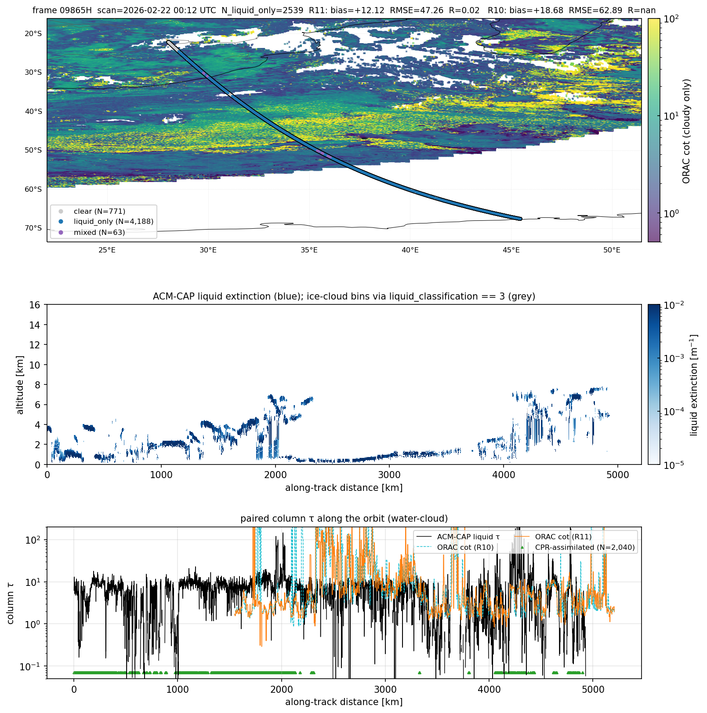
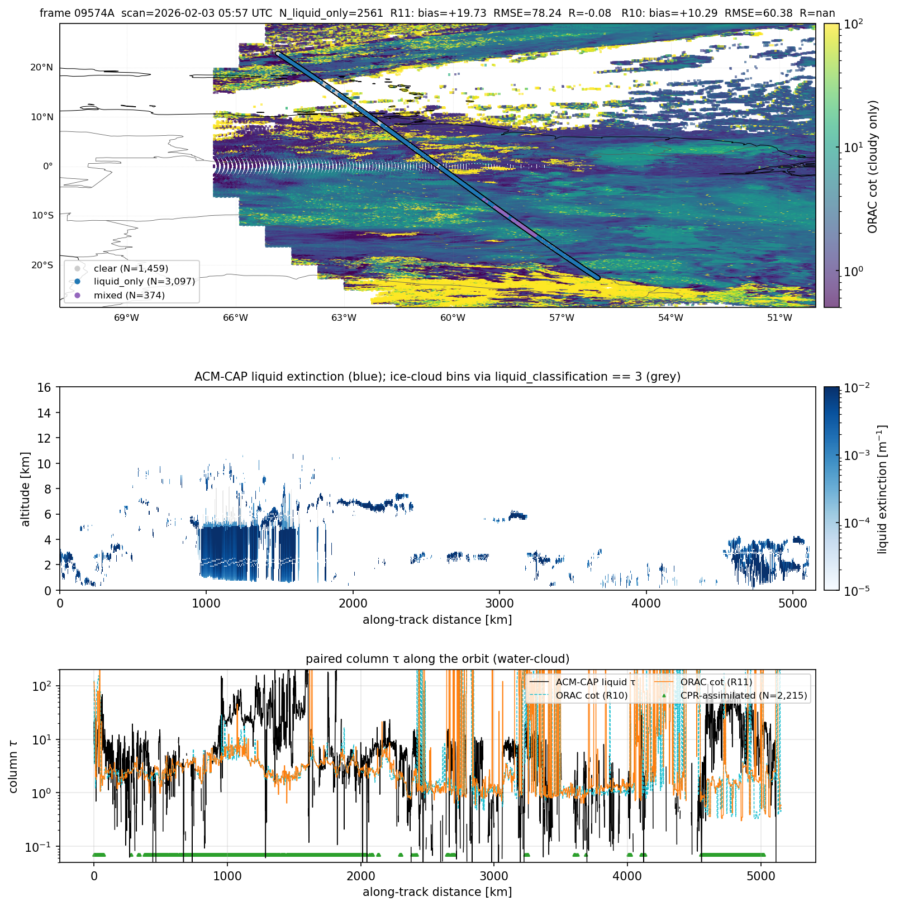
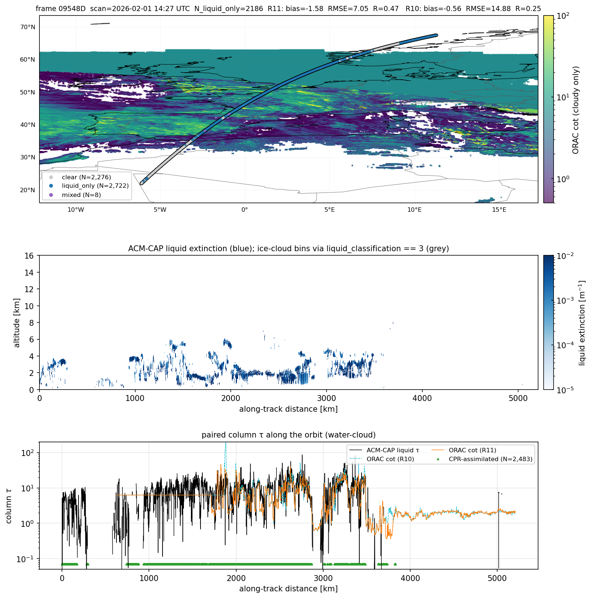
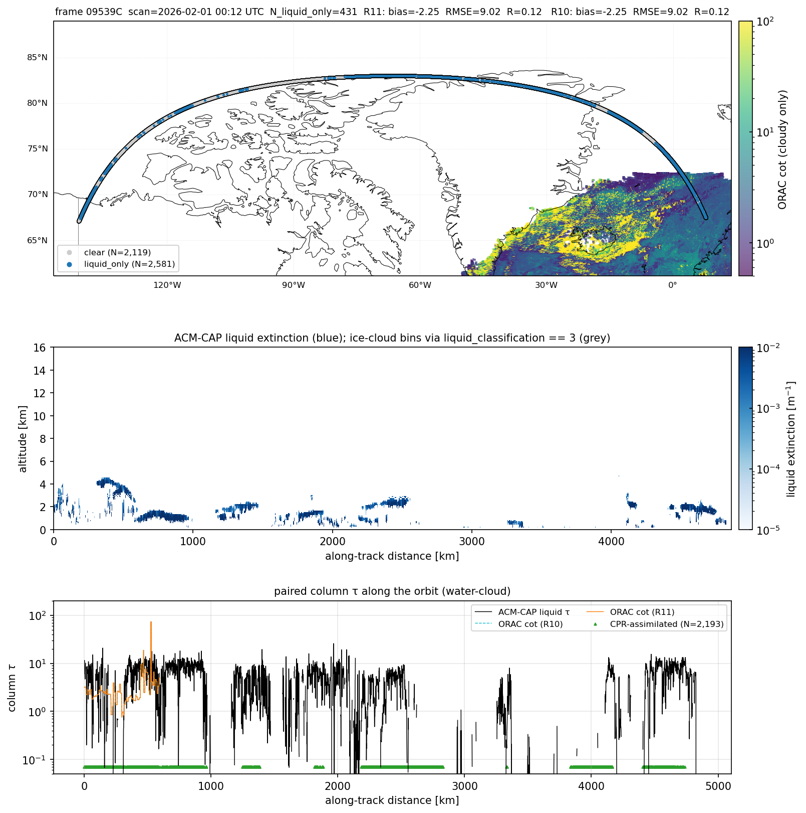
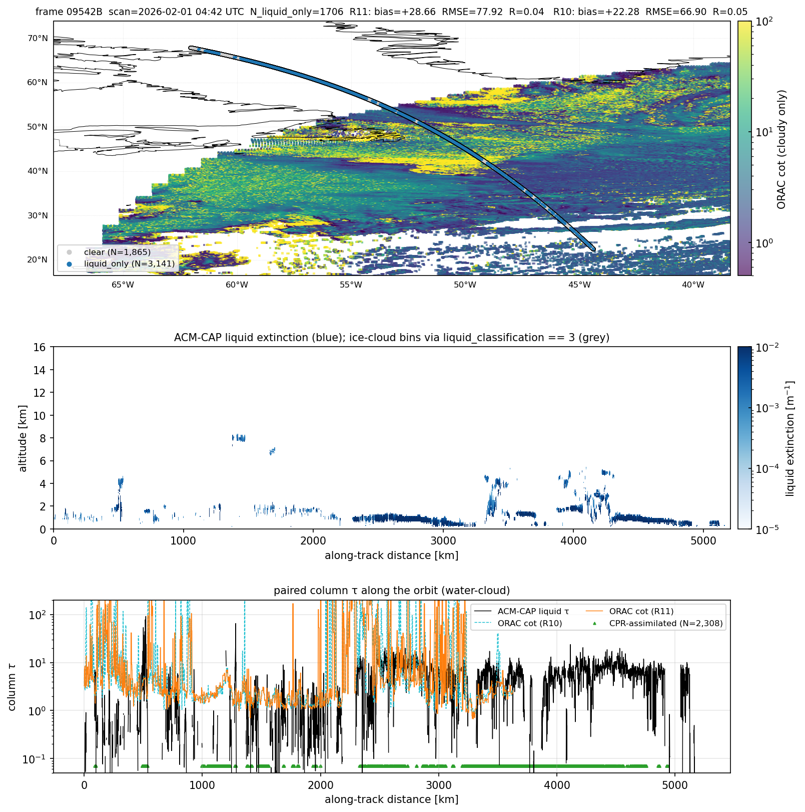
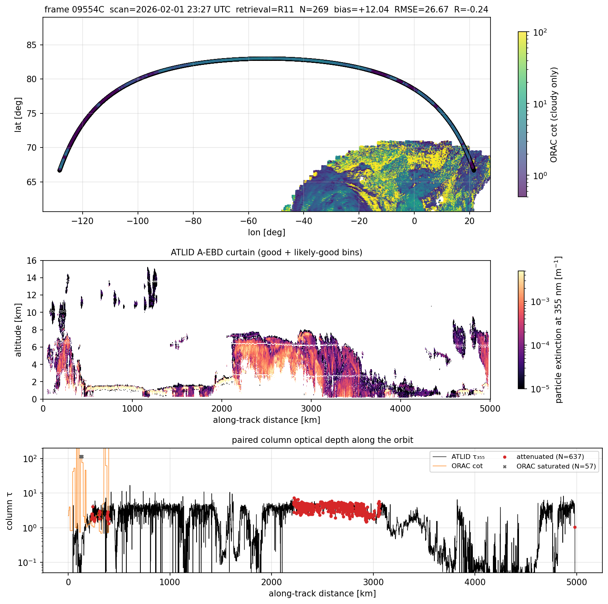
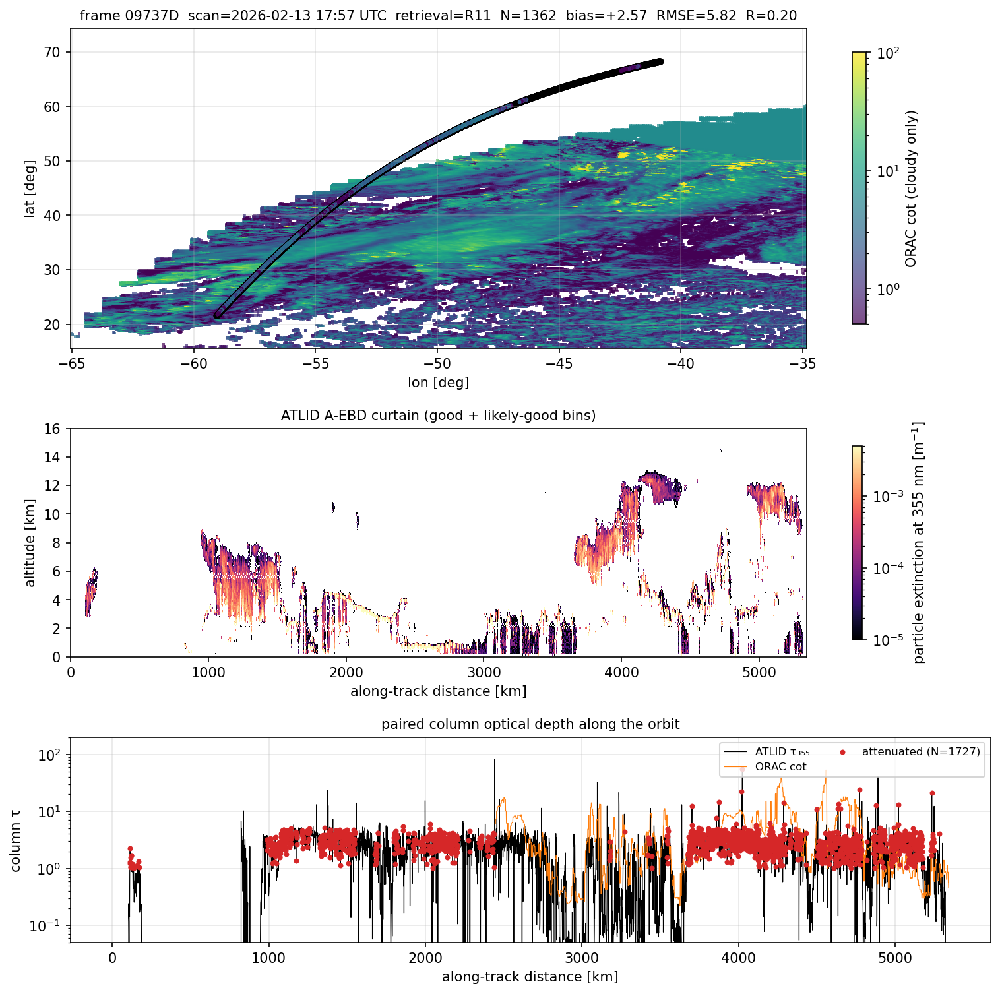
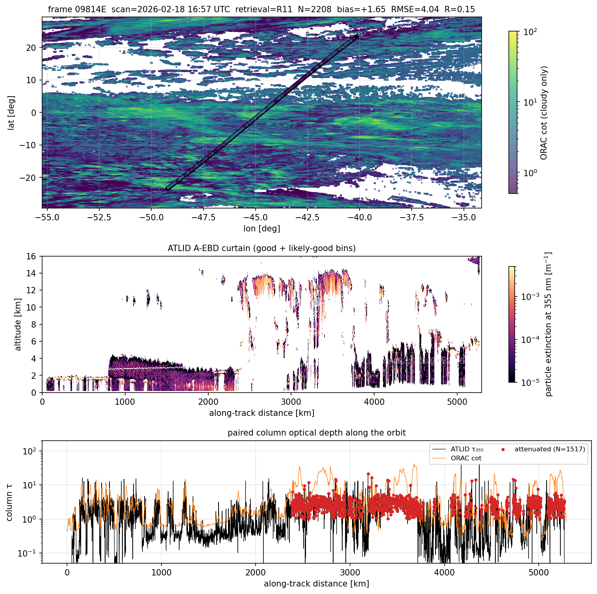

# ORAC SEVIRI track-study report — February 2026

This report documents the **per-orbit case-study figures** that sit
alongside the population-level CTH and COT validation. Track studies are
the qualitative complement to the bias / RMSE / R tables: they show what
the matched comparison actually looks like for one EarthCARE frame at a
time, with ATLID's vertical structure displayed alongside the ORAC SEVIRI
optical depth on the same horizontal axis.

Two flavours of track-study figure exist, both used here:

1. **Synergy track panels** (`validation/track_figures.py:track_panel_synergy`)
   — ACM-CAP frames. Three panels: SEVIRI cot map with the ACM-CAP nadir
   track coloured by phase; ACM-CAP liquid-extinction curtain with
   ice-cloud overlay; along-track liquid τ from ACM-CAP vs ORAC cot.
   Optionally overlays the R10 retrieval on the bottom panel.
2. **A-EBD track panels** (`validation/track_figures.py:track_panel`) —
   `ATL_EBD_2A` frames. Three panels: SEVIRI cot map with ATLID track
   coloured by per-profile column τ; ATLID 355 nm extinction curtain;
   along-track ATLID column τ vs ORAC cot, with attenuated and
   ORAC-saturated points highlighted.

Track studies live in two folders:

- `figures/cot_water_2026-02_track_studies/` — 10 ACM-CAP frames, with
  R10-vs-R11 overlays.
- `figures/validation/2026-02/track_*.png` — 3 A-EBD frames at three
  latitude bands (polar, midlat, tropics).

## 1. Why track studies matter

The aggregate CTH and COT reports give one number per stratum across
hundreds of thousands of pixels. They cannot reveal:

- **Where along the orbit** ATLID and ORAC agree or diverge;
- **Whether the bias is a coherent translation** (the whole curve
  offset) or a few extreme excursions (broken cloud edges, attenuated
  columns);
- **Whether R11 changes the qualitative shape** of a retrieval, or just
  shifts the magnitude;
- **What kind of cloud** is driving each statistic — broken cumulus,
  marine stratocumulus, deep convection, polar liquid layer cloud, ice
  cirrus over warm cloud, etc.

The case-study panels surface all of that. They were curated to span the
geographic and cloud-regime space the validation table summarises.

## 2. Synergy (ACM-CAP) case-study tour

The 10 frames are scattered across regimes: marine stratocumulus,
mid-latitude frontal cloud, deep convection, dust over ocean, Arctic
liquid layer cloud. Each figure has a six-element title strip:

```
frame <ID>  scan=<UTC>  N_liquid_only=<…>  R11: bias=… RMSE=… R=…  R10: bias=… RMSE=… R=…
```

The "N_liquid_only" is the count of ACM-CAP profiles classified as
liquid-only over the orbit (the population entering the liquid τ
comparison). R10 RMSE/R fields read `nan` when the R10 sample inside this
frame is too small after filtering.

### 2.1 Marine stratocumulus — frame 09865H, 2026-02-22, southern Indian Ocean



`figures/cot_water_2026-02_track_studies/track_09865H_marine-stratocumulus_R10_vs_R11.png`
— headline numbers: N_liquid_only = 2 539, R11 bias = +12.12, RMSE 47.26,
R 0.02; R10 bias = +18.68, RMSE 62.89.

- **Top map**: the 5 000-km-long track crosses a near-continuous
  stratocumulus deck off the South African coast, retrieved at SEVIRI cot
  ≈ 5–30 (yellow-green).
- **Curtain (middle)**: ACM-CAP liquid extinction is concentrated below
  3 km — exactly the marine-stratocumulus signature — with episodic deep
  liquid columns up to 6–7 km after the 4 000 km mark.
- **Bottom**: ATLID liquid τ (black) sits between 3 and 30 along the
  whole orbit; both ORAC streams (R11 orange, R10 light-blue) climb to
  τ = 100 in dense streaks. The over-shoot is structural, not noisy —
  this is the regime that dominates the +7 all-stratum bias from the COT
  report, and the per-orbit numbers here (+12 R11, +19 R10) reproduce
  it. **R10 is consistently higher than R11** in this scene; the lower
  R11 bias here is the per-orbit reflection of the marginal R10-vs-R11
  difference noted in the population report.

### 2.2 Tropical Atlantic — frame 09574A, 2026-02-03



`track_09574A_tropical-atlantic_R10_vs_R11.png` — N_liquid_only = 2 561,
R11 bias = +19.73, RMSE 78.24; R10 bias = +10.29, RMSE 60.38.

- **Top**: equatorial Atlantic crossing, with deep convection and broken
  cumulus on the western side and lower-deck warmer cloud east of the
  ITCZ.
- **Curtain**: liquid extinction signal is thin and patchy, mostly below
  4 km, with deep ice contributions visible (ice points are screened out
  of the liquid view).
- **Bottom**: extreme broken structure. ATLID jumps between τ = 1 and
  τ = 100 within tens of kilometres — typical broken cumulus. ORAC
  follows the envelope but with substantial scatter; R11 here happens
  to be *higher* than R10 (opposite to 09865H), which underlines that
  the population-level ordering does not hold per-frame in the
  high-noise broken-cloud regime.

### 2.3 Western Europe winter front — frame 09548D, 2026-02-01



`track_09548D_western-europe_R10_vs_R11.png` — N_liquid_only = 2 186,
R11 bias = −1.58, RMSE 7.05, R = 0.47; R10 bias = −0.56, RMSE 14.88.

- This is the **best track in the curated set**. R = 0.47 is far above
  the all-orbit average and the bias is small.
- **Top**: a frontal band stretching across NW Europe, retrieved at
  τ = 5–30 with sharp edges.
- **Bottom**: the two τ traces lock together over the central
  ~ 1 500 km of the orbit, with both streams tracking ACM-CAP within a
  factor of two. **R11 RMSE drops by half compared to R10** for this
  scene.
- **Reading**: well-organised mid-latitude liquid frontal cloud at moderate
  τ is the regime where the SEVIRI liquid retrieval is cleanest. This
  case is the point estimate for "what good looks like" in the
  population report.

### 2.4 Arctic / Greenland — frame 09539C, 2026-02-01



`track_09539C_arctic-greenland_R10_vs_R11.png` — N_liquid_only = 431,
R11 bias = −2.25, RMSE 9.02, R 0; R10 bias = −2.25, RMSE 9.02, R 0.12.

- **Top**: the orbit passes near 80°N over Greenland and the Arctic
  Ocean. SEVIRI coverage here is poor — the scatter is sparse and
  cot is mostly retrieved over a narrow eastern strip.
- **Curtain**: liquid extinction is thin (max ~ 4 km altitude),
  consistent with Arctic supercooled liquid layer cloud.
- **Bottom**: only the central ~ 1 500 km of the orbit has any ORAC
  sample, and the ORAC trace tracks ACM-CAP within a factor of two —
  bias is small (−2.25). **The Arctic polar bias seen in the
  population report (+18.1 in `lat_polar`) does NOT reproduce in this
  individual case.** The polar stratum signal is being driven by other
  orbits, not by every single Arctic case. This is exactly the kind of
  finding track studies surface that the population aggregate hides.

### 2.5 North Atlantic mid-latitude — frame 09542B, 2026-02-01



`track_09542B_north-atlantic_R10_vs_R11.png` — N_liquid_only = 1 706,
R11 bias = +28.66, RMSE 77.92, R 0.04; R10 bias = +22.28, RMSE 66.90.

- **Top**: a long oblique pass from Greenland to the mid-Atlantic, with
  bright cyclonic cloud structures (yellow τ ≈ 30–60) crossed by the
  track.
- **Bottom**: ORAC saturates at τ = 100 for long stretches (orange line
  pinned at the upper limit), while ACM-CAP τ varies from 5 to 50.
  Saturation alone explains a few units of bias here, but the residual
  is dominated by the bright frontal-cloud regime.
- **Reading**: this is the **worst case** in the synergy curated set
  (largest bias and RMSE). Mid-latitude bright cyclones with thick
  liquid frontal cloud are the regime that pushes the population bias
  toward +30. R11 is +6 worse than R10 in this scene, opposite to 09865H.

### 2.6 Other curated frames

- **South America — 09543A** (`track_09543A_south-america_R10_vs_R11.png`)
  — bias R11 +0.10, R10 +0.57, RMSE 33–34. Equatorial South America
  with deep convective cloud. Bias is near zero on average; RMSE is
  driven by the broken-cumulus / convective-edge regime.
- **North Africa — 09540A** (`track_09540A_north-africa_R10_vs_R11.png`)
  — bias R11 −0.24, R10 +0.60, RMSE 4–15. Nile-valley pass; small
  liquid signal, low bias. R10 RMSE is 3× R11's because of a single
  spike near 1 200 km along-track.
- **Indian Ocean — 09553A** (`track_09553A_indian-ocean_R10_vs_R11.png`)
  — bias R11 +71, R10 +65, RMSE > 100. Tropical Indian Ocean with deep
  convection; ORAC saturates extensively. Worst RMSE in the set.
- **South Indian Ocean — 09648H** (`track_09648H_south-indian-ocean_R10_vs_R11.png`)
  — bias R11 +6.4, R10 +12.2, RMSE 33–50. Long Sc-deck case similar in
  shape to 09865H.
- **Tropical mixed — 09885A** (`track_09885A_tropical-mixed_R10_vs_R11.png`)
  — bias R11 +2.3, R10 −1.2, RMSE 51 / 43. Tropical Atlantic with
  mixed-phase patches; the two streams disagree on whether the bias is
  positive or negative.

### 2.7 Synergy case-study takeaways

1. **R10-vs-R11 ordering is not consistent per-orbit.** In some scenes
   R10 has the smaller bias (09865H, 09648H, 09885A); in others R11
   does (09574A, 09542B). The all-month +1.3 advantage to R10 in the
   COT report is a small *average* of these per-orbit oscillations.
2. **The good cases are mid-latitude frontal cloud** (09548D R = 0.47;
   09543A R10 = 0.57). The bad cases are tropical bright cyclones and
   stratocumulus decks.
3. **ORAC's τ = 100 saturation matters** in the bright-cyclone scenes
   (09542B, 09553A). It contributes a few units of bias but is not
   the leading driver of the +7 all-stratum bias in the population
   table.
4. **Polar liquid-cloud per-orbit bias is not always +18.** The single
   curated Arctic case (09539C) has bias −2 with only 431 liquid
   profiles. The population polar signal is therefore distributed
   unevenly across many orbits — high SZA forward-model error
   plausible, but worth more orbits before a cause is locked in.

## 3. A-EBD (ATLID-only) case-study tour

The three A-EBD frames target the three latitude bands of the validation
strata (polar / midlat / tropics) and use **column 355 nm extinction**
from ATLID as the reference. Different validation chain from the synergy
case studies — these are the ATLID-only, ice-eligible track panels that
sit underneath the ice section of the COT report.

### 3.1 Polar — frame 09554C, 2026-02-01



`figures/validation/2026-02/track_09554C_polar.png` — N = 269, bias
+12.04, RMSE 26.67, R 0.24.

- **Top**: a high-latitude pass crossing the North Atlantic from 50°W
  southward to ~ 30°N. SEVIRI cot is dense over the eastern leg.
- **Curtain**: ATLID 355 nm extinction shows a deep cloud structure
  between 1 000 and 3 000 km along-track, with attenuation evident in
  the curtain's lower fading.
- **Bottom**: red points are profiles where ATLID was attenuated — τ is
  a *lower bound*. ORAC τ (orange) sits well above the attenuated
  ATLID τ in those segments by construction. This is the same
  ATLID-saturation effect that drives the −13 `tau_very_thick` bias
  in the COT-ice headline; here it shows up as the +12 per-orbit bias
  because the headline view filter is not applied in the track-panel
  case.

### 3.2 Mid-latitude — frame 09737D, 2026-02-13



`figures/validation/2026-02/track_09737D_midlat.png` — N = 1 362, bias
+2.57, RMSE 5.82, R 0.20.

- **Top**: pass over the western North Atlantic with a frontal band
  cutting across the orbit at the eastern end.
- **Curtain**: extinction signal is intermittent — clear sky at the
  west, a dense band of thick cloud (saturated red curtain) east of
  3 000 km.
- **Bottom**: the curtain saturation maps directly onto the lower
  panel: most of the right half is red (attenuated). ORAC τ in the
  thick segments is plausible but has no point-comparable ATLID truth.
  In the unattenuated thin-cloud segments left of 2 000 km, ORAC and
  ATLID lock together within a factor of 2.

### 3.3 Tropical — frame 09814E, 2026-02-18



`figures/validation/2026-02/track_09814E_tropics.png` — N = 2 208, bias
+1.65, RMSE 4.04, R 0.15.

- **Top**: South America to mid-Atlantic, dense ITCZ cloud across the
  middle of the track.
- **Curtain**: deep tropical convection between 1 000 and 2 500 km
  reaches 14 km altitude — anvil cirrus over a thick lower deck. ATLID
  saturates extensively in this column (low extinction signal at the
  base).
- **Bottom**: 1 517 attenuated profiles (red) — about two-thirds of
  the orbit. The unattenuated thin-cirrus segments (high ATLID, low
  ORAC) have ORAC tracking the ATLID column extinction within ~ 2× —
  consistent with the "ice cloud τ < 5 is well retrieved" finding from
  the COT report.

### 3.4 A-EBD case-study takeaways

1. **Attenuation drives almost everything.** The polar +12 bias and
   the midlat / tropical +2 bias are mostly the per-orbit
   manifestation of "ATLID stops measuring above τ ≈ 3"; the headline
   ice COT report removes these by construction (`attenuated` filter
   in `cli.py:498`).
2. **The unattenuated tropical thin-cirrus regime is well retrieved**.
   In the 09814E bottom panel the ATLID and ORAC traces agree within
   ~ 2× over thin-cirrus segments — point-by-point validation of the
   r_log ≈ 0.32 figure in the ice COT report.
3. **The midlat case is structurally cleanest** of the three. R = 0.20
   sounds low but is on the *linear* axis; the per-orbit log-correlation
   (not computed here, but visually evident in the locked traces left of
   2 000 km) is much higher.

## 4. Reading the bottom panel in general

The shared element across both flavours of track study is the bottom
panel: black = lidar / synergy reference, orange = ORAC R11, light-blue
(when present) = ORAC R10, with auxiliary markers:

- **Red dots** (A-EBD only) — ATLID attenuated profiles, τ is a lower
  bound.
- **Grey × markers** (A-EBD only) — ORAC saturation hits (τ = 100).
- **Green dots at the bottom** (synergy only) — CPR-assimilated profiles;
  these are the segments where ACM-CAP is the trusted ATLID + radar
  synergy retrieval rather than ATLID-only.

A few pixels of agreement between the lidar trace and the ORAC trace at
multiple along-track scales is the visual signal that the population
correlation is real. A frame where the orange line is parallel-but-shifted
from the black line is a frame contributing a clean bias to the
population. A frame where the orange line has the right envelope but
unrelated detail is a frame contributing scatter, not bias.

## 5. Conclusions

1. **Track studies validate the population claims**. The +7 water-cloud
   bias is visible as systematic offsets in 09865H and 09542B; the +1
   ice-cloud bias is visible as locked traces in unattenuated thin-cirrus
   segments of 09814E.
2. **They also show the heterogeneity behind the averages**. Per-orbit
   R10-vs-R11 ordering swaps depending on cloud regime; the all-month
   "R10 is +1.3 better on COT" is a small mean of mixed-sign per-orbit
   differences.
3. **One Arctic case (09539C) does not reproduce the +18 polar liquid
   bias**. The population polar signal is therefore unevenly distributed
   across orbits and cannot be debugged from a single case study; more
   curated polar frames would help isolate the cause.
4. **ORAC saturation at τ = 100** explains a small fraction of the
   bright-cyclone bias (09542B, 09553A) but is not the dominant driver of
   the all-stratum overestimate.
5. **The mid-latitude frontal-cloud regime (09548D)** is the cleanest
   per-orbit case: R = 0.47, bias −1.6 R11. Use this frame as the
   reference figure when communicating ORAC's best-case liquid-τ
   performance.

## 6. Reproducibility

```bash
# Synergy track panel for one ACM-CAP frame, with R10-vs-R11 overlay
python -m validation track-plot \
    --matches "validation_data/synergy_2026-02_R11/*.csv" \
    --matches-r10 "validation_data/synergy_2026-02_R10/*.csv" \
    --frame-id 09865H \
    --kind synergy \
    --retrieval R11 \
    --out figures/cot_water_2026-02_track_studies/track_09865H_marine-stratocumulus_R10_vs_R11.png

# A-EBD track panel for an A-EBD frame
python -m validation track-plot \
    --matches "validation_data/cot_2026-02_R11/matches_*.csv" \
    --frame-id 09554C \
    --kind aebd \
    --retrieval R11 \
    --out figures/validation/2026-02/track_09554C_polar.png
```

Code:

- Synergy panel: `validation/track_figures.py:track_panel_synergy`
- A-EBD panel: `validation/track_figures.py:track_panel`
- CLI dispatch: `validation/cli.py:cmd_track`

Inputs: matches CSVs from the corresponding collocate run plus the
EarthCARE HDF5 frames under `earthcare_data/`.

Tracked outputs:

- `figures/cot_water_2026-02_track_studies/` — 10 ACM-CAP frames × 2
  variants (R11-only, R10-vs-R11) = 20 figures.
- `figures/validation/2026-02/track_*.png` — 3 A-EBD frames at polar,
  midlat, tropical latitudes.
