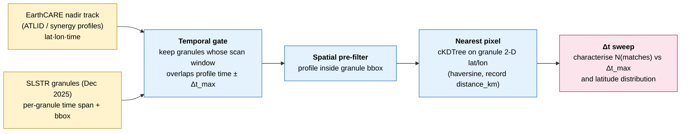
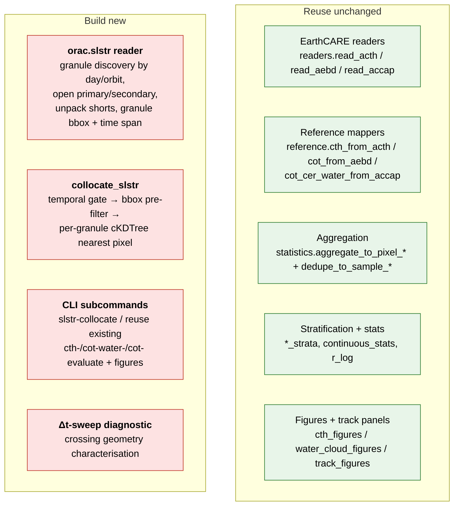

# ORAC SLSTR × EarthCARE validation — cal/val plan

A plan to extend the existing ORAC × EarthCARE validation framework (built and
proven on **SEVIRI**, see `docs/validation_pipeline.md`) to **ORAC retrievals
on SLSTR** (Sentinel-3A). The method, reference priority, aggregation, and
stratification are inherited wholesale from the SEVIRI work; this document
records only what is **new or different** for SLSTR, plus a staged work plan
toward a first meeting-ready result on **CTH and COT**.

Target validation month: **December 2025** (the one full month of ORAC SLSTR
v5.1 output available). First-round variables: **CTH + COT** (water and ice),
mirroring the two mature SEVIRI paths.

---

## 1. The SLSTR ORAC data

### 1.1 Location and layout

The real product NetCDFs are under the **`l2b/`** tree, not the `done/` tree
(which holds only zero-byte completion markers):

```
/gws/ssde/j25a/cloud_ecv/data_out/slstr/v5.1_new_snowice/slstra/l2b/
    YYYY/MM/DD/<absolute_orbit>/
        C3S-312bL1-L2-CLOUD-CLD-SLSTR_ORAC_Sentinel3a_<YYYYMMDDhhmm>_<orbit>_R9999.primary.nc
        …_R9999.secondary.nc
        …_R9999.bugsrad.nc      # broadband fluxes — not needed for cloud cal/val
```

- **Platform**: Sentinel-3A only (`slstra`). No Sentinel-3B in this v5.1 tree.
- **Version**: `v5.1_new_snowice` — an ORAC build with revised snow/ice surface
  handling. Relevant because December is NH midwinter, so a large fraction of
  high-latitude scenes sit over snow / sea-ice, where passive cloud retrieval is
  hardest and an active reference (ATLID) is most valuable.
- **Retrieval streams**: a **single stream** (`R9999`). There is **no R10 vs
  R11 comparison** as there was for SEVIRI — this simplifies every downstream
  step (one value per pixel, no compare figures).
- **Coverage**: `l2b/` contains `2020-04` (full), a single `2024-03` day, and
  **`2025-12` (full month, 31 days, ~15 000 primary granules, ~485/day,
  ~15 orbits/day)**. Only **Dec 2025** is viable for a monthly study.

### 1.2 Granule structure

Each `*.primary.nc` is a **swath granule**, not a fixed grid:

| Property | Value |
|---|---|
| dims | `along_track = 1200`, `across_track = 1500`, `views = 1` |
| geolocation | 2-D `lat(along, across)`, `lon(along, across)`, `time(along, across)` |
| nadir pixel | ~1 km (SLSTR nadir); across-track ~1500 px ≈ 1420 km swath |
| granule length | ~3 min of orbit; a full orbit = many consecutive granules |
| fill | ORAC packed shorts with `scale_factor`/`add_offset`, `_FillValue` |

This is the key structural contrast with SEVIRI: **a moving 2-D swath with
per-granule footprints**, versus SEVIRI's single fixed full-disk grid sampled
every 15 min.

### 1.3 Variables (same ORAC family as SEVIRI)

The cloud variable set is **identical** to the SEVIRI ORAC L2 product, so the
existing reference-mapping and statistics code applies unchanged:

`cot`, `cot_uncertainty`, `cer`, `cer_uncertainty`, `ctp`/`ctp_corrected`,
`ctt`/`ctt_corrected`, **`cth`/`cth_corrected`**, `cwp`, `phase` (1 = liquid,
2 = ice), `phase_pavolonis`, `cldmask`, `cldtype`, `cc_total` (cloud fraction),
`lsflag` (land/sea), `lusflag` (land-use), `illum` (illumination / day-night),
`solar_zenith_view_no1`, `qcflag`, `stemp`, `cccot_pre`, plus cost/iteration
diagnostics (`costja`, `costjm`, `niter`) in the secondary file.

Global attrs confirm `L2_Processor = ORAC`, `Sensor = SLSTR`,
`Conventions = CF-1.4`, `institution = RAL_Space`.

**Two findings from inspecting the granules that shape the collocation:**

1. **`time` is a fully-populated per-pixel array** (Julian days, same encoding as
   SEVIRI; decode with `orac.io.julian_to_datetime`). A granule spans ~3 min and
   the filename timestamp is its start. So the temporal gate can use the *actual*
   matched-pixel time, not just a nominal slot time.
2. **COT/CER are daytime-only.** `illum` is `1 = day, 2 = twilight, 3 = night`.
   On night granules (`illum = 3`, solar zenith > 90°) ORAC cannot run its solar
   `cot`/`cer`/`cwp` retrieval and they sit at the **first-guess prior** (a
   constant `cot = 6.3`, `cer = 30`, `cwp = 110`); the thermal `cth`/`ctp`/`ctt`
   retrieve normally. **The COT comparison must therefore be filtered to
   `illum == 1` (day)**; CTH can use day + night. The collocator carries `illum`
   and `solar_zenith_view_no1` so this is a stratifier, not a hard cut at match
   time. Global coverage also means the matcher must be **dateline/pole-safe**
   (3-D unit-vector KD-tree, not raw lat/lon).

---

## 2. Reference priority — unchanged from SEVIRI

The EarthCARE reference side is **identical** to the SEVIRI validation: validate
against the most independent measurement available, ATLID first, nadir synergy
second, MSI-swath products never. See `docs/validation_pipeline.md §1–2` for the
full rationale (Holz 2008, Karlsson 2013, Cloud_cci PVIR v6).

First-round reference mapping (CTH + COT):

| ORAC SLSTR variable | Primary reference | Product | Existing extractor (reuse) |
|---|---|---|---|
| `cth_corrected` | **A-CTH** `ATLID_thick_cloud_top_height` | `ATL_CTH_2A` | `reference.cth_from_acth` |
| `cot` (water) | **ACM-CAP** `liquid_optical_depth` | `ACM_CAP_2B` | `reference.cot_cer_water_from_accap` |
| `cot` (ice) | **A-EBD** ∫ 355 nm extinction dz | `ATL_EBD_2A` | `reference.cot_from_aebd` |

Later rounds (out of first-round scope): `cer` ← ACM-CAP liquid/ice effective
radius; `phase`/`cldmask` ← A-TC / A-FM (categorical metrics); `cwp` ← ACM-CAP
`iwp + lwp`.

**Reference data gap.** We currently hold EarthCARE data only for 2024-12,
2026-01, 2026-02 — **nothing for Dec 2025**. ACM-CAP, A-CTH and A-EBD for
Dec 2025 are confirmed available on ESA MAAP (baseline `EXBC`). Downloading them
via `python -m earthcare download` is **step 1** of the work plan (§6).

---

## 3. The one genuinely new problem: collocation geometry

This is where SLSTR departs fundamentally from SEVIRI and deserves the most
attention at the meeting.

**SEVIRI (solved).** Geostationary: every on-disk ATLID sample has a nearest
SEVIRI pixel available in *every* 15-min slot. Time is never the binding
constraint (`|Δt| ≤ 7.5 min` is trivially satisfiable), so the SEVIRI collocator
picks the nearest-in-time slot and matches every profile. Match volume is huge
(hundreds of thousands of pixels/month).

**SLSTR (new).** Both EarthCARE and Sentinel-3A are **sun-synchronous polar
LEO** satellites at *different* local equator-crossing times. Two such orbiters
observe the same ground location simultaneously only near **orbit-track
crossings**, which:

- concentrate at **high latitudes** (all polar ground tracks converge toward the
  poles) — conveniently the snow/ice regime this v5.1 build targets;
- become sparse at low latitudes, where the local-time offset means the same
  spot is revisited hours apart;
- make the **temporal match window the binding design parameter**, not distance.



**Design consequences to decide empirically (first analysis, §6 step 3):**

1. **Choose Δt_max by a sweep.** Run the crossing search at several windows
   (e.g. ±5, ±10, ±30, ±60 min) and plot match count and median `distance_km`
   and latitude vs window. Pick the knee that balances sample size against
   cloud-advection error. Report the chosen window explicitly (the SEVIRI
   headline was `|Δt| ≤ 7.5 min`; SLSTR will likely need wider).
2. **Expect a high-latitude-weighted, smaller sample** than SEVIRI. A full month
   is required; sub-monthly previews may be too thin at low latitudes.
3. **Day/night split is real here.** SLSTR retrieves CTH/CTP at night via the
   thermal split-window, but `cot`/`cer` need reflected sunlight. ATLID works
   day and night. So the COT comparison is effectively **daytime-only**; CTH can
   use both. Use the `illum` / solar-zenith field to stratify, as SEVIRI did.
4. **Tighter footprint match than SEVIRI.** SLSTR nadir pixels are ~1 km vs
   SEVIRI's 3–7 km, so far fewer ATLID profiles fall in one SLSTR pixel and the
   sub-pixel heterogeneity that dominated the SEVIRI COT-water scatter
   (`docs/reports/cot_homogeneity_2026-02.md`) should be **smaller** — a point
   worth testing directly by reusing the homogeneity sweep.

---

## 4. What to reuse vs build

The `validation/` package is deliberately variable-agnostic; the EarthCARE
reference half is **100 % reusable**. The break is confined to the ORAC-side
reader and the matcher.



**Existing SEVIRI matcher to adapt** (`validation/collocate.py`): the SEVIRI
version (`match_track_to_seviri` → `_query_slot`) already does bulk cKDTree
nearest-pixel on 2-D `lat`/`lon` with haversine distance recorded and no hard
distance cap. The SLSTR matcher keeps that inner kernel and replaces the
outer loop: instead of "pick nearest 15-min slot then query the whole disk",
it becomes "gather granules overlapping `profile_time ± Δt_max`, pre-filter
profiles to each granule's bbox, query that granule's swath". The output schema
(one row per EarthCARE profile + `granule_id`, `distance_km`, `time_diff_s`,
`valid_match`, ORAC fields, ATLID QC fields) stays the same, so
`statistics.py` / `figures.py` / `track_figures.py` consume it untouched.

A parallel `orac/` reader module (mirroring the SEVIRI `orac` package that reads
slots) is the cleanest home for granule discovery and NetCDF opening.

---

## 5. Aggregation & stratification (mostly inherited)

- **Two views** as for SEVIRI: *sample* (nearest profile per SLSTR pixel) and
  *pixel* (ATLID averaged over profiles in one SLSTR footprint; ORAC constant
  within pixel). Because SLSTR pixels are ~1 km, `n_atlid` per pixel will be
  small (often 1–3), so the sample and pixel views should nearly coincide —
  itself a useful check that the SEVIRI aggregation asymmetry is reduced.
- **QC modes** reused verbatim: A-CTH `qc_strict/relaxed/off/no_trop_cap`;
  ACM-CAP `quality_status` gate; A-EBD attenuation flag + ORAC saturation
  tracking (`cot ≥ 100`).
- **Strata**, reused with SLSTR-relevant emphasis:
  - **surface**: ocean / land from `lsflag`; **plus a snow/ice cut** (from
    `lusflag` / `stemp` / DEM, or ATLID surface class) — the natural focus given
    `v5.1_new_snowice` and December.
  - **latitude band**: tropics / midlat / polar — expect the sample to skew
    polar due to the crossing geometry (§3).
  - **day / night**: from `illum` / solar zenith — COT daytime-only.
  - **cloud phase, ATLID cloud class, τ band, match distance, time offset** —
    all as in the SEVIRI reports.
- **Headline metrics** unchanged: `N`, bias (ORAC − reference), RMSE, MAE,
  Pearson `R`, and for COT the log-space `r_log` (the meaningful correlation on
  the 3-decade τ distribution — see `cot_validation_2026-02.md §1.3`).

---

## 6. Staged work plan

| Step | Task | Output |
|---|---|---|
| 1 | **Download EarthCARE Dec-2025 reference** — A-CTH, A-EBD, ACM-CAP over the month (`python -m earthcare download`). Bounded by MAAP throughput; ACM-CAP is bulky (~GB/frame). | `earthcare_data/{ATL_CTH_2A,ATL_EBD_2A,ACM_CAP_2B}/2025/12/` |
| 2 | **SLSTR reader** — granule discovery (day → orbit → granule), open primary/secondary, unpack, expose per-granule bbox + time span. | `orac`-style SLSTR module + unit smoke test on one granule |
| 3 | **Crossing-geometry study** — Δt sweep (±5/10/30/60 min) over one week: match count, latitude distribution, `distance_km`. **Decide Δt_max.** | short diagnostic note + figure; sets the collocation window |
| 4 | **SLSTR collocator** — temporal gate + bbox pre-filter + per-granule cKDTree; emit per-frame matches CSVs (schema-compatible with SEVIRI). | `validation_data/slstr_cth_2025-12/`, `…_synergy_2025-12/`, `…_cot_2025-12/` |
| 5 | **CTH validation** — reuse `cth-evaluate` + `cth-figures`; scatter, diagnostics, QC sensitivity, bias/R by stratum (incl. snow/ice, day/night). | `figures/slstr_cth_2025-12/` + stats CSV |
| 6 | **COT validation** — water vs ACM-CAP (`cot-water-*`), ice vs A-EBD (`cot- --ice-only`); reuse homogeneity sweep to test the ~1 km footprint benefit. | `figures/slstr_cot_water_2025-12/`, `…/ice/` + stats |
| 7 | **Track studies** — a few curated Dec-2025 crossings across regimes/surfaces via `track_figures`. | per-orbit panels |
| 8 | **Report** — `docs/reports/slstr_cth_2025-12.md` and `…_cot_2025-12.md`, same structure as the SEVIRI reports. | meeting-ready writeup |

For the **next meeting**, steps 1–6 (CTH + COT headline numbers and figures) are
the deliverable; steps 7–8 are the follow-through.

---

## 7. Proposed CLI shape (mirrors SEVIRI)

```bash
# 1. reference download (step 1)
python -m earthcare download --product ACM-CAP \
    --start 2025-12-01T00:00:00Z --end 2026-01-01T00:00:00Z --dest earthcare_data
#   …and A-CTH, A-EBD likewise.

# 2. collocate EarthCARE driver track → SLSTR granules (step 4)
python -m validation slstr-collocate \
    --driver A-CTH --start 2025-12-01 --end 2026-01-01 \
    --slstr-root /gws/ssde/j25a/cloud_ecv/data_out/slstr/v5.1_new_snowice/slstra/l2b \
    --max-time-diff-min 30 \
    --out validation_data/slstr_cth_2025-12

# 3. evaluate + figures — REUSE the existing SEVIRI subcommands unchanged
python -m validation cth-evaluate  --matches 'validation_data/slstr_cth_2025-12/matches_cth_*.csv' \
    --out validation_data/slstr_cth_2025-12.csv
python -m validation cth-figures   --matches 'validation_data/slstr_cth_2025-12/matches_cth_*.csv' \
    --qc-mode qc_strict --label "SLSTR cth 2025-12" --out figures/slstr_cth_2025-12
```

The `evaluate` / `figures` / `track-plot` subcommands are reference-driven, not
platform-driven, so only `slstr-collocate` is genuinely new; everything
downstream is the SEVIRI machinery.

---

## 8. Risks & open questions

1. **Match volume at low latitudes.** If the crossing geometry (§3) yields too
   few tropical/mid-lat matches at a defensible Δt, the SLSTR study may be
   inherently high-latitude-weighted. That is scientifically fine (snow/ice is
   the interesting regime) but must be stated, not hidden — quantify it in
   step 3 before committing to headline strata.
2. **Granule-boundary double counting.** Consecutive granules overlap slightly;
   a profile near a seam could match two granules. De-duplicate to the nearest
   in `distance_km` (then `time_diff_s`), as the sample view already does.
3. **Time variable semantics.** `time` is per-pixel Julian days; confirm the
   filename timestamp vs the along-track time array agree before trusting the
   temporal gate (the SEVIRI reader learned the filename time is authoritative).
4. **Snow/ice surface label source.** Decide whether to take the surface class
   from ORAC (`lsflag`/`lusflag`/`stemp`) or from an independent field (ATLID
   surface type, or an ancillary sea-ice product) — using ORAC's own label to
   stratify a study of ORAC's snow/ice skill is slightly circular.
5. **No R10/R11 axis.** The SEVIRI reports leaned on the R10-vs-R11 contrast;
   SLSTR has one stream. The comparative angle, if wanted later, would be
   ORAC-SLSTR vs ORAC-SEVIRI against the same ATLID truth — deferred.

---

## 9. Summary

- Point the pipeline at **`…/slstra/l2b/2025/12/`** (not `done/`), single stream
  **R9999**, ORAC variable set identical to SEVIRI.
- **Reuse everything on the reference side**; build only a **SLSTR granule
  reader** and a **temporal-gated granule collocator**.
- The **collocation geometry** (two polar orbiters → crossing-limited, time-
  window-binding, high-latitude-weighted) is the one real methodological change
  and the first thing to characterise empirically.
- First deliverable: **CTH + COT (water + ice) for Dec 2025**, in the same
  report format as the SEVIRI work — after downloading the missing EarthCARE
  Dec-2025 reference.
</content>
</invoke>
