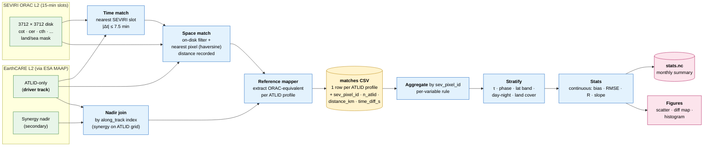
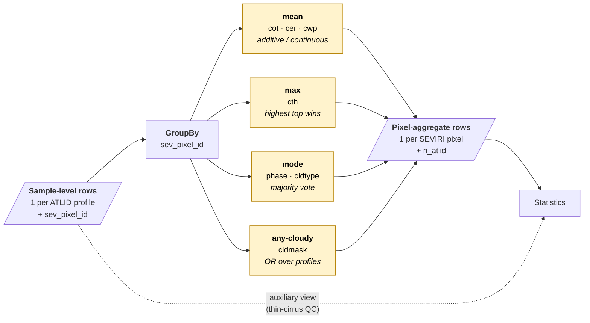
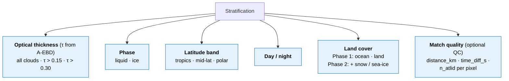
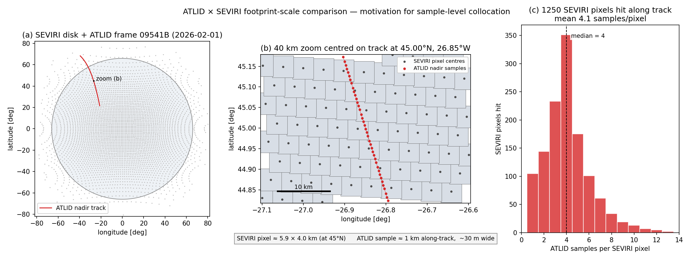

# ORAC × EarthCARE Validation Pipeline

End-to-end design for the `validation/` module that evaluates ORAC SEVIRI L2 cloud retrievals against EarthCARE L2 references. Diagrams render natively on GitHub.

---

## 1. Reference priority — ATLID first, MSI never

```mermaid
flowchart TB
    classDef primary fill:#fde2e2,stroke:#c0392b,stroke-width:2px,color:#000
    classDef secondary fill:#fff3cd,stroke:#b8860b,stroke-width:2px,color:#000
    classDef tertiary fill:#e8f5e9,stroke:#2e7d32,stroke-width:1px,color:#000
    classDef excluded fill:#eceff1,stroke:#546e7a,stroke-width:1px,color:#546e7a,stroke-dasharray: 5 3
    classDef orac fill:#dcefff,stroke:#1565c0,stroke-width:2px,color:#000

    O["ORAC SEVIRI L2<br/>cot · cer · cth · cwp · phase · cldmask · cldtype"]:::orac

    P["<b>Primary</b> — ATLID-only<br/>A-CTH · A-EBD · A-TC · A-ICE · A-FM<br/>independent lidar truth"]:::primary
    S["<b>Secondary</b> — Synergy along ATLID nadir column<br/>ACM-CAP · AC-TC · ACM-COM"]:::secondary
    T["<b>Tertiary</b> — CPR-only or alternate synergy<br/>C-CLD · C-TC · C-FMR (nadir column only)"]:::tertiary
    X["<b>EXCLUDED</b> — MSI swath products<br/>AM-CTH · M-COP · M-CM · M-AOT<br/>shared passive-retrieval errors"]:::excluded

    P  -->|"used first"|              O
    S  -->|"if primary missing"|      O
    T  -->|"cross-check"|             O
    X  -.->|"never used"|             O
```

**Rule.** Validate against the most independent measurement available. ATLID is an active lidar — its physics share nothing with passive SEVIRI, so disagreements reveal real ORAC errors. MSI-derived products like AM-CTH share the *passive-retrieval* physics that ORAC uses, so an AM-CTH agreement could just be two passive sensors making the same mistake. This convention follows Holz 2008, Karlsson & Johansson 2013, and ESA Cloud_cci PVIR v6 — all of which use CALIOP only.

---

## 2. Per-variable reference matrix

| ORAC variable | Primary (ATLID-only)                       | Secondary (synergy nadir)                   | Tertiary                |
|---------------|--------------------------------------------|---------------------------------------------|-------------------------|
| `cth`         | **A-CTH** `ATLID_cloud_top_height`         | AC-TC top-layer height                      | ACM-CAP top cloudy bin  |
| `cot`         | **A-EBD** ∫ extinction dz                  | ACM-CAP ∫(ice + liquid extinction)          | —                       |
| `cer` (ice)   | **A-ICE** `ice_effective_radius`           | ACM-CAP `ice_effective_radius`              | C-CLD nadir             |
| `cer` (liq)   | — (no pure-lidar option)                   | **ACM-CAP** `liquid_effective_radius`       | C-CLD nadir             |
| `cwp`         | A-ICE IWP (ice phase only — sanity check)  | **ACM-CAP** `iwp + lwp`                     | C-CLD nadir             |
| `phase`       | **A-TC** target classification             | AC-TC classification                        | ACM-COM top-layer class |
| `cldmask`     | **A-FM** feature mask ≥ threshold          | AC-TC `detection_status`                    | C-FMR nadir             |
| `cldtype`     | **A-TC** → Pavolonis remap                 | AC-TC → Pavolonis                           | ACM-COM top-layer       |
| ~~`ctt`~~     | out of scope (no ATLID reference; needs ERA5) |                                          |                         |
| ~~`ctp`~~     | out of scope                                  |                                          |                         |

---

## 3. End-to-end pipeline



### Space match — design note

SEVIRI is a continuous geostationary grid: every on-disk ATLID sample has a well-defined nearest pixel by construction. Rather than imposing a hard distance cap (which would have to scale with view zenith angle to be physically sensible — pixels grow from ~3 km at the sub-satellite point to ~30 km at the limb), we:

1. **Pre-filter** ATLID samples to where SEVIRI's `lat`/`lon` is finite (the disk).
2. **Match** survivors to their nearest pixel (haversine, no distance cap).
3. **Record** `distance_km` and `time_diff_s` per match as columns.

Distance is then available downstream as a QC stratification (e.g. high-VZA limb pixels naturally have larger nearest-centre distances) without forcing a hard cut at match time.

---

## 4. Aggregation — sample-level → pixel-aggregate

Each SEVIRI pixel typically captures **a variable number of ATLID profiles** (median ≈ 4 at mid-latitudes, ranging from 1 to ~13 depending on latitude and crossing geometry). The collocation step stores rows at sample level so nothing is lost; statistics aggregate downstream by `sev_pixel_id` using a per-variable rule.



`n_atlid` (samples per pixel) travels through to statistics so we can filter by minimum group size if pixel-mean noise becomes a concern.

---

## 5. Stratification dimensions

Statistics are reported across the full sample and within each of these strata. τ-stratification is **mandatory** for `cth` and `cldmask` (the headline number is the τ > 0.3 subset, the passive-equivalent baseline from Karlsson 2013 + PVIR v6). The τ filter is applied **before** aggregation so thin layers are not diluted away by averaging.



---

## 6. Module layout

The `validation/` package is implemented for the **cot** variable end-to-end. Other variables (cth, cer, cwp, phase, cldmask, cldtype) plug in by adding a per-product reader and an extractor — the collocation, aggregation, stratification and figure code are variable-agnostic.

```
validation/
  __init__.py
  __main__.py            # python -m validation
  cli.py                 # collocate · evaluate · figures
  collocate.py           # bulk cKDTree match, time + space + nadir join
  readers.py             # A-EBD reader (extend per product)
  reference.py           # cot_from_aebd: ∫α dz with QC + attenuation flag
  statistics.py          # aggregate_to_pixel + stratified_stats + cot_report
  figures.py             # scatter_panel · diagnostic_panel · bias_by_stratum
```

**Attenuation flag.** A profile is "attenuated" (reported τ is a lower bound) when ≥50% of bins below 5 km altitude are QS=3 *and* the integrated τ ≥ 1.0. Replaces an earlier "any QS=3 anywhere in column" rule that fired on isolated noise bins and over-flagged 99% of profiles. The current rule fires on ~33% of profiles in mid-Atlantic test frames, with median τ=3.3 — consistent with lidar saturation around the published τ~3-5 threshold for ATLID at 355 nm.

**ORAC saturation tracking.** ORAC cot retrievals at the upper LUT rail (≥100) are unconverged. They're flagged as a separate stratum (`cot_orac_saturated`), not silently dropped. ~4% of cot matches are saturated in the mid-Atlantic test scene.

---

## 7. CLI

```bash
# Match every A-EBD frame in 2026-02 to the nearest SEVIRI ORAC slot.
# Per-frame CSVs in --out (resumable: existing CSVs are skipped).
python -m validation collocate \
    --driver A-EBD --start 2026-02-01 --end 2026-03-01 \
    --seviri-root /gws/ssde/j25a/cloud_ecv/data_out/seviri --retrieval R11 \
    --out validation_data/cot_2026-02

# Concatenate per-frame CSVs and write the stratified stats table.
python -m validation evaluate \
    --matches 'validation_data/cot_2026-02/matches_*.csv' \
    --out validation_data/cot_2026-02/stats.csv

# Five PNGs: sample/pixel scatter, 2x2 diagnostic, bias-by-stratum (sample
# and pixel), R-by-stratum (pixel).
python -m validation figures \
    --matches 'validation_data/cot_2026-02/matches_*.csv' \
    --out figures/validation/2026-02 --label "cot 2026-02"

# Figures
python -m validation figures \
    --stats validation_data/stats_2026-02.nc \
    --out figures/validation/2026-02/
```

---

## 8. Footprint scale (motivation)

ATLID samples ~1 km along-track with a ~30 m laser footprint; SEVIRI pixels at 45°N are ~5.9 × 4.0 km. The figure below shows the scale contrast for a real overpass and quantifies how many ATLID profiles fall in each SEVIRI pixel along the track — this is exactly what `n_atlid` represents in the aggregation step.



---

## 9. Methodological lineage

The collocation protocol (sample-level, lidar-centric, nearest-passive-pixel, ±7.5 min, ≤5 km) and τ-stratified reporting follow conventions established for SEVIRI/MODIS vs **CALIOP** and adopted by ESA Cloud_cci. These works explicitly use active-lidar references — the same reason this module restricts EarthCARE references to ATLID (primary) and nadir synergy (secondary), and excludes AM-CTH entirely.

- Holz, R. et al. 2008, *JGR Atmos.*, [doi:10.1029/2008JD009837](https://doi.org/10.1029/2008JD009837) — founding MODIS-vs-CALIOP nearest-pixel protocol.
- Karlsson, K.-G. & Johansson, E. 2013, *AMT* 6, 1271, [doi:10.5194/amt-6-1271-2013](https://doi.org/10.5194/amt-6-1271-2013) — passive-vs-CALIOP "optimal method" reference.
- Karlsson, K.-G. et al. 2017, *AMT* 10, 633 — CLARA-A2 cloud-mask scoring vs CALIOP τ.
- Stengel, M. et al. 2017, *ESSD* 9, 881, [doi:10.5194/essd-9-881-2017](https://doi.org/10.5194/essd-9-881-2017) — ESA Cloud_cci data record description.
- ESA Cloud_cci **PVIR v6** and **CC4CL ATBD v9** — validation protocol for ORAC-based retrievals (τ > 0.3 passive-equivalent subset is mandatory there).
- Meirink, J.F. et al. 2023, *ESSD* 15, 5153, [doi:10.5194/essd-15-5153-2023](https://doi.org/10.5194/essd-15-5153-2023) — CLAAS-3 SEVIRI + CALIPSO ±7.5 min protocol.
